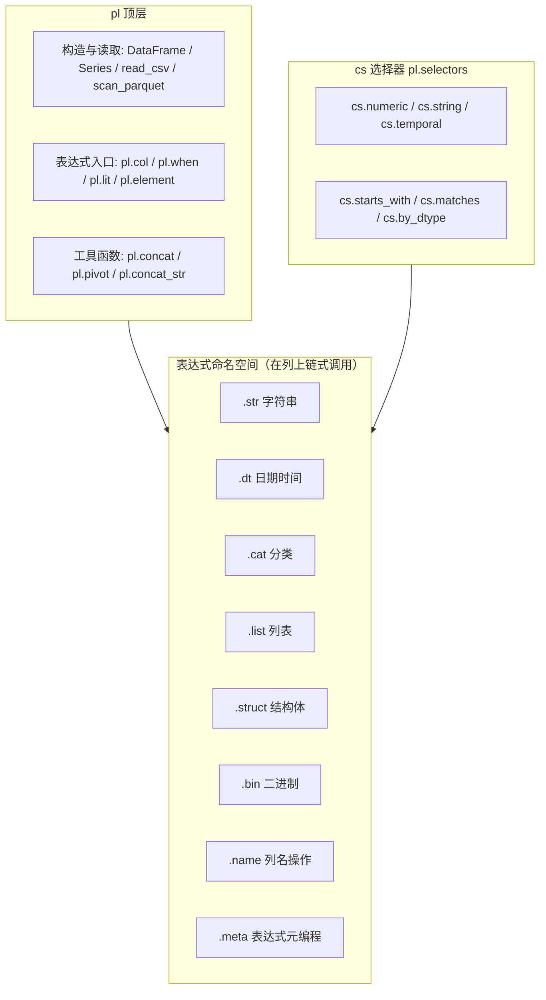

# 《Polars 高效数据处理实战》写作规划

> 第一阶段产出：书籍定位、章节大纲、图示规划、写作规范。
> 第二阶段依据本文档实施：初始化 mdbook 项目、搭建 SUMMARY.md 骨架、配置 mermaid 预处理器。
> **实施状态**：16 章正文 + 3 附录已完成；每章含代码示例、mermaid 图、练习题、性能检查清单；
> 配套 `examples/`（4 个可运行脚本）与 `tests/`（pytest 校验）随书维护；
> API 已对照 polars 1.44.1 与官方文档（docs.pola.rs）逐一核验。

## 一、书籍定位

- **书名（暂定）**：《Polars 高效数据处理实战》
- **主线**：围绕"为什么 Polars 快"，讲透表达式引擎、列式内存、惰性执行、多线程模型，让读者在真实数据场景中写出高效代码
- **两条贯穿主线（全书重点，各章反复呼应）**：
  1. **流式操作**：scan → 惰性变换 → sink 的端到端流式管道，内存受控处理超大数据集
  2. **链式调用**：以表达式方法链为核心的声明式编程风格，一次构建、整体优化
- **代码生态**：Python 为主
- **目标读者**：高性能计算工程师——代码易上手，内容深度下探到内存布局、并行模型、执行引擎层面
- **实战案例**：3 个完整案例（日志分析、金融时序、数据工程管道）

## 二、mdbook 项目结构（第二阶段实施）

```
polars/
├── book.toml              # 配置：标题、语言、mermaid 预处理器
├── src/
│   ├── SUMMARY.md         # 目录（唯一真源）
│   ├── chapter_01/        # 每章一个目录，便于放图和资源
│   │   ├── intro.md
│   │   └── ...
│   └── theme/             # 可选：自定义样式
└── mermaid/               # mermaid 源文件备份（可选）
```

技术要点：

- 使用 mdbook-mermaid 预处理器，在 book.toml 中注册
- 代码块标注语言（python/rust），后续可接 mdbook-highlight 定制高亮

## 三、章节大纲

### 第一部分：基础与心智模型

| 章 | 标题 | 要点 | mermaid 图 |
|---|---|---|---|
| 1 | 为什么是 Polars | 单机多核时代的回归；与 pandas/Spark/DuckDB 定位对比；性能基准概览 | 生态定位图 |
| 2 | 核心对象与内存模型 | Series/DataFrame/表达式；Arrow 列式内存布局（与 NumPy row-major 对比）；零拷贝原理；**命名空间体系（见第四节）** | Arrow 内存布局图、核心对象 classDiagram、命名空间全景图 |
| 3 | I/O 与序列化 | scan vs read 的行为差异；**sink_* 流式写出与 scan 端到端衔接（流式主线第一站）**；Parquet 谓词下推；内存映射；云存储 | 两种读取路径的内存行为时序图 |

### 第二部分：表达式与执行引擎（本书核心）

| 章 | 标题 | 要点 | mermaid 图 |
|---|---|---|---|
| 4 | 表达式系统内核 | 表达式如何被解析为物理计划；向量化/SIMD 执行；表达式不经过 Python 解释器的原因 | 表达式编译流水线 graph |
| 5 | **链式调用与表达式组合（重点章）** | 方法链心智模型：为什么链式优于逐步赋值（可整体优化、免中间物化）；表达式组合与复用（表达式存为变量、函数化封装）；`pipe` 拼接自定义步骤；多行链式的可读性写法；与 pandas 链式（assign/query）对比；**反模式：链中夹带 collect/UDF 打断优化** | 链式调用流水线 flowchart（一段链式代码的解析与优化全景） |
| 6 | Eager vs Lazy | 两种模式执行时序对比；explain() 读查询计划；优化规则（谓词下推、投影裁剪、join 重排） | 优化前后查询计划对比 flowchart |
| 7 | 并行与多线程模型 | Rayon 工作窃取调度；morsel-driven 并行；线程数控制；GIL 为何不是瓶颈 | 多线程调度 sequenceDiagram |
| 8 | **流式操作与流式执行引擎（重点章）** | new streaming engine；分块（morsel）机制；峰值内存控制；**scan → 变换 → sink_* 端到端流式管道（流式主线核心章）**；collect(engine="streaming")；哪些操作可流式、哪些会断流；与 batch 处理结合 | 流式 pipeline flowchart、可流式操作判定决策树 |

### 第三部分：高效数据处理技术

| 章 | 标题 | 要点 | mermaid 图 |
|---|---|---|---|
| 9 | 数据清洗与变换 | 缺失值（validity bitmap）、cast 规则、字符串（多编码）、Categorical 的字典编码；**全流程以链式调用实现** | 清洗流程 flowchart |
| 10 | 分组聚合与连接 | **基础聚合全家桶**：`sum` `mean` `median` `min/max` `std/var` `count` `len` `n_unique`；**百分位/分位数**：`quantile`（插值方法 linear/nearest/midpoint 的差异）、`q1/q3` 与 IQR 异常检测；多级分组与命名聚合（`pl.col(...).agg(...)`）；聚合结果展开（`explode` / `flatten`）；group_by 的多线程分区策略；**join 全家桶**：`inner` / `left` / `right` / `outer(coalesce)` / `cross` / `semi` / `anti`，各自语义、实现与代价；**`join_asof`** 最近邻时序连接；多键 join、join 顺序对性能的影响；窗口函数（`over`）；**超大数据集的流式 join/聚合策略** | join 策略决策树、join 类型集合示意图 |
| 11 | 时间序列 | 日期底层表示、rolling 的并行化、重采样；**同比/环比专题**：`shift` + `group_by` 计算环比、`pct_change`、分组内 period-over-period（按年/月分组的同比）、`over` 窗口下的组内环比、缺失周期补齐（`upsample`）后再算环比 | 重采样时间轴图、环比/同比计算示意 flowchart |
| 12 | 性能调优方法论 | profile 火焰分析；性能反模式（逐行操作、不必要的 collect、打断链式优化）；缓存局部性；基准测试陷阱 | 调优决策树 |
| 13 | UDF 边界与生态互通 | map_elements 的性能悬崖；表达式 plugin（Rust 编译进引擎）；与 NumPy/Arrow/DuckDB 零拷贝互通 | 生态互操作架构图 |

### 第四部分：综合实战

> 三个案例统一要求：以**链式调用**组织全部代码，以**流式 scan/sink** 控制内存峰值——作为两条主线的综合检验。

| 章 | 案例 | 场景亮点 |
|---|---|---|
| 14 | 亿级日志分析管道 | 流式扫描 + 增量聚合 + 内存受控（流式主线深度实践） |
| 15 | 金融时间序列回测 | 多表 join + rolling + 向量化信号计算 |
| 16 | 数据工程管道 | Parquet 数据湖 + 增量 ETL + 与 DuckDB 协作 |

### 附录

| 附录 | 内容 |
|---|---|
| A | polars SQL 方言 |
| B | 常用操作速查表——**按 namespace 分类编排**（见第四节）+ **常用分析操作速查**：聚合/分位数/环比/同比/各 join 类型模板（含 pandas 对照） |
| C | 版本迁移与 deprecated 追踪 |

## 四、命名空间体系（第 2 章新增节 + 附录 B 结构）

Polars 的 API 分四层：顶层函数 → 容器对象 → 表达式命名空间 → 选择器。



### 4.1 顶层 `pl`

| 类别 | 常用成员 | 说明 |
|---|---|---|
| 容器类型 | DataFrame / LazyFrame / Series / Expr | 四个核心对象 |
| 构造 | `pl.DataFrame()` `pl.Series()` `pl.from_arrow()` `pl.from_pandas()` | 从各数据源构造 |
| 读取（Eager） | `read_csv` `read_parquet` `read_json` `read_ipc` | 一次性载入内存 |
| 扫描（Lazy） | `scan_csv` `scan_parquet` `scan_ipc` `scan_pyarrow_dataset` | 延迟执行、可下推优化 |
| 表达式入口 | `col` `first` `last` `lit` `when` `element` `duration` | 构建表达式的起点 |
| 组合工具 | `concat` `concat_str` `pivot` `align_frames` | 多表/多列操作 |
| 上下文配置 | `pl.Config` `pl.thread_pool_size()` | 引擎行为调优 |

### 4.2 表达式命名空间（按数据类型划分）

| 命名空间 | 适用 dtype | 常用方法 |
|---|---|---|
| `.str` | String | `contains` `str.split` `replace` `slice` `to_datetime` `strip_chars` `len_bytes` `str.pad_start` |
| `.dt` | Date/Datetime/Duration | `year` `month` `weekday` `hour` `truncate` `offset_by` `total_seconds` `round` |
| `.cat` | Categorical/Enum | `get_categories` `set_ordering` `to_local` |
| `.list` | List | `len` `get` `first` `join` `sum` `min` `eval` `unique` |
| `.struct` | Struct | `field` `json_encode` `rename_fields`（`unnest` 经由 DataFrame） |
| `.bin` | Binary | `contains` `decode` `size` |
| `.name` | 任意列 | `keep` `map` `prefix_fields` `suffix` `to_uppercase` |
| `.meta` | 任意表达式 | `has_multiple_outputs` `root_names` `output_name`（调试/元编程） |

### 4.3 通用表达式方法（跨类型，直接在 Expr 上调用）

| 类别 | 方法 |
|---|---|
| 数学 | `sum` `mean` `std` `var` `log` `exp` `abs` `clip` `round` |
| 统计 | `quantile` `median` `mode` `skew` `kurtosis` `n_unique` |
| 排名/序 | `rank` `cum_sum` `diff` `shift` `pct_change` `rolling_mean` `ewm_mean` |
| 比较/逻辑 | `eq` `ne` `gt` `is_between` `is_null` `is_in` `and_`/`or_` |
| 分组上下文 | `over` `agg` `map_groups` |
| 条件 | `fill_nan` `fill_null` `mask` `zip_with` `replace` |
| 类型 | `cast` `is_(dtype)` |

### 4.4 容器方法

| 上下文 | 关键方法 | 说明 |
|---|---|---|
| DataFrame | `select` `with_columns` `filter` `group_by` `join` `sort` `head/tail` `unique` `pivot` `melt` `explode` `to_arrow` | Eager，立即执行 |
| LazyFrame | 同上 + `explain` `profile` `sink_parquet` `collect(engine=)` | 可优化、可流式 |
| Series | `to_list` `to_numpy` `is_sorted` `set_sorted` `zip_with` | 一维操作，多为语法糖 |

### 4.5 选择器 `cs`（`pl.selectors`）

按模式而非列名选列，动态管道的利器：

```python
import polars.selectors as cs

df.select(cs.numeric() & ~cs.first())      # 除第一列外的数值列
df.select(cs.matches(r"^amount_"))          # 正则匹配列名
df.select(cs.temporal(), cs.by_dtype(pl.String))
```

## 五、mermaid 图示规划

全书约 24 张图，类型分配：

| 类型 | 数量 | 用途 |
|---|---|---|
| `flowchart` | ~12 | 数据管道、流式 pipeline、可流式操作判定决策树、**链式调用流水线**、调优/join 决策树、**环比/同比计算示意**、命名空间全景 |
| `graph TB` | ~4 | 架构图（表达式引擎、查询优化器） |
| `sequenceDiagram` | ~4 | Eager vs Lazy 执行时序、多线程调度、读取路径内存行为 |
| `classDiagram` | ~3 | 核心对象模型、命名空间关系 |
| **join 集合示意图** | ~1 | 各 join 类型的行匹配关系（inner/left/outer/semi/anti 对比） |
| `timeline`/`gantt` | 可选 | 版本演进 |

## 六、写作规范

- **章节模板**：每章开头一段"本章要解决什么问题"，结尾"要点回顾 + 性能检查清单"
- **代码块约定**：统一标注语言；输出用 `# shape: ...` 风格注释；性能对比标注数据规模
- **图示编号**：`图 N-M`（第 N 章第 M 图），正文引用时使用编号
- **性能声明**：所有性能论断需注明 polars 版本与数据规模，避免过时误导
