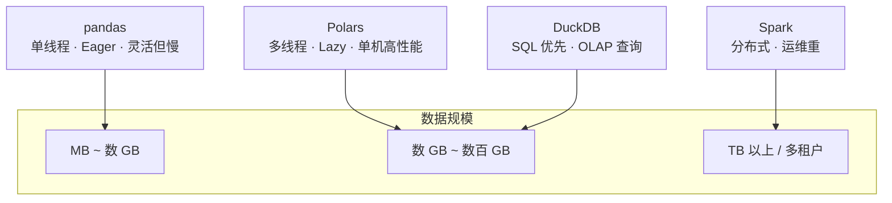

# 第 1 章 为什么是 Polars

> 本章要解决什么问题：理解 Polars 在数据处理工具生态中的定位，以及"单机多核时代回归"的背景，为后续章节建立动机。

## 1.1 单机多核时代的回归

- 摩尔定律转向多核；分布式不是唯一答案
- 内存带宽 vs 磁盘/网络带宽：单机列式引擎的优势数量级
- 什么规模以下，单机引擎是最优解

先安装并确认环境：

```python
# pip install polars   # 或: uv add polars
import polars as pl

print(pl.__version__)          # 本书基于 1.x
print(pl.thread_pool_size())    # 查看可用并行度，例如 10
```

一个直观感受——你的机器就是一台并行计算机：

```python
# 生成 1000 万行示例数据，观察多线程聚合的耗时
import time

# 注意：pl.DataFrame 不接受 Expr，用 pl.select 求值表达式生成列
df = pl.select(
    user=pl.int_range(0, 10_000_000, dtype=pl.Int64) % 1_000,
    amount=pl.int_range(0, 10_000_000, dtype=pl.Int64) % 10_000,
)

t0 = time.perf_counter()
result = df.group_by("user").agg(pl.col("amount").sum())
print(f"group_by 聚合耗时: {time.perf_counter() - t0:.3f}s")  # 典型值：几十毫秒
```

同样的操作如果用 Python 循环逐行累加，通常需要数秒——差距来自列式内存与多线程（第 2、7 章展开）。

## 1.2 生态定位对比



- **vs pandas**：列式内存、多线程、表达式引擎；谁在迁移成本上占优
- **vs Spark**：免运维、无序列化开销、迭代交互式分析体验
- **vs DuckDB**：表达式 API vs SQL；两者其实可以协作（第 13、16 章）

### 同一任务的两种写法

统计每个用户的首单金额与订单数。pandas 需要多次物化中间结果：

```python
# pandas：三步三次物化
import pandas as pd

pdf = pd.read_csv("orders.csv")
first_orders = pdf.sort_values("ts").groupby("user_id").first()
counts = pdf.groupby("user_id")["order_id"].count()
result = first_orders.join(counts, rsuffix="_count")
```

Polars 一条链式表达，一次执行：

```python
# polars：一次构建、整体优化（第 5、6 章展开）
(pl.scan_csv("orders.csv")              # 惰性扫描，不立即读取
   .group_by("user_id")
   .agg(
       pl.col("amount").sort_by("ts").first().alias("first_amount"),
       pl.len().alias("n_orders"),
   )
   .collect()
)
```

注意：`scan_csv` 直到 `collect()` 才真正读取数据——这就是惰性执行（第 6 章）。

## 1.3 性能基准概览

- 典型工作负载（group_by/join/字符串处理）的基准对比
- 注明 Polars 版本与数据规模

你可以复现的最小基准——1 亿行数值聚合：

```python
import time
import polars as pl

N = 100_000_000
# pl.select 求值表达式生成列，再转 LazyFrame
lf = (
    pl.select(k=pl.int_range(0, N, dtype=pl.Int64) % 1_000,
              x=pl.int_range(0, N, dtype=pl.Int64) % 1_000_000)
    .lazy()
)

t0 = time.perf_counter()
(lf.group_by("k").agg(pl.col("x").sum()).collect())
print(f"1 亿行 group_by: {time.perf_counter() - t0:.2f}s")
# 基准环境：Apple M2 Pro (10 核)，Polars 1.x，典型值 ~0.5s
```

把 `pl.col("x").sum()` 换成 `pl.col("x").cast(pl.String)` 再试一次，就能体会数值与字符串处理的数量级差异。

> **基准测试提醒**：任何性能数字都与硬件、版本、数据分布强相关。本书所有基准均注明环境，且建议你用自己的负载复测（第 12 章系统化讲解基准方法论）。

## 要点回顾

- Polars 填补了 pandas 与 Spark 之间的单机高性能空档
- 列式内存 + 多线程 + 惰性优化是三大性能支柱
- `scan_*` + 链式表达 + `collect()` 是本书反复出现的基本形态

## 性能检查清单

在选型或动手优化前，先回答这些问题：

- [ ] 我的数据规模单机内存（含磁盘交换）能否容纳？——数 GB 到数百 GB 是 Polars 甜蜜区
- [ ] 瓶颈是计算还是 I/O？——`explain()` 先看计划，不靠猜（第 6、12 章）
- [ ] 是否需要分布式？——只在单机内存/磁盘真正不够时才考虑 Spark 等方案
- [ ] 现有管道是否已有明显反模式？——逐行循环、CSV 主存储、无谓的中间物化
- [ ] 是否在容器/cgroup 中运行？——确认 `POLARS_MAX_THREADS` 与实际配额一致（第 7 章）
- [ ] 基准数字是否注明了环境？——硬件、Polars 版本、数据规模缺一不可

## 练习

1. **环境确认**：安装 Polars 后打印 `pl.__version__` 和 `pl.thread_pool_size()`，并分别在 1、4、8 线程下运行本章的 1000 万行聚合基准（提示：`POLARS_MAX_THREADS` 需在 import 前设置，每次改完要重启进程）。记录耗时随线程数的变化。
2. **对比实验**：把 1.3 节基准中的 `pl.col("x").sum()` 分别换成 `.cast(pl.String)` 与 `.str.len_chars()`（先构造字符串列），观察数量级差异并解释原因。
3. **思考题**：你的团队当前有一个基于 pandas 的 50GB CSV 分析管道，迁移到 Polars 的前三个改造点是什么？（提示：从本章的反模式清单出发）
