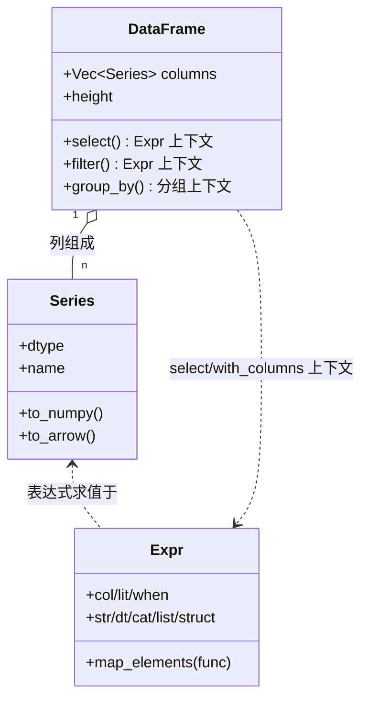
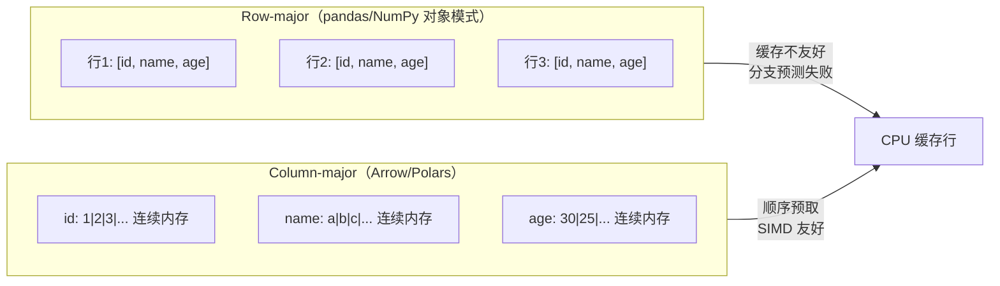

# 第 2 章 核心对象与内存模型

> 本章要解决什么问题：掌握 DataFrame/Series/Expr 三个核心对象，理解 Arrow 列式内存布局如何成为 Polars 性能的地基，并建立 API 命名空间全景。

## 2.1 三个核心对象



- DataFrame：列的集合，不是行的容器
- Series：带类型的一维列
- Expr：**尚未执行的计算描述**——Polars 性能哲学的起点

### 动手感受三个对象

```python
import polars as pl

# DataFrame：列的集合
df = pl.DataFrame({
    "id": [1, 2, 3],
    "name": ["a", "b", "c"],
    "score": [90.5, 85.0, 78.5],
})
print(df.schema)
# {'id': Int64, 'name': String, 'score': Float64}
# 注意：dtype 是强类型的，不存在 pandas 的 object 兜底

# Series：带类型的一维列
s = df.get_column("score")
print(s.dtype, s.len())      # Float64 3
print(s.sum(), s.mean())     # 254.0 84.666...

# Expr：尚未执行的计算描述
expr = pl.col("score") * 2 + 1
print(type(expr))            # <class 'polars.expr.expr.Expr'>
# 此时没有任何计算发生——它只是"描述"
```

关键心智模型：`pl.col("score") * 2 + 1` 在 pandas 里对应逐行求值，在 Polars 里是一棵待编译的表达式树，`collect()` 时整体翻译为 Rust 向量化内核（第 4 章）。

## 2.2 Arrow 列式内存布局



- 与 NumPy row-major 对比：缓存局部性
- validity bitmap：null 不是 NaN，也不是哨兵值
- 零拷贝原理：为什么 `from_arrow` / `to_numpy`(无 null) 不复制数据

> **精确表述**：Polars 遵循 Arrow 列式规范，但**并非构建在 PyArrow 之上**——它有自己的 Rust 计算与缓冲区实现（衍生自 Arrow2 的设计）。这带来两个推论：① 与 Arrow 生态（PyArrow、DuckDB、DataFusion）交换数据时通常零拷贝；② Polars 的内部优化不受 PyArrow 限制，validity bitmap 的处理效率比通用 Arrow 实现更高。

### 观察内存占用

```python
import polars as pl

df = pl.select(
    id=pl.int_range(0, 1_000_000, dtype=pl.Int64),
    flag=(pl.int_range(0, 1_000_000, dtype=pl.Int64) % 2 == 0),
)

print(df.estimated_size("mb"))  # ≈ 7.7 MB
# Int64 (8B) + Bool (1B) × 100 万行
# Bool 按位打包：每行约 8 + 1/8 = 8.125 字节

# 收窄 dtype 立省一半
df2 = df.with_columns(pl.col("id").cast(pl.Int32))
print(df2.estimated_size("mb"))  # ≈ 3.9 MB
```

### null 与 NaN 是两回事

```python
s = pl.Series("x", [1.0, None, float("nan")])
print(s.is_null())   # [False, True, False]  值缺失
print(s.is_nan())    # [False, None, True]   浮点未定义；null 位置传播为 null
print(s.sum())       # nan 会传染；null 会被跳过 → 1.0 + nan = nan
# 聚合前先处理：
s.fill_nan(0).sum()          # 或先 fill_nan 再算
```

### 零拷贝验证

```python
import numpy as np

arr = np.arange(1_000_000, dtype=np.float64)
s = pl.Series("x", arr)          # 无 null → 零拷贝
print(s.to_numpy().__array_interface__["data"][0]
      == arr.__array_interface__["data"][0])  # True：同一块内存
```

## 2.3 dtype 系统

- 数值类型严格固定宽度（`Int8`~`Int64`、`Float32/64`）
- `String` 不是 Python str 对象的集合
- `Categorical/Enum`：字典编码（第 9 章展开）

```python
# dtype 决定行为：String 列的 sort 与 Categorical 的 sort 代价完全不同
df = pl.DataFrame({"city": ["上海", "北京", "上海", "深圳"]})
df_cat = df.with_columns(pl.col("city").cast(pl.Categorical))
print(df_cat.get_column("city").to_physical())  # 字典索引 [0,1,0,2]
```

## 要点回顾

- DataFrame 是列的集合；Expr 是计算的描述而非执行
- Arrow 列式布局带来缓存友好、SIMD 可用、跨系统零拷贝
- null（bitmap 标记）与 NaN（浮点值）语义不同，处理方式也不同
- 列式布局是后续流式引擎分块（morsel）处理的前提——按列切块才能逐块流过计算内核

## 性能检查清单

- [ ] 数据是否以最窄的合理 dtype 存储？（用 `estimated_size()` 验证）
- [ ] 是否避免了把列转成 Python 对象列表再处理？（`to_list()` 是性能悬崖）
- [ ] null 与 NaN 是否被正确区分处理？
- [ ] 是否零拷贝衔接了 NumPy/Arrow 数据源？

## 练习

1. **dtype 收窄**：构造一个 `user_id`（范围 0~500 万）和 `flag`（0/1）的 DataFrame，用 `estimated_size()` 对比 Int64/Int32/Int8 三种存储的内存，并给出安全的最窄组合。
2. **null vs NaN**：对 Series `[1.0, None, nan]` 依次执行 `sum()`、`fill_null(0).sum()`、`fill_nan(0).sum()`，解释三个结果为什么不同。
3. **零拷贝验证**：用 `__array_interface__` 验证 `to_numpy()` 的零拷贝行为，然后给原 Series 加一个 null 再试一次——解释为什么这次不再零拷贝。
