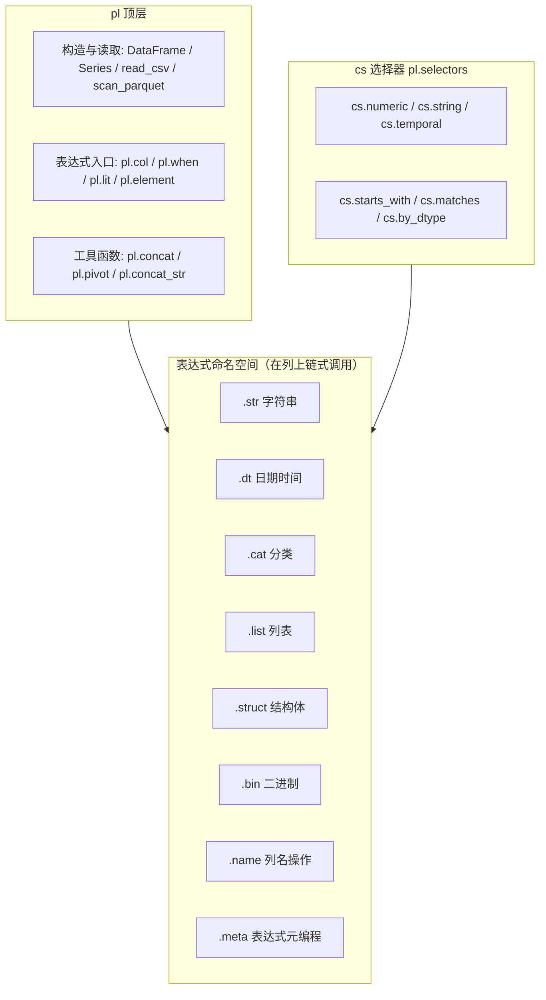

# 2.1 命名空间体系

> Polars 的 API 分四层：顶层函数 → 容器对象 → 表达式命名空间 → 选择器。理解分层，就能预判哪些调用走 Rust 内核、哪些会掉进 Python 层。



## pl 顶层

| 类别 | 常用成员 | 说明 |
|---|---|---|
| 容器类型 | `DataFrame` / `LazyFrame` / `Series` / `Expr` | 四个核心对象 |
| 构造 | `pl.DataFrame()` `pl.Series()` `pl.from_arrow()` `pl.from_pandas()` | 从各数据源构造 |
| 读取（Eager） | `read_csv` `read_parquet` `read_json` `read_ipc` | 一次性载入内存 |
| 扫描（Lazy） | `scan_csv` `scan_parquet` `scan_ipc` `scan_pyarrow_dataset` | 延迟执行、可下推优化 |
| 表达式入口 | `col` `first` `last` `lit` `when` `element` `duration` `from_epoch` | 构建表达式的起点 |
| 组合工具 | `concat` `concat_str` `pivot` `align_frames` | 多表/多列操作 |
| 上下文配置 | `pl.Config` `pl.thread_pool_size()` | 引擎行为调优 |

## 表达式命名空间（按数据类型划分）

| 命名空间 | 适用 dtype | 常用方法 |
|---|---|---|
| `.str` | String | `contains` `str.split` `replace` `slice` `to_datetime` `strip_chars` `len_bytes` `str.pad_start` |
| `.dt` | Date/Datetime/Duration | `year` `month` `weekday` `hour` `truncate` `offset_by` `total_seconds` `round` |
| `.cat` | Categorical/Enum | `get_categories` `set_ordering` `to_local` |
| `.list` | List | `len` `get` `first` `join` `sum` `min` `eval` `unique` |
| `.struct` | Struct | `field` `json_encode` `rename_fields`（`unnest` 经由 DataFrame） |
| `.bin` | Binary | `contains` `decode` `size` |
| `.name` | 任意列 | `keep` `map` `prefix_fields` `suffix` `to_uppercase` |
| `.meta` | 任意表达式 | `has_multiple_outputs` `root_names` `output_name`（调试/元编程） |

## 通用表达式方法（跨类型，直接在 Expr 上调用）

| 类别 | 方法 |
|---|---|
| 数学 | `sum` `mean` `std` `var` `log` `exp` `abs` `clip` `round` |
| 统计 | `quantile` `median` `mode` `skew` `kurtosis` `n_unique` `approx_n_unique` `hist` |
| 排名/序 | `rank` `cum_sum` `diff` `shift` `pct_change` `rolling_mean` `ewm_mean` `rle_id` `interpolate` |
| 比较/逻辑 | `eq` `ne` `gt` `is_between` `is_null` `is_in` `and_`/`or_` |
| 分组上下文 | `over` `agg` `map_groups` |
| 条件 | `fill_nan` `fill_null` `mask` `zip_with` `replace` |
| 类型 | `cast` `is_(dtype)` |

## 容器方法

| 上下文 | 关键方法 | 说明 |
|---|---|---|
| DataFrame | `select` `with_columns` `filter` `group_by` `join` `sort` `head/tail` `unique` `pivot` `melt` `explode` `to_arrow` | Eager，立即执行 |
| LazyFrame | 同上 + `explain` `profile` `sink_parquet` `collect(engine=)` | 可优化、可流式 |
| Series | `to_list` `to_numpy` `is_sorted` `set_sorted` `zip_with` | 一维操作，多为语法糖 |

## 选择器 cs（pl.selectors）

按模式而非列名选列，动态管道的利器：

```python
import polars.selectors as cs

df.select(cs.numeric() & ~cs.first())      # 除第一列外的数值列
df.select(cs.matches(r"^amount_"))          # 正则匹配列名
df.select(cs.temporal(), cs.by_dtype(pl.String))
```
