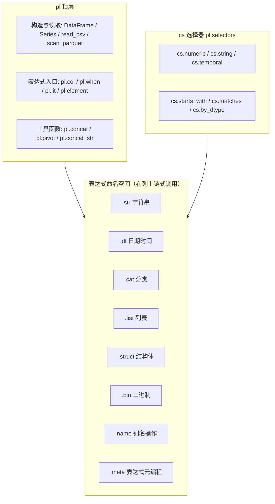

# 2.4 命名空间体系

> Polars 的 API 分四层：顶层函数 → 容器对象 → 表达式命名空间 → 选择器。理解分层，就能预判哪些调用走 Rust 内核、哪些会掉进 Python 层。



## pl 顶层

| 类别 | 常用成员 | 说明 |
|---|---|---|
| 容器类型 | `DataFrame` / `LazyFrame` / `Series` / `Expr` | 四个核心对象 |
| 构造 | `pl.DataFrame()` `pl.Series()` `pl.from_arrow()` `pl.from_pandas()` | 从各数据源构造 |
| 读取（Eager） | `read_csv` `read_parquet` `read_json` `read_ipc` | 一次性载入内存 |
| 扫描（Lazy） | `scan_csv` `scan_parquet` `scan_ipc` `scan_pyarrow_dataset` | 延迟执行、可下推优化 |
| 表达式入口 | `col` `first` `last` `lit` `when` `element` `duration` `from_epoch` | 构建表达式的起点 |
| 组合工具 | `concat` `concat_str` `pivot` `align_frames` | 多表/多列操作 |
| 上下文配置 | `pl.Config` `pl.thread_pool_size()` | 引擎行为调优 |

## 表达式命名空间（按数据类型划分）

| 命名空间 | 适用 dtype | 常用方法 |
|---|---|---|
| `.str` | String | `contains` `split` `replace` `slice` `to_datetime` `strip_chars` `len_bytes` `pad_start` |
| `.dt` | Date/Datetime/Duration | `year` `month` `weekday` `hour` `truncate` `offset_by` `total_seconds` `round` |
| `.cat` | Categorical/Enum | `physical` `slice` `starts_with` `ends_with`（`get_categories` 已弃用，改用 `unique()` 查看类别） |
| `.list` | List | `len` `get` `first` `join` `sum` `min` `eval` `unique` |
| `.struct` | Struct | `field` `json_encode` `rename_fields` `unnest` |
| `.bin` | Binary | `contains` `decode` `size` |
| `.name` | 任意列 | `keep` `map` `prefix` `suffix` `to_uppercase`（`prefix_fields`/`suffix_fields` 仅用于 Struct 字段） |
| `.meta` | 任意表达式 | `has_multiple_outputs` `root_names` `output_name`（调试/元编程） |

## 通用表达式方法（跨类型，直接在 Expr 上调用）

| 类别 | 方法 |
|---|---|
| 数学 | `sum` `mean` `std` `var` `log` `exp` `abs` `clip` `round` |
| 统计 | `quantile` `median` `mode` `skew` `kurtosis` `n_unique` `approx_n_unique` `hist` |
| 排名/序 | `rank` `cum_sum` `diff` `shift` `pct_change` `rolling_mean` `ewm_mean` `rle_id` `interpolate` |
| 比较/逻辑 | `eq` `ne` `gt` `is_between` `is_null` `is_in` `and_`/`or_` |
| 分组上下文 | `over` `map_batches`（`map_elements` 走 Python，见第 4 章） |
| 条件 | `fill_nan` `fill_null` `replace` |
| 类型 | `cast` `is_finite` `is_infinite` |

## 容器方法

| 上下文 | 关键方法 | 说明 |
|---|---|---|
| DataFrame | `select` `with_columns` `filter` `group_by` `join` `sort` `head/tail` `unique` `pivot` `unpivot`（1.0 前叫 `melt`）`explode` `to_arrow` | Eager，立即执行 |
| LazyFrame | 同上 + `explain` `sink_parquet` `collect(engine=)`（`profile` 自 1.43 起弃用，为旧引擎专用） | 可优化、可流式 |
| Series | `to_list` `to_numpy` `is_sorted` `set_sorted` `zip_with` | 一维操作，多为语法糖 |

## 选择器 cs（pl.selectors）

按模式而非列名选列，动态管道的利器：

```python
import polars.selectors as cs

df.select(cs.numeric() & ~cs.first())      # 除第一列外的数值列
df.select(cs.matches(r"^amount_"))          # 正则匹配列名
df.select(cs.temporal(), cs.by_dtype(pl.String))
```

## 要点回顾

- API 分四层（顶层函数 → 容器对象 → 表达式命名空间 → 选择器），遇到不确定的调用先判断它落在哪一层——表达式命名空间与选择器组合是动态管道的主力。

## 性能检查清单

- [ ] 按模式选列是否用了 `cs` 选择器，而不是手写列名清单？
- [ ] dtype 专属操作是否走了对应命名空间（`.str`/`.dt`/`.list`），而不是 `map_elements` 退回 Python 层？
- [ ] 改列名是否用 `.name` 命名空间在表达式内完成，而不是执行后手动 rename？

## 练习

1. **选择器求和**：构造一个同时含字符串列与数值列的 DataFrame，用 `cs.numeric()` 一次选中所有数值列并逐列求和（`df.select(cs.numeric().sum())`）。
2. **长度之别**：查阅 `.str` 命名空间文档，对 `["你好", "ab"]` 分别执行 `len_chars` 与 `len_bytes`，解释两个结果为何不同（提示：UTF-8 编码下一个汉字占 3 字节）。
3. **批量改名**：用 `.name` 命名空间在一个 `select()` 里完成：列名转大写（`to_uppercase`）、加前缀（`prefix`）、用函数变换列名（`map`）三种操作各出一条示例。
