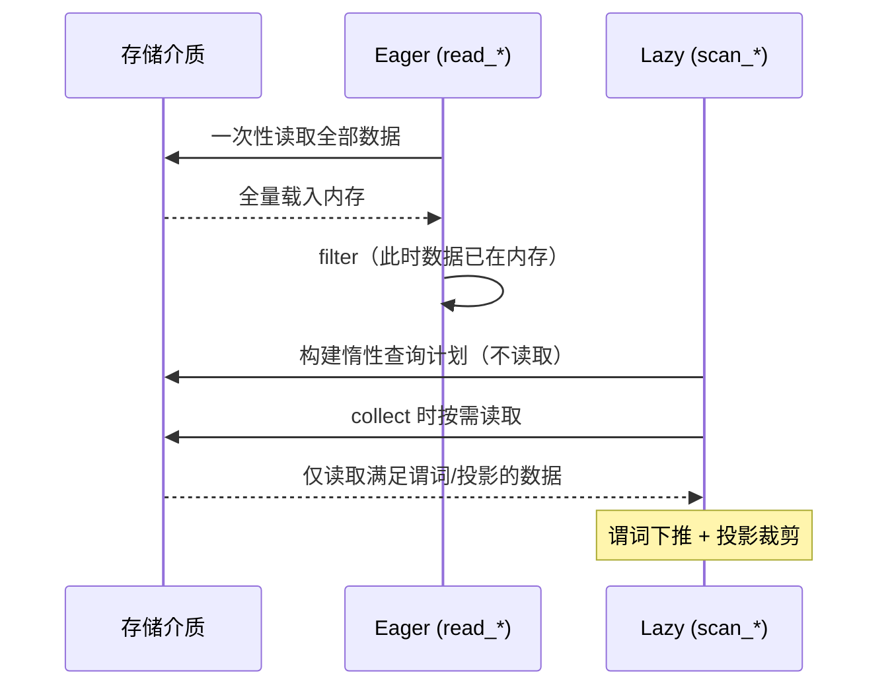

# 第 3 章 I/O 与序列化

> 本章要解决什么问题：掌握 read 与 scan 两条读取路径的行为差异，衔接 sink_* 流式写出，打通端到端流式管道的第一站。

## 3.1 scan vs read



- `read_*`：立即物化 DataFrame
- `scan_*`：返回 LazyFrame，谓词下推到存储层
- **流式主线第一站**：`scan_*` 读取 + `sink_*` 写出，全程内存受控

### 用 explain 看差异

```python
import polars as pl

# read：全部数据先进内存，之后才过滤
df = pl.read_csv("orders.csv")          # 全量读取
small = df.filter(pl.col("amount") > 1000)

# scan：过滤下推到读取阶段，只读需要的行和列
lf = (
    pl.scan_csv("orders.csv")
      .filter(pl.col("amount") > 1000)   # 谓词下推
      .select(["user_id", "amount"])      # 投影裁剪
)
print(lf.explain())
# 输出中可见 SELECTION: col("amount") > 1000
# 与 PROJECT 2/12 COLUMNS —— 12 列只读 2 列
```

## 3.2 各格式选型

| 格式 | 场景 | 要点 |
|---|---|---|
| CSV | 数据交换 | 解析开销大、类型需显式声明 |
| Parquet | 分析主存储 | 列存、压缩、谓词下推支持最好 |
| IPC/Feather | 进程间/临时缓存 | Arrow 原生、零拷贝友好 |
| JSON/NDJSON | API 对接 | 建议先转 Parquet 再分析 |
| 数据库/云存储 | 企业环境 | `scan_pyarrow_dataset`、`pl.read_database` |

### CSV 读取的类型陷阱

```python
# CSV 无类型信息，靠推断——显式声明更稳更快
lf = pl.scan_csv(
    "events.csv",
    schema_overrides={
        "user_id": pl.Int64,
        "ts": pl.Datetime,            # 或 try_parse_dates=True
        "city": pl.Categorical,
    },
    null_values=["", "NULL", "\\N"],
)
```

### CSV 转存 Parquet 一次，后续每次都快

```python
(pl.scan_csv("events.csv")
   .with_columns(pl.col("ts").str.to_datetime("%Y-%m-%d %H:%M:%S"))
   .sink_parquet("events.parquet"))
```

## 3.3 Parquet 深入

- 谓词下推原理：min/max 统计信息 + 行组过滤
- 内存映射：`memory_map` 参数
- 云存储：`scan_parquet("s3://...")` 的行为

```python
# 行组统计信息：数据还没读，存储层就能跳过整个行组
lf = pl.scan_parquet("events.parquet")
print(lf.collect_schema())
# 更进一步：用 pyarrow 查看行组级 min/max
import pyarrow.parquet as pq
pf = pq.ParquetFile("events.parquet")
print(pf.metadata.row_group(0).column(0).statistics)
```

```python
# 多文件/分区目录扫描：通配符即可
lf = pl.scan_parquet("logs/date=2026-08-*/*.parquet")
# 分区列 date 会自动从路径解析出来（hive 风格 date=xxx/ 目录结构自动推断）
```

```python
# 非标准分区结构需显式开启或关闭，否则可能多出/漏掉虚拟分区列
lf = pl.scan_parquet("logs/", hive_partitioning=True)
print(lf.collect_schema())   # date 列从目录名解析而来
```

## 3.4 sink_* 流式写出

- `sink_parquet` / `sink_csv` / `sink_ipc`：不经过 collect 直接落盘
- 与 scan 衔接的完整示例（第 8 章展开引擎细节）

```python
# 端到端流式：读取 → 变换 → 写出，全程不物化
(pl.scan_parquet("logs/*.parquet")
   .filter(pl.col("level") == "ERROR")
   .with_columns(hour=pl.col("ts").dt.truncate("1h"))
   .group_by("hour")
   .agg(pl.len().alias("n"))
   .sink_parquet("error_stats.parquet"))
```

## 要点回顾

- 分析型工作负载永远优先 scan + Parquet
- read 只适合小数据或需要立即查看的场景
- CSV 的类型推断不可靠，生产管道必须显式 schema

## 性能检查清单

- [ ] 是否用 scan_parquet 替代了 read_csv？
- [ ] CSV 是否已转存为 Parquet？
- [ ] 是否利用了投影裁剪只读需要的列？（`explain()` 验证 PROJECT）
- [ ] 谓词是否足够选择性以触发行组跳过？
- [ ] 生产管道是否用 `sink_*` 替代了 collect + write？

## 练习

1. **计划解读**：对一个 12 列的 Parquet 文件执行 `scan → filter → select 2 列 → explain()`，找出输出中的 `PROJECT` 和 `SELECTION`，确认投影与谓词都下推了。
2. **格式转换**：把一份 CSV（可用 `pl.DataFrame(...).write_csv()` 生成）转存为 Parquet，对比转换前后 `read_csv` 与 `scan_parquet` 的读取耗时与内存。
3. **分区扫描**：按 `date=YYYY-MM-DD` 目录结构生成三天的分区数据，用 glob 扫描其中两天，验证分区列自动解析、且第三天未参与计算（提示：`collect_schema()` 与行数）。
