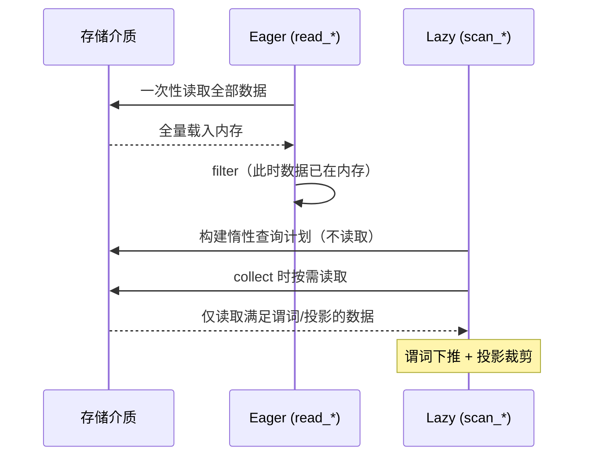

# 第 3 章 I/O 与序列化

> 本章要解决什么问题：掌握 read 与 scan 两条读取路径的行为差异，衔接 sink_* 流式写出，打通端到端流式管道的第一站。

## 3.1 scan vs read



- `read_*`：立即物化 DataFrame
- `scan_*`：返回 LazyFrame，谓词下推到存储层
- **流式主线第一站**：`scan_*` 读取 + `sink_*` 写出，全程内存受控

### 用 explain 看差异

```python
import polars as pl

# read：全部数据先进内存，之后才过滤
df = pl.read_csv("orders.csv")          # 全量读取
small = df.filter(pl.col("amount") > 1000)

# scan：过滤下推到读取阶段，只读需要的行和列
lf = (
    pl.scan_csv("orders.csv")
      .filter(pl.col("amount") > 1000)   # 谓词下推
      .select(["user_id", "amount"])      # 投影裁剪
)
print(lf.explain())
# 输出中可见 SELECTION: col("amount") > 1000
# 与 PROJECT 2/12 COLUMNS —— 12 列只读 2 列
```

## 3.2 各格式选型

| 格式 | 场景 | 要点 |
|---|---|---|
| CSV | 数据交换 | 解析开销大、类型需显式声明 |
| Parquet | 分析主存储 | 列存、压缩、谓词下推支持最好 |
| IPC/Feather | 进程间/临时缓存 | Arrow 原生、零拷贝友好 |
| JSON/NDJSON | API 对接 | 建议先转 Parquet 再分析 |
| 数据库/云存储 | 企业环境 | `scan_pyarrow_dataset`、`pl.read_database` |

### CSV 读取的类型陷阱

```python
# CSV 无类型信息，靠推断——显式声明更稳更快
lf = pl.scan_csv(
    "events.csv",
    schema_overrides={
        "user_id": pl.Int64,
        "ts": pl.Datetime,            # 或 try_parse_dates=True
        "city": pl.Categorical,
    },
    null_values=["", "NULL", "\\N"],
)
```

### CSV 转存 Parquet 一次，后续每次都快

```python
(pl.scan_csv("events.csv")
   .with_columns(pl.col("ts").str.to_datetime("%Y-%m-%d %H:%M:%S"))
   .sink_parquet("events.parquet"))
```

## 3.3 Parquet 深入

- 谓词下推原理：min/max 统计信息 + 行组过滤
- 内存映射：`memory_map` 参数
- 云存储：`scan_parquet("s3://...")` 的行为

```python
# 行组统计信息：数据还没读，存储层就能跳过整个行组
lf = pl.scan_parquet("events.parquet")
print(lf.collect_schema())
# 更进一步：用 pyarrow 查看行组级 min/max
import pyarrow.parquet as pq
pf = pq.ParquetFile("events.parquet")
print(pf.metadata.row_group(0).column(0).statistics)
```

### 行组统计：数据还没读，先查"目录"

上面最后一行打印的 `statistics`，就是 Parquet 谓词下推的物理基础。Parquet 文件在水平方向切成若干**行组（row group）**，每个行组的每一列都在文件 footer 里登记了 min/max/null_count 统计。`scan_parquet` 执行时先读 footer（KB 级），把过滤条件与各行组的 min/max 对比——区间与条件完全不相交的行组**整块跳过，一个字节都不读**。

自己造一个文件看清楚。100 万行按时间排序的事件表，每 10 万行一个行组：

```python
import polars as pl
import pyarrow.parquet as pq

N = 1_000_000
events = pl.select(
    ts=pl.datetime_range(
        pl.datetime(2026, 1, 1),
        pl.datetime(2026, 1, 1) + pl.duration(seconds=N - 1),
        interval="1s",
    ),
).with_columns(
    user_id=pl.int_range(0, N, dtype=pl.Int64) % 10_000,
    amount=pl.int_range(0, N, dtype=pl.Int64) % 500,
)
events.write_parquet("events.parquet", row_group_size=100_000)

pf = pq.ParquetFile("events.parquet")
print(f"行组数: {pf.metadata.num_row_groups}")
for i in range(pf.metadata.num_row_groups):
    s = pf.metadata.row_group(i).column(0).statistics   # 第 0 列 = ts
    print(f"行组 {i}: ts ∈ [{s.min}, {s.max}]")
# 实测输出（节选）：
# 行组数: 10
# 行组 0: ts ∈ [2026-01-01 00:00:00, 2026-01-02 03:46:39]
# 行组 1: ts ∈ [2026-01-02 03:46:40, 2026-01-03 07:33:19]
# ……
# 行组 9: ts ∈ [2026-01-11 10:00:00, 2026-01-12 13:46:39]
```

十个行组的 ts 区间严格递增、互不重叠。于是查询"1 月 10 日零点以后的事件"时，前 7 个行组的 max 都早于阈值，直接整块跳过——实测只有 22% 的行被真正解码。**数据还没读，存储层就替你完成了大半过滤**，这正是 3.1 节 explain 输出里 `SELECTION` 最终落到的地方。

### 写入侧的配合：排序决定统计信息的质量

统计跳过的前提是行组的 min/max 区间足够窄，而区间宽度取决于数据在行组内的分布。`write_parquet` 因此有两个写入侧决策值得一并考虑：`row_group_size` 决定行组多大（行数），**写入前的排序**决定每个行组的区间多窄。

同一份数据（`user_id` 取值 0~9999），两种写法：

```python
base = pl.select(
    user_id=pl.int_range(0, N, dtype=pl.Int64) % 10_000,
    amount=pl.int_range(0, N, dtype=pl.Int64) % 500,
)

# 乱序写入：user_id 在每个行组里几乎铺满整个取值域
base.sample(fraction=1.0, shuffle=True, seed=42).write_parquet(
    "users_shuffled.parquet", row_group_size=100_000
)
# 排序写入：先按过滤列排序再落盘
base.sort("user_id").write_parquet("users_sorted.parquet", row_group_size=100_000)

def row_group_ranges(path):
    pf = pq.ParquetFile(path)
    return [
        f"[{pf.metadata.row_group(i).column(0).statistics.min}, "
        f"{pf.metadata.row_group(i).column(0).statistics.max}]"
        for i in range(pf.metadata.num_row_groups)
    ]

print(row_group_ranges("users_shuffled.parquet"))
# 实测：['[0, 9999]', '[0, 9999]', … 共 10 个全区间]
# 每个行组的 min/max 都铺满 0~9999 —— 对 user_id 的任何过滤都退化为全表扫描
print(row_group_ranges("users_sorted.parquet"))
# 实测：['[0, 999]', '[1000, 1999]', '[2000, 2999]', …, '[9000, 9999]']
# 区间几乎不重叠 —— 任何 user_id 过滤最多命中 1 个行组
```

**ETL 落盘前按高频过滤列排序，是一次排序换来的永久加速**：之后每次按该列查询都受益。`row_group_size` 则控制粒度——行组越小跳过越精准，但 footer 元数据越多；默认值对多数场景够用，大表可显式设为几十万到百万行。

### 谓词下推实测：行组跳过值多少钱

1000 万行、12 列、按 `id` 排序写入，`row_group_size=1_000_000` 切成 10 个行组。同一张表、三种选择性的过滤，聚合全部列以放大读取量：

```python
import time

BIG = 10_000_000
cols = {"id": pl.int_range(0, BIG, dtype=pl.Int64)}
for j in range(11):                     # 12 列宽表，模拟真实分析表
    cols[f"col_{j:02d}"] = (pl.int_range(0, BIG, dtype=pl.Int64) * (j + 7)) % 100_000
pl.select(**cols).write_parquet("big_ids.parquet", row_group_size=1_000_000)

aggs = [pl.col(f"col_{j:02d}").sum() for j in range(11)]

def bench(pred):
    lf = pl.scan_parquet("big_ids.parquet").filter(pred).select(aggs)
    lf.collect()                        # 预热
    best = float("inf")
    for _ in range(5):
        t0 = time.perf_counter()
        lf.collect()
        best = min(best, time.perf_counter() - t0)
    return best

print(f"id > 9_990_000: {bench(pl.col('id') > 9_990_000) * 1e3:.1f} ms")
print(f"id > 5_000_000: {bench(pl.col('id') > 5_000_000) * 1e3:.1f} ms")
print(f"id > 1_000_000: {bench(pl.col('id') > 1_000_000) * 1e3:.1f} ms")
# 实测（Apple Silicon，页缓存热，5 次取最优）：
# id > 9_990_000:   8.4 ms   —— 9/10 行组整块跳过，只解码最后 1 个行组
# id > 5_000_000:  39.2 ms   —— 跳过 5/10
# id > 1_000_000:  60.8 ms   —— 跳过 1/10
```

耗时随命中的行组数近似线性增长——过滤越有选择性，跳过越多、查询越快。反过来，如果这张表当初是乱序写入的，三个查询都会退化为 ~60 ms 的全量扫描：排序写入的价值在这一刻兑现。

### 压缩与编码：zstd / lz4 / snappy

`write_parquet(compression=)` 一行切换编解码器。同一份 100 万行 × 3 列整型数据：

```python
sample = pl.select(
    id=pl.int_range(0, N, dtype=pl.Int64),
    user_id=pl.int_range(0, N, dtype=pl.Int64) % 10_000,
    amount=pl.int_range(0, N, dtype=pl.Int64) % 500,
)
for codec in ["zstd", "lz4", "snappy"]:
    sample.write_parquet(f"events_{codec}.parquet", compression=codec)
# 实测落盘大小：zstd 1.4 MB ／ lz4 4.7 MB ／ snappy 6.2 MB（uncompressed 11.6 MB）
```

选型一句话：

- **zstd**（Polars 默认）：压缩率与速度的最佳均衡，分析主存储无脑选
- **lz4**：解压最快，适合会被反复重读的中间数据、热缓存
- **snappy**：只在对接只认 snappy 的老旧读取器时才需要

列存 + 规律性强的整型数据是 zstd 的主场（本例压到原始大小的 12%）；数据越随机三者差距越小，但 zstd 依然不亏——没有理由不保留默认。

### 分区目录：文件之外的另一级跳过

行组统计负责**文件内部**的跳过，分区裁剪负责**目录级**的跳过——先跳目录、再跳行组，两级过滤叠加：

```python
# 多文件/分区目录扫描：通配符即可
lf = pl.scan_parquet("logs/date=2026-08-*/*.parquet")
# 分区列 date 会自动从路径解析出来（hive 风格 date=xxx/ 目录结构自动推断）
```

```python
# 非标准分区结构需显式开启或关闭，否则可能多出/漏掉虚拟分区列
lf = pl.scan_parquet("logs/", hive_partitioning=True)
print(lf.collect_schema())   # date 列从目录名解析而来
```

## 3.4 sink_* 流式写出

- `sink_parquet` / `sink_csv` / `sink_ipc`：不经过 collect 直接落盘
- 与 scan 衔接的完整示例（第 8 章展开引擎细节）

```python
# 端到端流式：读取 → 变换 → 写出，全程不物化
(pl.scan_parquet("logs/*.parquet")
   .filter(pl.col("level") == "ERROR")
   .with_columns(hour=pl.col("ts").dt.truncate("1h"))
   .group_by("hour")
   .agg(pl.len().alias("n"))
   .sink_parquet("error_stats.parquet"))
```

## 要点回顾

- 分析型工作负载永远优先 scan + Parquet
- read 只适合小数据或需要立即查看的场景
- CSV 的类型推断不可靠，生产管道必须显式 schema

## 性能检查清单

- [ ] 是否用 scan_parquet 替代了 read_csv？
- [ ] CSV 是否已转存为 Parquet？
- [ ] 是否利用了投影裁剪只读需要的列？（`explain()` 验证 PROJECT）
- [ ] 谓词是否足够选择性以触发行组跳过？
- [ ] 生产管道是否用 `sink_*` 替代了 collect + write？

## 练习

1. **计划解读**：对一个 12 列的 Parquet 文件执行 `scan → filter → select 2 列 → explain()`，找出输出中的 `PROJECT` 和 `SELECTION`，确认投影与谓词都下推了。
2. **格式转换**：把一份 CSV（可用 `pl.DataFrame(...).write_csv()` 生成）转存为 Parquet，对比转换前后 `read_csv` 与 `scan_parquet` 的读取耗时与内存。
3. **分区扫描**：按 `date=YYYY-MM-DD` 目录结构生成三天的分区数据，用 glob 扫描其中两天，验证分区列自动解析、且第三天未参与计算（提示：`collect_schema()` 与行数）。
