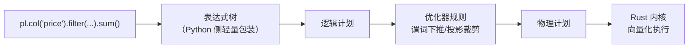

# 第 4 章 表达式系统内核

> 本章要解决什么问题：理解一段表达式代码从写下到执行经历了什么，为什么它能绕开 Python 解释器直达 Rust 向量化内核。

## 4.1 表达式如何被解析为物理计划



- `pl.col('x')` 本身不触发任何计算
- Python 只负责描述，执行完全在 Rust 侧

写下 `pl.col('price') * 1.13` 时，Python 侧发生的只是把一个新节点挂到计算树上——树在生长，数据纹丝不动；操作对象是什么、何时执行，全部只存在于这棵树的描述里。真正的执行发生在 collect：整棵树被一次性翻译成物理计划交给 Rust 内核，而不是每个算子各自进出一次解释器。正因如此，后面几节才能看到同一棵描述树被优化器改写、被跨上下文复用、被整体翻译——"先描述、后执行"是表达式系统一切性质的根源。

```python
import polars as pl

# 表达式是可组合的树
price = pl.col("price")
taxed = price * 1.13
discounted = pl.when(price > 1000).then(price * 0.9).otherwise(price)
# 整棵树在 collect 时一次性翻译执行

df = pl.DataFrame({"price": [1200, 300, 850]})
print(df.select(
    taxed.alias("with_tax"),
    discounted.alias("final"),
))
# shape: (3, 2)
# ┌──────────┬───────┐
# │ with_tax │ final │
# │ ---      │ ---   │
# │ f64      │ f64   │
# ╞══════════╪═══════╡
# │ 1356.0   │ 1080.0│
# │ 339.0    │ 300.0 │
# │ 960.5    │ 850.0 │
# └──────────┴───────┘
```

### 亲眼看两个计划：explain 的优化前后

表达式树在 collect 时被翻译成逻辑计划，经过优化器改写后才生成物理计划。`explain` 能把两个版本都摊开——`pl.QueryOptFlags.none()` 关闭全部优化规则，得到忠实还原代码书写顺序的原始计划；默认 `explain` 给出改写后的版本：

```python
import polars as pl

# 先造一张 12 列的表，让优化空间看得见
N = 100_000
cols = {"user_id": pl.int_range(0, N, dtype=pl.Int64) % 5_000}
for j in range(11):
    cols[f"col_{j:02d}"] = pl.int_range(0, N, dtype=pl.Int64) % 100
pl.select(**cols).write_parquet("orders.parquet")

q = (
    pl.scan_parquet("orders.parquet")
    .filter(pl.col("col_00") > 50)
    .select(["user_id", "col_01"])
)

# 原始计划：FILTER 是 SCAN 之上的独立节点，要读全部 12 列
print(q.explain(optimizations=pl.QueryOptFlags.none()))
# SELECT [col("user_id"), col("col_01")]
#   FILTER (col("col_00") > 50)
#   FROM
#     Parquet SCAN [orders.parquet]
#     PROJECT */12 COLUMNS
#     ESTIMATED ROWS: 100000

# 优化后计划（默认 explain）：FILTER 节点消失了
print(q.explain())
# simple π 2/2 ["user_id", "col_01"]
#   Parquet SCAN [orders.parquet]
#   PROJECT 3/12 COLUMNS
#   SELECTION: col("col_00") > 50
#   ESTIMATED ROWS: 100000
```

同一段表达式代码，两个计划两种执行方式：原始计划里过滤发生在数据全部进入内存之后，且 12 列全读；优化后计划里谓词下推进 SCAN（`SELECTION`——第 3 章的行组跳过正是在这里生效），投影裁剪到 3 列：`user_id`、`col_01` 是结果需要的，`col_00` 是过滤本身需要的。优化器做的事，就是把"忠实翻译"改写成"最少工作量"。

### 表达式的不可变性与复用

表达式对象一旦构建就是**不可变的描述树**：它不属于任何 DataFrame，可以在任意多个上下文里重复使用而不被"消耗"，也不会被意外修改。循环外构建一次、循环内反复引用，是零成本的复用模式：

```python
taxed = pl.col("price") * 1.13          # 构建一次

df_a = pl.DataFrame({"price": [100, 200]})
df_b = pl.DataFrame({"price": [50, 60, 70]})
print(df_a.select(taxed.alias("with_tax")))   # 同一个 taxed 对象
print(df_b.select(taxed.alias("with_tax")))   # 用在两个上下文，互不影响

# 循环外构建、循环内复用：每轮只是把同一棵树交给引擎
frames = [pl.DataFrame({"price": [i, i * 2]}) for i in range(3)]
total = 0.0
for f in frames:
    total += f.select(taxed.sum()).item()
print(round(total, 2))   # 10.17
```

### Expr 是轻量句柄，但不是免费的

Python 侧的 `Expr` 只是指向 Rust 侧表达式树节点的轻量句柄，创建成本以微秒计：

```python
import time

t0 = time.perf_counter()
for _ in range(100_000):
    e = pl.col("price") * 1.13          # 每次循环都新建
t_build = time.perf_counter() - t0

taxed = pl.col("price") * 1.13          # 循环外建一次
t0 = time.perf_counter()
for _ in range(100_000):
    e = taxed                           # 循环内只是引用
t_reuse = time.perf_counter() - t0
print(f"每次新建: {t_build:.3f}s vs 复用: {t_reuse:.3f}s")
# 实测：每次新建 0.141s vs 复用 0.002s —— 单个约 1.4 µs
```

日常几十上百个表达式完全无感；但要警惕在十万次级的热循环里每次重建表达式——累计 0.14 s 的纯构建开销（对照 4.3 节：100 万行的整列乘法才约 1 ms）。表达式是"图纸"不是"工件"：画一次，到处用。

## 4.2 向量化与 SIMD

- 逐元素循环 vs 整列批量指令
- 缓存行一次装载 8 个 Float64

向量化的收益来自两级：指令级——一条 SIMD 指令一次处理一批元素，把逐元素循环的分支与循环开销摊到整批上；内存级——顺序访问让预取器始终有活干，内存等待被计算时间掩盖。下面的对比里 NumPy 同样是向量化的，所以差距并不来自向量化本身，而来自 Polars 把整列切成多个分区、交给线程池并行处理（第 7 章）——单线程向量化是下限，多线程把它抬到接近核数的倍数。

```python
import time

import numpy as np
import polars as pl

N = 50_000_000
a_np = np.random.rand(N)
b_np = np.random.rand(N)

def bench(fn, repeat=5):
    fn()                       # 预热
    t0 = time.perf_counter()
    for _ in range(repeat):
        fn()
    return (time.perf_counter() - t0) / repeat

# NumPy：元素级运算不经过 BLAS 且默认单线程
t_np = bench(lambda: a_np + b_np)

# Polars：向量化 + 多线程分区
sa, sb = pl.Series(a_np), pl.Series(b_np)
t_pl = bench(lambda: sa + sb)
print(f"NumPy {t_np * 1e3:.1f} ms vs Polars {t_pl * 1e3:.1f} ms")
# 典型结果：Polars 快 1~4 倍（取决于核数）
```

### 表达式在上下文中求值

```python
df = pl.DataFrame({
    "user": ["a", "b", "a", "b"],
    "amount": [100, 200, 150, 300],
})

# 同一个表达式，不同上下文，语义不同
df.select(pl.col("amount").sum())           # 全局聚合 → 750
df.with_columns(pl.col("amount").sum().alias("total"))  # 广播 → 每行 750
df.group_by("user").agg(pl.col("amount").sum())  # 分组聚合
```

元素级表达式的独立可组合——每一行的结果只依赖同一行的输入——正是流式引擎逐块执行的基础（第 8 章）。

## 4.3 为什么不经过 Python 解释器

- pandas 的 `df['a'] > 5`：掩码计算也在 NumPy，但复杂链式操作会多次往返
- Polars：一次进入引擎、一次返回结果
- `Series.map_elements`（旧名 `apply`，1.44 已移除）的代价对比（引出第 13 章 UDF 边界）

解释器开销的特点是按次数计费：每次 Python↔Rust 边界穿越都要把数据从连续缓冲区拆成 Python 对象、算完再装回去，单次成本固定、随调用次数线性累积。pandas 的单个操作并不慢——比较与算术同样跑在 NumPy 的 C 内核里——问题出在链式组合：每一步都返回新的中间对象，复杂管道等于在两层表示之间反复搬运，每步物化一份新的临时数组。Polars 的整条链只在进出两端各穿越一次边界，中间全部以原生表达式在引擎内流转；`map_elements` 则相当于主动把边界搬到每一行上，先看正反两面的对照：

```python
# 反面教材：掉进 Python 层
df.with_columns(
    pl.col("amount").map_elements(lambda x: x * 1.13)  # 每行一次 Python 调用
)

# 正面写法：整列在 Rust 内核完成
df.with_columns((pl.col("amount") * 1.13).alias("taxed"))
```

```python
# 亲眼见证差距：100 万行
import time
big = pl.select(x=pl.int_range(0, 1_000_000, dtype=pl.Int64).cast(pl.Float64))

t0 = time.perf_counter()
big.select(pl.col("x") * 2)
t_expr = time.perf_counter() - t0          # 典型值：~1 ms

t0 = time.perf_counter()
big.select(pl.col("x").map_elements(lambda v: v * 2))
t_udf = time.perf_counter() - t0           # 典型值：~300 ms
print(f"表达式快 {t_udf / t_expr:.0f} 倍")
```

## 要点回顾

- 表达式 = 声明式计算描述，执行在 Rust 向量化内核
- Python/解释器开销被摊薄到一次性进出
- 同一表达式在不同上下文（select/with_columns/group_by）语义不同

## 性能检查清单

- [ ] 热点路径是否全部由表达式完成而非逐行 apply？
- [ ] 是否避免了循环中反复构建小表达式？
- [ ] `map_elements` 是否只用在确无原生表达式的场景？

## 练习

1. **表达式组合**：只用一个 `select()` 调用，同时计算 `price` 列的含税价（×1.13）、折扣价（>1000 打九折）、以及对数价格（`log`），三个结果分别命名。
2. **上下文语义**：对同一 DataFrame 分别在 `select`、`with_columns`、`group_by().agg()` 中求 `pl.col("x").mean()`，写出三个输出的 shape 并解释差异。
3. **性能实测**：复现 4.3 节的 100 万行对比（表达式 vs `map_elements`），在你的机器上记录倍数差距，并把 `map_elements` 的 lambda 换成等效 NumPy 向量化写法再测一次。
