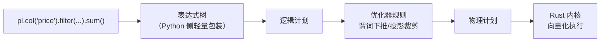

# 第 4 章 表达式系统内核

> 本章要解决什么问题：理解一段表达式代码从写下到执行经历了什么，为什么它能绕开 Python 解释器直达 Rust 向量化内核。

## 4.1 表达式如何被解析为物理计划



- `pl.col('x')` 本身不触发任何计算
- Python 只负责描述，执行完全在 Rust 侧

```python
import polars as pl

# 表达式是可组合的树
price = pl.col("price")
taxed = price * 1.13
discounted = pl.when(price > 1000).then(price * 0.9).otherwise(price)
# 整棵树在 collect 时一次性翻译执行

df = pl.DataFrame({"price": [1200, 300, 850]})
print(df.select(
    taxed.alias("with_tax"),
    discounted.alias("final"),
))
# shape: (3, 2)
# ┌──────────┬───────┐
# │ with_tax │ final │
# │ ---      │ ---   │
# │ f64      │ f64   │
# ╞══════════╪═══════╡
# │ 1356.0   │ 1080.0│
# │ 339.0    │ 300.0 │
# │ 960.5    │ 850.0 │
# └──────────┴───────┘
```

## 4.2 向量化与 SIMD

- 逐元素循环 vs 整列批量指令
- 缓存行一次装载 8 个 Float64

```python
import time

import numpy as np
import polars as pl

N = 50_000_000
a_np = np.random.rand(N)
b_np = np.random.rand(N)

def bench(fn, repeat=5):
    fn()                       # 预热
    t0 = time.perf_counter()
    for _ in range(repeat):
        fn()
    return (time.perf_counter() - t0) / repeat

# NumPy：元素级运算不经过 BLAS 且默认单线程
t_np = bench(lambda: a_np + b_np)

# Polars：向量化 + 多线程分区
sa, sb = pl.Series(a_np), pl.Series(b_np)
t_pl = bench(lambda: sa + sb)
print(f"NumPy {t_np * 1e3:.1f} ms vs Polars {t_pl * 1e3:.1f} ms")
# 典型结果：Polars 快 1~4 倍（取决于核数）
```

### 表达式在上下文中求值

```python
df = pl.DataFrame({
    "user": ["a", "b", "a", "b"],
    "amount": [100, 200, 150, 300],
})

# 同一个表达式，不同上下文，语义不同
df.select(pl.col("amount").sum())           # 全局聚合 → 750
df.with_columns(pl.col("amount").sum().alias("total"))  # 广播 → 每行 750
df.group_by("user").agg(pl.col("amount").sum())  # 分组聚合
```

元素级表达式的独立可组合——每一行的结果只依赖同一行的输入——正是流式引擎逐块执行的基础（第 8 章）。

## 4.3 为什么不经过 Python 解释器

- pandas 的 `df['a'] > 5`：掩码计算也在 NumPy，但复杂链式操作会多次往返
- Polars：一次进入引擎、一次返回结果
- `Series.apply` 的代价对比（引出第 13 章 UDF 边界）

```python
# 反面教材：掉进 Python 层
df.with_columns(
    pl.col("amount").map_elements(lambda x: x * 1.13)  # 每行一次 Python 调用
)

# 正面写法：整列在 Rust 内核完成
df.with_columns((pl.col("amount") * 1.13).alias("taxed"))
```

```python
# 亲眼见证差距：100 万行
import time
big = pl.select(x=pl.int_range(0, 1_000_000, dtype=pl.Int64).cast(pl.Float64))

t0 = time.perf_counter()
big.select(pl.col("x") * 2)
t_expr = time.perf_counter() - t0          # 典型值：~1 ms

t0 = time.perf_counter()
big.select(pl.col("x").map_elements(lambda v: v * 2))
t_udf = time.perf_counter() - t0           # 典型值：~300 ms
print(f"表达式快 {t_udf / t_expr:.0f} 倍")
```

## 要点回顾

- 表达式 = 声明式计算描述，执行在 Rust 向量化内核
- Python/解释器开销被摊薄到一次性进出
- 同一表达式在不同上下文（select/with_columns/group_by）语义不同

## 性能检查清单

- [ ] 热点路径是否全部由表达式完成而非逐行 apply？
- [ ] 是否避免了循环中反复构建小表达式？
- [ ] `map_elements` 是否只用在确无原生表达式的场景？

## 练习

1. **表达式组合**：只用一个 `select()` 调用，同时计算 `price` 列的含税价（×1.13）、折扣价（>1000 打九折）、以及对数价格（`log`），三个结果分别命名。
2. **上下文语义**：对同一 DataFrame 分别在 `select`、`with_columns`、`group_by().agg()` 中求 `pl.col("x").mean()`，写出三个输出的 shape 并解释差异。
3. **性能实测**：复现 4.3 节的 100 万行对比（表达式 vs `map_elements`），在你的机器上记录倍数差距，并把 `map_elements` 的 lambda 换成等效 NumPy 向量化写法再测一次。
