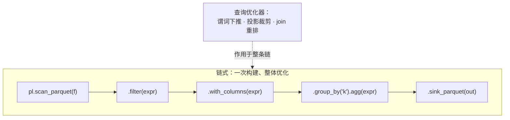

# 第 5 章 链式调用与表达式组合

> 本章要解决什么问题：建立方法链心智模型——为什么链式优于逐步赋值、如何组合与复用表达式、哪些写法会悄悄打断优化。

## 5.1 方法链心智模型



- 逐步赋值：每个中间 DataFrame 都物化一次
- 链式：一次构建、整体优化

差别不在语法而在执行时机：Eager 的每个方法调用都同步执行并返回一张全宽新表，逐步赋值因此每步都物化一份接近全量的副本；链式构建的只是一棵计划树，执行推迟到 `collect` 一次完成，谓词下推、投影裁剪这类重写都发生在引擎看到整条链之后。实测（polars 1.44.1，Apple M3，1000 万行 × 8 列订单表：内存态全表 640 MB、落盘 33 MB，页缓存热、预热后 3 次取最优）：三步赋值 0.076 s，scan 加一条链 0.020 s，约 3.8 倍。差距主要来自投影裁剪——链式计划知道终点只需要两列，扫描层只解码 2/8 列；给逐步赋值手动补上"只读两列"，耗时立刻降到 0.021 s，几乎追平。也就是说，这个量级下三次物化的代价主要记在内存账上：I/O 差距被页缓存掩盖（文件小到整个驻留缓存），576/648 MB 的中间副本对耗时的贡献也被内存带宽摊薄，但它们真实存在——数据再大几倍，这笔账就从秒表上的小数变成 OOM 边界。

### 逐步赋值 vs 链式

```python
import polars as pl

# 逐步赋值：三次物化，三次全量扫描
df = pl.read_parquet("orders.parquet")
df = df.filter(pl.col("amount") > 100)
df = df.with_columns(taxed=pl.col("amount") * 1.13)
df = df.select(["user_id", "taxed"])

# 链式 + scan：一次优化一次执行
result = (
    pl.scan_parquet("orders.parquet")
      .filter(pl.col("amount") > 100)
      .with_columns(taxed=pl.col("amount") * 1.13)
      .select(["user_id", "taxed"])
      .collect()
)
```

用 `explain()` 验证：链式版本中 filter 被下推到扫描层，只有 `user_id`、`amount` 两列被读取。

## 5.2 表达式组合与复用

```python
# 表达式是普通 Python 对象，可存为变量、函数化封装
zscore = lambda c: (pl.col(c) - pl.col(c).mean()) / pl.col(c).std()

df.with_columns(zscore("amount").alias("amount_z"))

# 更严谨的函数化封装（带类型提示，可复用于任何数值列）
def winsorize(name: str, p: float = 0.01) -> pl.Expr:
    """截尾到 [p, 1-p] 分位区间，抑制极端值"""
    col = pl.col(name)
    return col.clip(
        col.quantile(p, interpolation="linear"),
        col.quantile(1 - p, interpolation="linear"),
    )

df.with_columns(winsorize("amount"))
```

- 表达式变量复用
- 函数化封装常用表达式模式
- `pipe` 拼接自定义步骤到链中

三种手段对应三种复用粒度，成立的前提相同：表达式是描述计算的普通 Python 对象而非结果，存成变量或函数只是让同一份逻辑有唯一的定义点——改一处，所有查询同步生效，还顺带得到可单独测试的单元。`pipe` 把复用粒度从"一列怎么算"抬到"一段管道做什么"：自定义步骤接收并返回 LazyFrame，拼进链后仍是同一棵计划树，惰性边界不被打断。复用全部发生在构建期，执行期零成本——优化器看到的仍是展开后的完整表达式，与手写展开别无二致。

```python
# pipe：把"对 LazyFrame 的变换"也函数化
def add_calendar_features(lf: pl.LazyFrame) -> pl.LazyFrame:
    return lf.with_columns(
        dow=pl.col("ts").dt.weekday(),
        is_weekend=pl.col("ts").dt.weekday() > 5,
    )

result = (
    pl.scan_parquet("orders.parquet")
      .pipe(add_calendar_features)   # 像内置方法一样拼进链里
      .group_by(["dow", "is_weekend"])
      .agg(pl.len().alias("n"))
      .collect()
)
```

## 5.3 多行链式的可读性写法

```python
result = (
    pl.scan_parquet("data.parquet")
    .filter(pl.col("date") >= start)
    .with_columns(amount_cents=pl.col("amount") * 100)
    .group_by("user_id")
    .agg(pl.col("amount_cents").sum().alias("total"))
    .sort("total", descending=True)
    .collect()
)
```

- 括号包裹 + 每步一行 + 别名即文档
- 与 pandas 链式（`assign`/`query`）对比：pandas 链式无法被整体优化

排版约定的目的只有一个：让数据自上而下流过每一步，`alias` 充当行内文档，读者不必跳回定义处对照列义。pandas 也能用 `assign`/`query` 写出同样整洁的链，但每个方法调用都立即执行、立即返回一张全宽新表——相邻两步之间不存在"尚未执行的计划"，自然也没有查询优化器能在其上做谓词下推或投影裁剪。Polars 的链在 collect 之前只是一棵计划树，下推与裁剪发生在引擎看到整条链之后，这是整洁之外链式在 Polars 里的真正红利。

## 5.4 反模式：打断链式优化

```python
# 反模式 1：链中夹带 collect —— 强制物化，优化器失去全局视图
lf = pl.scan_parquet("big.parquet").filter(pl.col("a") > 1)
df_mid = lf.collect()                    # ❌ 全量物化
result = df_mid.group_by("k").agg(pl.len())

# 正确：一路惰性到底
result = (pl.scan_parquet("big.parquet")
            .filter(pl.col("a") > 1)
            .group_by("k")
            .agg(pl.len())
            .collect())                  # ✅ 只在最终边界 collect 一次

# 反模式 2：链中夹带 UDF —— 谓词无法下推到扫描层
(pl.scan_parquet("big.parquet")
   .with_columns(pl.col("x").map_elements(complex_fn))  # ❌ 断流
   .filter(pl.col("x") > 0))

# 正确：先 filter 再 UDF，把过滤下推到读取阶段
(pl.scan_parquet("big.parquet")
   .filter(pl.col("x") > 0)              # ✅ 可下推的谓词放前面
   .with_columns(pl.col("x").map_elements(complex_fn)))
```

## 要点回顾

- 链式调用不是语法糖，是整体优化的前提
- 表达式可变量化、函数化、pipe 化复用
- collect 只出现在管道终点

## 性能检查清单

- [ ] 链中是否有 collect/UDF 断点？
- [ ] 重复表达式模式是否已函数化封装？
- [ ] 管道是否用 `pipe` 组合出了可测试的步骤？
- [ ] 用 `explain()` 确认过整条链的最终计划？

## 练习

1. **反模式修复**：把 5.4 节"链中夹带 collect"的反例改写为全程惰性的正确版本，用 `explain()` 对比两份计划的区别。
2. **表达式函数库**：为"计算列的同比/环比增速"封装一个可复用的表达式函数 `growth(name, n)`，返回相对 n 期前的变化率，并在两个不同列上复用它。
3. **pipe 重构**：把一条五步以上的清洗管道拆成三个 `LazyFrame → LazyFrame` 的函数，用 `pipe` 串联，保证最终 `explain()` 的计划与未拆分时一致。
