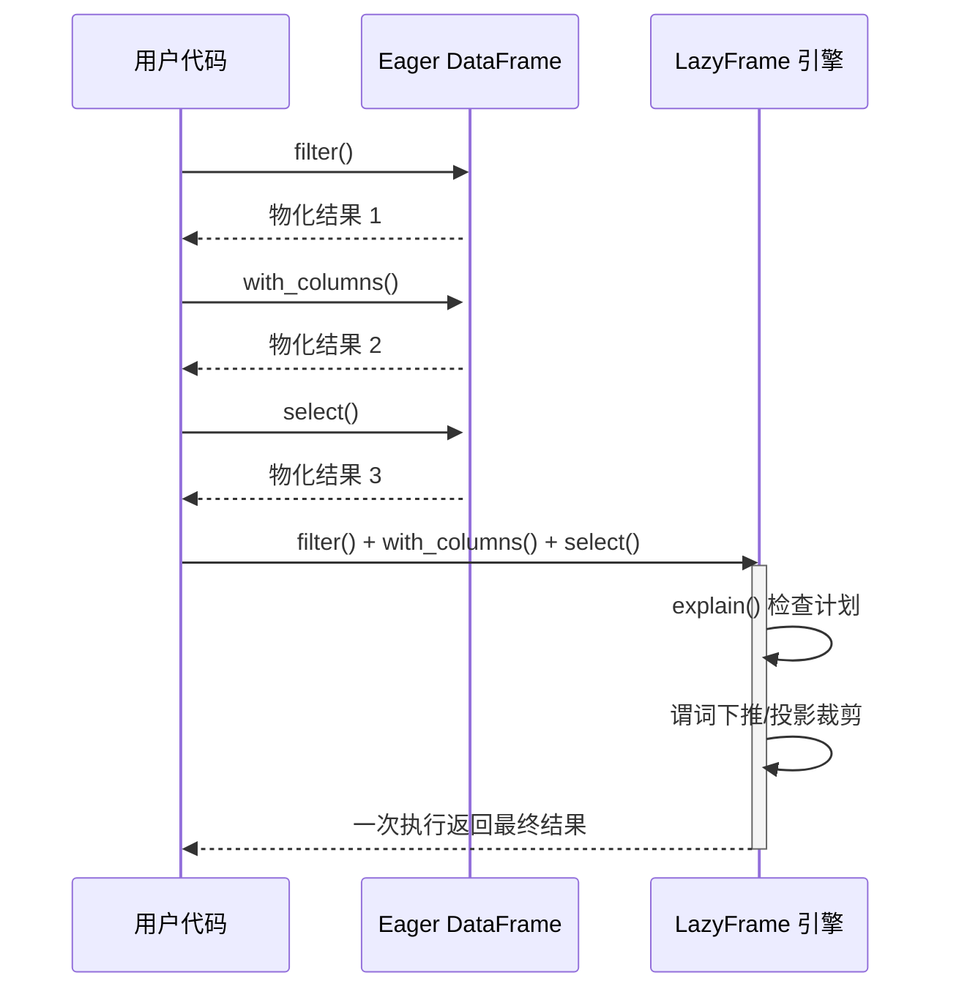

# 第 6 章 Eager vs Lazy

> 本章要解决什么问题：掌握两种执行模式的本质差异，学会读查询计划、预判优化器行为。

## 6.1 两种模式执行时序对比



- Eager：每步物化，适合探索式小数据交互
- Lazy：一次优化一次执行，适合生产管道

```python
import polars as pl

# Eager：DataFrame 每步都真的执行
df = pl.read_parquet("orders.parquet")
df.filter(pl.col("amount") > 100)        # 立即执行，分配内存
df.with_columns(taxed=pl.col("amount") * 1.13)  # 又立即执行

# Lazy：LazyFrame 只记录计划
lf = pl.scan_parquet("orders.parquet")
lf2 = lf.filter(pl.col("amount") > 100)      # 什么都不发生
lf3 = lf2.with_columns(taxed=pl.col("amount") * 1.13)  # 还是什么都不发生
result = lf3.collect()                        # 此刻才读取+优化+执行
```

## 6.2 读取查询计划

```python
(pl.scan_parquet("data.parquet")
   .filter(pl.col("a") > 5)
   .select(["a", "b"])
   .explain())
# 典型输出：
# Parquet SCAN [data.parquet]
# PROJECT 2/5 COLUMNS      ← 投影裁剪：5 列只读 2 列
# SELECTION: col("a") > 5  ← 谓词下推：过滤发生在扫描层
# ESTIMATED ROWS: 1000
```

- 学会看 `SELECTION`、`PROJECT` 节点

## 6.3 优化规则

- 谓词下推（filter 下推到扫描层）
- 投影裁剪（只读用到的列）
- join 重排（小表构建哈希）
- 优化开关：`optimizations=pl.QueryOptFlags(...)`

```python
# 观察 filter 下推如何跨 join 移动：大表 join 小表
orders = pl.scan_parquet("orders.parquet")     # 大表
users = pl.scan_parquet("users.parquet")       # 小表

print((orders
   .join(users, on="k")
   .filter(pl.col("amount") > 100)
   .explain()))
# 典型输出：
# INNER JOIN:
#   LEFT PLAN ON: [col("k")]
#     Parquet SCAN [orders.parquet]
#     PROJECT */2 COLUMNS
#     SELECTION: col("amount") > 100   ← filter 已下推到 orders 扫描层
#   RIGHT PLAN ON: [col("k")]
#     Parquet SCAN [users.parquet]
# END INNER JOIN
```

```python
# 关闭优化对比（理解优化器做了什么）
lf = pl.scan_parquet("data.parquet").filter(pl.col("a") > 5)
print(lf.explain())                             # 带优化
print(lf.explain(optimizations=pl.QueryOptFlags.none()))  # 原始计划
```

## 6.4 什么时候用 Eager

- 数据很小（几百 MB 以内）、交互式探索
- 需要反复 `head()` 查看中间结果
- 其余场景一律 Lazy：`scan_*` 开头，`collect()`/`sink_*` 结尾

## 要点回顾

- 生产管道一律 Lazy，探索分析可 Eager
- explain 是最直接的性能工具
- 优化器的三大常见动作：谓词下推、投影裁剪、join 重排

## 性能检查清单

- [ ] 是否将 read 换成 scan？
- [ ] 用 explain 验证过谓词已下推？
- [ ] 是否读入了从未使用的列？
- [ ] collect 是否只出现在管道终点？
- [ ] 是否用 `QueryOptFlags.none()` 对比过优化前后计划？

## 练习

1. **计划对比**：构造 `scan → join → filter → select` 的链，分别用默认优化与 `QueryOptFlags.none()` 打印计划，圈出被下推/重排的节点。
2. **物化计数**：把 6.1 节的 Eager 三步操作改为给每步中间结果记录 `estimated_size()` 与行数，统计中间物化的总量；再用 Lazy 版本跑一次，对比两者处理的总量差异。
3. **思考题**：什么情况下 Eager 反而比 Lazy 快？（提示：数据已在内存且反复交互查看中间结果时，优化本身的成本）
