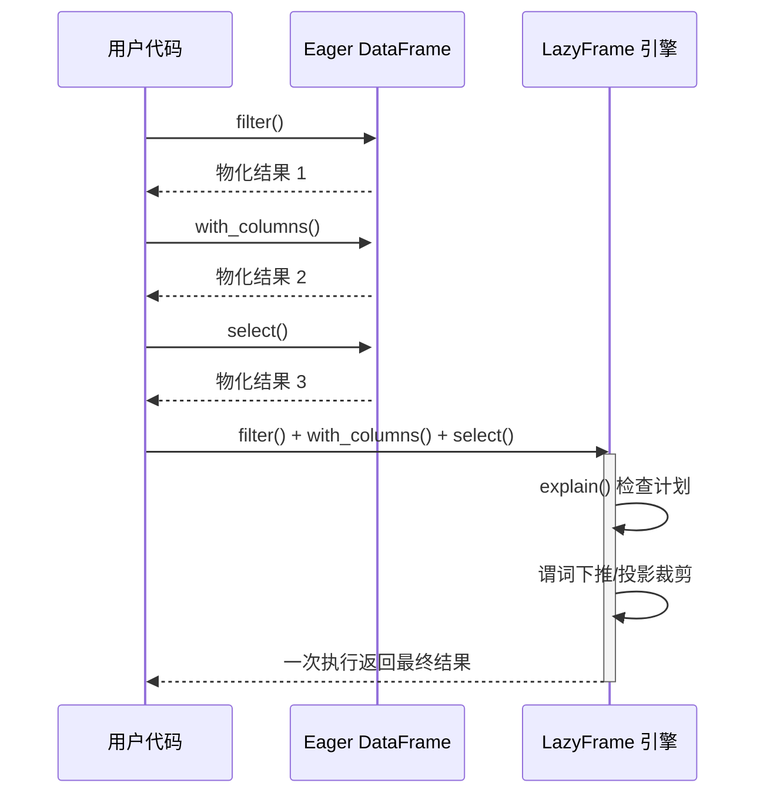

# 第 6 章 Eager vs Lazy

> 本章要解决什么问题：掌握两种执行模式的本质差异，学会读查询计划、预判优化器行为。

## 6.1 两种模式执行时序对比



- Eager：每步物化，适合探索式小数据交互
- Lazy：一次优化一次执行，适合生产管道

分野在调用语义而不在 API 外观：Eager 的每个方法都同步执行并返回真实数据，任何一步的中间结果都能立刻 `head()` 查看、画图、喂给其他库——这是交互探索的刚需，代价是每步一份全量物化；Lazy 的每个方法只是往计划树里追加一个节点，直到 collect 才真正读取、优化、执行，中间结果只在引擎内部流转，从不作为完整对象现身。本质上这是一笔交换：Eager 用内存与重复遍历换"步步可见"，Lazy 用"只在终点可见"换整链优化——数据越大，物化与 I/O 占比越高，这笔交换就越划算。

```python
import polars as pl

# Eager：DataFrame 每步都真的执行
df = pl.read_parquet("orders.parquet")
df.filter(pl.col("amount") > 100)        # 立即执行，分配内存
df.with_columns(taxed=pl.col("amount") * 1.13)  # 又立即执行

# Lazy：LazyFrame 只记录计划
lf = pl.scan_parquet("orders.parquet")
lf2 = lf.filter(pl.col("amount") > 100)      # 什么都不发生
lf3 = lf2.with_columns(taxed=pl.col("amount") * 1.13)  # 还是什么都不发生
result = lf3.collect()                        # 此刻才读取+优化+执行
```

一个直观的量级对比（1000 万行订单，统计每用户首单金额）：

```python
n = 10_000_000
orders = pl.select(
    user=pl.int_range(0, n) % 1_000_000,
    ts=pl.int_range(0, n),
    amount=(pl.int_range(0, n) % 500 + 1).cast(pl.Float64),
).with_columns(first=pl.col("ts") == pl.col("ts").min().over("user"))

# Eager：每次 filter/sort 都物化一份新 DataFrame（约 150 MB/份）
step1 = orders.filter(pl.col("first"))                       # 物化 1
print("中间物化:", round(step1.estimated_size() / 1e6), "MB")

# Lazy：filter 与 group_by 在同一计划中统筹，中间结果只在引擎内部流转
lazy = (
    orders.lazy()
    .filter(pl.col("first"))
    .group_by("user").agg(pl.col("amount").sum())
    .collect()
)
```

## 6.2 读取查询计划

`explain()` 是 Lazy 模式最重要的"仪表盘"。学会逐行读它：

```python
(pl.scan_parquet("data.parquet")
   .filter(pl.col("a") > 5)
   .select(["a", "b"])
   .explain())
# 典型输出：
# Parquet SCAN [data.parquet]
# PROJECT 2/5 COLUMNS      ← 投影裁剪：5 列只读 2 列
# SELECTION: col("a") > 5  ← 谓词下推：过滤发生在扫描层
# ESTIMATED ROWS: 1000
```

逐行解读要点：

| 计划节点 | 含义 | 需要警惕的信号 |
|---|---|---|
| `Parquet SCAN [...]` | 数据源与文件列表 | 文件数是否比预期多（分区裁剪失败） |
| `PROJECT n/m COLUMNS` | 投影裁剪后的读取列 | `PROJECT */m` 表示全列读取——是否有列其实用不到 |
| `SELECTION: ...` | 下推到扫描层的过滤 | 你的 filter 若出现在独立 `FILTER` 节点而非 SELECTION，说明下推失败 |
| `ESTIMATED ROWS` | 优化器估算行数 | 与实际量级差一个数量级以上时，执行策略可能失真 |

> 计划自底向上读：最内层（缩进最深）是数据源，最外层是最后执行的操作。

## 6.3 优化规则

优化器在 `collect()` 触发时重写计划。五条最值得掌握的规则：

### 1. 谓词下推（predicate pushdown）

filter 尽量移到扫描层，让存储引擎跳过无关数据（Parquet 行组统计甚至能整块跳过）。

```python
# 观察 filter 下推如何跨 join 移动：大表 join 小表
# orders.parquet 为第 4 章生成的 12 列订单表；users 为 3 列维表
orders = pl.scan_parquet("orders.parquet")     # 大表
users = pl.scan_parquet("users.parquet")       # 小表

print((orders
   .join(users, on="user_id")
   .filter(pl.col("amount") > 100)
   .explain()))
# 实测输出（polars 1.44.1）：
# INNER JOIN:
# LEFT PLAN ON: [col("user_id")]
#   Parquet SCAN [orders.parquet]
#   PROJECT */12 COLUMNS
#   SELECTION: col("amount") > 100   ← filter 已下推到 orders 扫描层
#   ESTIMATED ROWS: 100000
# RIGHT PLAN ON: [col("user_id")]
#   Parquet SCAN [users.parquet]
#   PROJECT */3 COLUMNS
#   ESTIMATED ROWS: 3
# END INNER JOIN
```

注意：filter 写在 join 之前还是之后，优化后计划**往往相同**——这正是 Lazy 的价值，你可以按业务逻辑组织代码，让优化器负责执行顺序。

### 2. 投影裁剪（projection pushdown）

只读用到的列。列式存储的直接红利：12 列的 Parquet 只取 2 列，I/O 近似降为 1/6。

### 3. 切片下推（slice pushdown）

`head()` / `limit()` 也能下推——扫描层只读前 N 行：

```python
(pl.scan_parquet("data.parquet")
   .filter(pl.col("a") > 5)
   .head(100)
   .explain())
# SLICE[offset: 0, len: 100]        ← 切片下推：不读全量再截断
#   Parquet SCAN [data.parquet]
#   PROJECT */3 COLUMNS
#   SELECTION: col("a") > 5
```

交互式探索 `lf.head(5).collect()` 因此几乎是零成本的——**不需要为了"看一眼"而加载全量数据**。

### 4. 公共子表达式消除（common subexpression elimination）

同一个表达式出现多次时，只计算一次：

```python
(pl.scan_parquet("data.parquet")
   .with_columns(
       x=pl.col("a") * 2 + 1,
       y=(pl.col("a") * 2 + 1) + 10,   # 与 x 共享子表达式
   )
   .explain())
# WITH_COLUMNS:
# [col("__POLARS_CSER_...").alias("x"), (col("__POLARS_CSER_...") + 10).alias("y")]
#   WITH_COLUMNS:
#   [((col("a") * 2) + 1).alias("__POLARS_CSER_...")]  ← 只算一次，两处复用
#     Parquet SCAN [data.parquet]
```

`__POLARS_CSER_` 前缀的临时列就是消除后的共享结果。手写 `pl.col("a") * 2 + 1` 复用一个变量再引用，与让优化器自动消除，效果等价。

### 5. join 重排与哈希侧选择

多表 join 时优化器会基于估算行数决定构建哈希表的一侧（小表建哈希更省内存）。这依赖统计估算——极端倾斜数据下估算可能失真，这时用 `ESTIMATED ROWS` 排查。

### 优化开关：QueryOptFlags

```python
# 对比优化前后（理解优化器做了什么的最快途径）
lf = pl.scan_parquet("data.parquet").filter(pl.col("a") > 5)
print(lf.explain())                             # 带优化
print(lf.explain(optimizations=pl.QueryOptFlags.none()))  # 原始计划
```

常用开关（`QueryOptFlags(...)` 逐项控制）：

| 开关 | 控制内容 |
|---|---|
| `predicate_pushdown` | 谓词下推 |
| `projection_pushdown` | 投影裁剪 |
| `slice_pushdown` | 切片下推 |
| `comm_subexpr_elim` | 公共子表达式消除 |
| `comm_subplan_elim` | 重复子计划复用（同一条链被 join 两侧引用时） |
| `simplify_expression` | 常量折叠等表达式化简 |
| `cluster_with_columns` | 相邻 with_columns 合并 |

> 排查性能问题时，`QueryOptFlags.none()` 能看到"你写的计划"；默认 explain 看到的是"引擎要跑的计划"。两者差异就是优化器的工作量。

## 6.4 什么时候用 Eager

| 场景 | 推荐 | 理由 |
|---|---|---|
| 交互式探索、反复 `head()` 看中间结果 | Eager 可接受 | 数据已物化，反复查看无额外成本 |
| 数据 < 几百 MB | 均可 | 优化收益小于优化本身的调度成本 |
| 生产管道、批处理 | 一律 Lazy | 谓词下推/投影裁剪直接决定 I/O 量 |
| 超过内存的数据 | 必须 Lazy | 流式引擎（第 8 章）只作用于 LazyFrame |
| 中间结果要喂给非 Polars 库 | Lazy 到该点 collect | 物化边界即优化边界 |

经验法则：**`scan_*` 开头，`collect()`/`sink_*` 结尾**，中间不出现第二个 collect。

## 要点回顾

- 生产管道一律 Lazy，探索分析可 Eager；物化边界（collect）即优化边界
- explain 自底向上读：SCAN → SELECTION/PROJECT → 上层操作
- 五条核心规则：谓词下推、投影裁剪、切片下推、公共子表达式消除、join 重排
- `QueryOptFlags.none()` 对比是理解优化器行为的最快途径

## 性能检查清单

- [ ] 是否将 read 换成 scan？
- [ ] 用 explain 验证过谓词已下推（SELECTION 而非独立 FILTER 节点）？
- [ ] 是否读入了从未使用的列（`PROJECT */n` 是信号）？
- [ ] collect 是否只出现在管道终点？
- [ ] 是否用 `QueryOptFlags.none()` 对比过优化前后计划？
- [ ] head() 探索是否利用了切片下推（而非 read 全量再截断）？

## 练习

1. **计划对比**：构造 `scan → join → filter → select` 的链，分别用默认优化与 `QueryOptFlags.none()` 打印计划，圈出被下推/重排的节点。
2. **物化计数**：把 6.1 节的 Eager 三步操作改为给每步中间结果记录 `estimated_size()` 与行数，统计中间物化的总量；再用 Lazy 版本跑一次，对比两者处理的总量差异。
3. **切片下推验证**：对 `scan_parquet` 链式调用 `.head(100)`，用 explain 确认 `SLICE` 节点出现在扫描层；再对比 `pl.read_parquet(...).head(100)`，讨论两者的读取量差异。
4. **思考题**：什么情况下 Eager 反而比 Lazy 快？（提示：数据已在内存且反复交互查看中间结果时，优化本身的成本）
