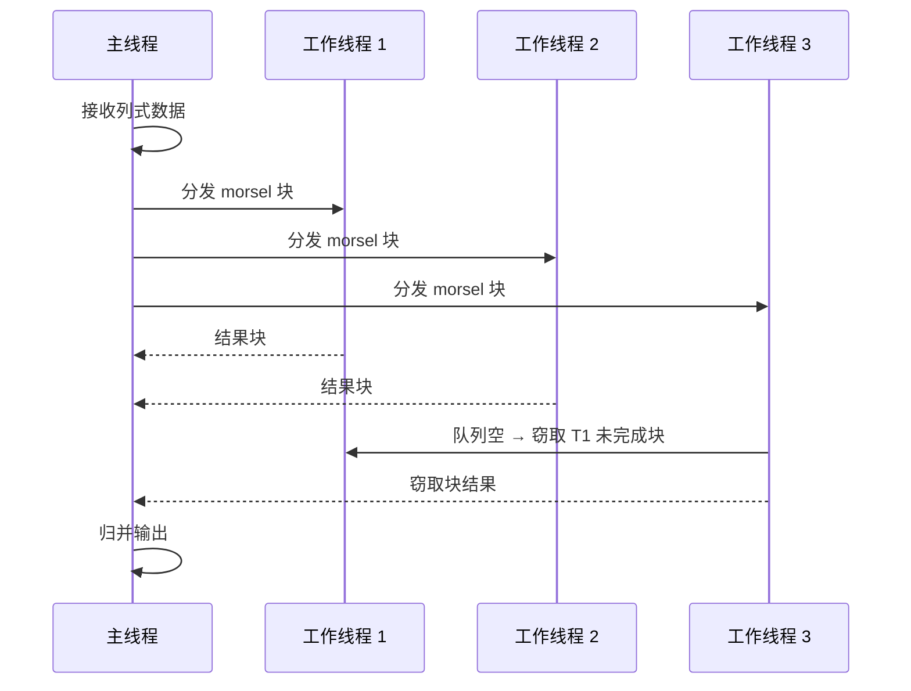

# 第 7 章 并行与多线程模型

> 本章要解决什么问题：理解 Polars 如何利用多核——Rayon 调度、morsel-driven 并行，以及为什么 GIL 在这里不是瓶颈。

## 7.1 线程池与 Rayon 工作窃取



- Rayon：work-stealing 调度器，自动负载均衡
- `pl.thread_pool_size()` 查看与控制

```python
import polars as pl
print(pl.thread_pool_size())   # 例如 10 —— 默认取 OS 可用并行度（通常是逻辑核数）

# 感受并行度带来的收益：1 亿行聚合
import time

N = 100_000_000
# int_range 只接受整数 dtype，转 Float64 需要显式 cast
df = pl.select(x=pl.int_range(0, N, dtype=pl.Int64).cast(pl.Float64))

t0 = time.perf_counter()
df.select(pl.col("x").sum())
print(f"并行 sum: {time.perf_counter() - t0:.3f}s")
# 改变线程数后对比（需重启进程）：
# POLARS_MAX_THREADS=1 python bench.py   # 单线程
# POLARS_MAX_THREADS=4 python bench.py   # 4 线程
```

## 7.2 morsel-driven 并行

- 数据切成小块（morsel）而非按行分发
- 与操作系统页缓存对齐

### morsel：数据流过算子链，而不是算子等全表

Polars 把数据切成十万行量级的列式小块（morsel），它是并行与调度的基本单位。关键在于：**每个 morsel 独立地流过整条算子链**——扫描产出一个 morsel，立刻交给 filter，过滤完交给 with_columns，再进入聚合的局部累加器，全程不必等其他 morsel。这是流水线并行，与 MapReduce 式的阶段屏障形成对照：MapReduce 中 map 全部完成、中间结果落盘排序之后 reduce 才能开始，任何一步都要等上一步的全表；morsel 模型没有全局屏障，扫描还在解码最后几个行组时，最早的 morsel 已经被过滤、变换、聚完了。同一批线程同时活跃在流水线的不同位置，数据像传送带上的零件流过工位，而不是整批零件在每个工位间来回搬运。

```python
# morsel 粒度由引擎自动决定，但能从行为上观察它
# filter 这类逐行无状态操作天然可并行——每个 morsel 独立处理
big = pl.scan_parquet("big.parquet")
(big.filter(pl.col("a") > 0)
    .select(pl.col("a").sum())
    .collect())
# 扫描、过滤、求和全部按 morsel 并行，无全局屏障
```

### 实测：流水线 vs 分步物化

2000 万行 × 7 列的表（乘法散列制造近似随机、低压缩性的数据，落盘 213 MB）。同一条 `filter → with_columns → sum` 链，一次 collect 与拆三次 collect 对比：

```python
import time

import polars as pl

N = 20_000_000
pl.select(x=pl.int_range(0, N, dtype=pl.Int64)).with_columns(
    **{f"c{j}": (pl.col("x") * 2654435761 + j * 40503) % 1_000_007 for j in range(6)}
).write_parquet("big.parquet")

# 一条惰性管道：每个 morsel 流过整条链，一次 collect
lf = (
    pl.scan_parquet("big.parquet")
    .filter(pl.col("x") % 2 == 0)          # 1000 万行
    .with_columns(z=pl.col("c0") * 2)
    .select(pl.col("z").sum())
)
lf.collect()                                # 预热
t0 = time.perf_counter()
lf.collect()
t_pipe = time.perf_counter() - t0

# 拆成三次独立 collect：每步物化一个完整中间结果
t0 = time.perf_counter()
s1 = pl.scan_parquet("big.parquet").filter(pl.col("x") % 2 == 0).collect()
s2 = s1.lazy().with_columns(z=pl.col("c0") * 2).collect()
s3 = s2.lazy().select(pl.col("z").sum()).collect()
t_steps = time.perf_counter() - t0

print(f"流水线: {t_pipe:.3f}s  分步物化: {t_steps:.3f}s")
print(f"中间物化: s1={s1.estimated_size()/1e6:.0f}MB, s2={s2.estimated_size()/1e6:.0f}MB")
# 实测（Apple Silicon，页缓存热，预热后 3 次取最优）：
# 流水线: 0.056s   分步物化: 0.184s（3.3 倍）
# 中间物化: s1=560MB, s2=640MB —— 流水线版里这两个中间结果从未整体存在过
```

3.3 倍的差距来自两处叠加，而两处都是"整条链作为一个查询执行"的直接后果：

- **列裁剪**：管道版知道下游只需要 `x` 和 `c0`，7 列只读 2 列（`explain()` 可见 `PROJECT 2/7 COLUMNS`）；分步版的第一步是独立查询，不知道后面要用什么，只能物化全部 7 列（560 MB）
- **无中间物化**：每个 morsel 直达聚合，千万行的中间结果从未作为整体存在；分步版则完整写出 s1、s2 再逐个读回

即使帮分步版手动裁到同样的 2 列（第一步加 `.select(["x", "c0"])`），实测仍要 0.063 s（约 1.1 倍）——剩下的差距就是纯粹的多次遍历与物化成本。时间差距会被页缓存掩盖一部分，**内存占用却从不缺席**：160 + 240 MB 的中间结果必须完整驻留，表再大几倍，就是 OOM 与否的差别（第 8 章的流式引擎把这条路线走到极致）。

### morsel 大小：引擎决定，你只管对齐

morsel 大小由引擎根据数据量与算子特性自动决定，不可直接配置、通常也不需要配置。写入侧能做的是让 `row_group_size`（第 3 章）与 morsel 的量级匹配：行组是 I/O 与解码的并行单元，十万到百万行的行组让一次解码的产出能被 morsel 流水线顺畅消化——默认值已在这个量级，大表显式设置更稳。

## 7.3 GIL 为何不是瓶颈

- 执行在 Rust 侧，释放 GIL
- 只在 collect 边界回到 Python

```python
# GIL 边界示意：Python 负责描述，Rust 负责执行
result = (
    pl.scan_parquet("big.parquet")   # Python：只是记账
      .group_by("k")                # Python：还是记账
      .agg(pl.len())                # Python：依然是记账
      .collect()                     # ← 唯一的边界：进 Rust，释放 GIL，多线程执行
)
```

这带来一个重要推论：**在 Polars 执行期间，你可以同时运行其他 Python 任务**（如 I/O），两者互不阻塞。

## 7.4 线程数控制

- 环境变量 `POLARS_MAX_THREADS`
- 与其他进程竞争 CPU 时的隔离策略

```bash
# 必须在 import polars 之前设置
export POLARS_MAX_THREADS=8
python pipeline.py
```

```python
# 典型场景：容器配额 4 核，但机器 64 核
# 不设置 → Polars 默认用 64 线程 → 严重过订阅 → 上下文切换淹没收益
# 对策：cgroup 感知地显式设置
import os
os.environ["POLARS_MAX_THREADS"] = "4"  # 必须在 import polars 前
import polars as pl
print(pl.thread_pool_size())  # 4
```

## 7.5 过度并行的陷阱

```python
# ❌ 反模式：进程池 × Polars 线程池 = 线程爆炸
from concurrent.futures import ProcessPoolExecutor

def process(path: str):
    return pl.scan_parquet(path).group_by("k").agg(pl.len()).collect()

# 8 进程 × 每进程 10 线程 = 80 线程争抢 10 核
with ProcessPoolExecutor(8) as ex:
    list(ex.map(process, paths))

# ✅ 正确做法：要么单进程让 Polars 自己并行（推荐）
# 要么手动限制每进程线程数：POLARS_MAX_THREADS=2 + 5 进程
```

## 7.6 GPU 引擎（可选）

Polars 支持将查询下推到 NVIDIA GPU 执行（`engine="gpu"`，需额外安装 `polars[gpu]` 且依赖 CUDA 环境）：

```python
# 安装：uv add "polars[gpu]"
result = (
    pl.scan_parquet("big.parquet")
      .group_by("k").agg(pl.col("x").sum())
      .collect(engine="gpu")    # 数据自动搬运到显存执行
)
```

适用边界：大规模数据 + 高算术密度的查询获益最大；小数据反而因主机↔显存搬运亏本。CPU 流式引擎（第 8 章）依然是内存受限场景的首选。

## 要点回顾

- Polars 并行无需手动配置，但可干预
- morsel 粒度是流式引擎（第 8 章）的执行单元
- 进程级并行与 Polars 线程池叠加会造成过订阅

## 性能检查清单

- [ ] 是否在容器/cgroup 中正确设置了线程数？
- [ ] 是否因嵌套并行（自建 multiprocessing + Polars）造成过订阅？
- [ ] `POLARS_MAX_THREADS` 是否在 import polars 之前设置？
- [ ] 是否利用了 GIL 释放做 I/O 与计算重叠？

## 练习

1. **扩展实验**：把 7.1 节的基准改为 `rolling_mean(100)` 与 `sort()`，观察哪种操作从多线程获益更多，并解释（提示：行间依赖）。
2. **过订阅复现**：用 `ProcessPoolExecutor(4)` 配合默认线程池跑四个聚合任务，再用 `POLARS_MAX_THREADS=2` 重跑，对比总耗时与系统负载。
3. **思考题**：Polars 执行期间用 `threading` 启动一个下载任务，为什么不会与聚合争抢 GIL？
