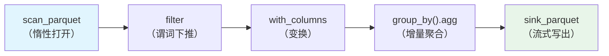
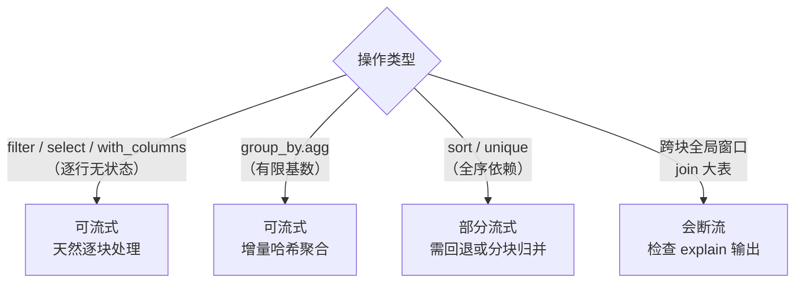

# 第 8 章 流式操作与流式执行引擎

> 本章要解决什么问题：掌握 scan → 惰性变换 → sink 的端到端流式管道，理解 new streaming engine 的 morsel 机制，知道哪些操作可流式、哪些会断流。这是全书流式主线的核心章。

## 8.1 端到端流式管道



```python
(pl.scan_parquet("logs/*.parquet")
   .filter(pl.col("level") == "ERROR")
   .with_columns(hour=pl.col("ts").dt.truncate("1h"))
   .group_by("hour")
   .agg(pl.len().alias("n"))
   .sink_parquet("error_stats.parquet"))  # 全程内存受控
```

这条管道即使输入是 200GB，内存占用也只有：单个 morsel 的工作集 + 增量聚合的哈希表（小时数 × 列宽）。**内存复杂度 O(基数) 而非 O(数据量)**。

### collect vs sink 的内存对比

```python
import os
import polars as pl

# ❌ collect 路径：全量物化到内存再写盘
df = (pl.scan_parquet("logs/*.parquet")
        .group_by("endpoint").agg(pl.len()).collect())
df.write_parquet("out.parquet")

# ✅ sink 路径：不物化，逐 morsel 流过引擎
(pl.scan_parquet("logs/*.parquet")
   .group_by("endpoint").agg(pl.len())
   .sink_parquet("out.parquet"))
# 用 /usr/bin/time -l 或资源监视器对比两者峰值 RSS
```

## 8.2 new streaming engine

- 旧流式引擎 vs `collect(engine="streaming")`
- morsel 机制：分块读取 → 分块处理 → 分块写出
- 峰值内存控制原理

```python
# 流式 collect：结果仍是 DataFrame，但中间过程流式
result = (
    pl.scan_parquet("logs/*.parquet")
      .filter(pl.col("amount") > 0)
      .group_by("user_id")
      .agg(pl.col("amount").sum())
      .collect(engine="streaming")   # 显式指定流式引擎
)
# 适用：结果集小（聚合结果），但中间数据巨大
```

```python
# 异步 sink：sink 本身也可以不阻塞主线程
sink_lf = (
    pl.scan_parquet("logs/*.parquet")
      .group_by("endpoint").agg(pl.len())
      .sink_parquet("out.parquet", lazy=True)   # 只登记计划，不执行
)
# ...此处可继续登记其它 sink，统一调度...
sink_lf.collect()   # 此刻才真正执行；返回空 DataFrame，数据已在 out.parquet
```

## 8.3 哪些操作可流式



- 检查方法：`explain(streaming=True)` 中查看 STREAMING 节点

```python
lf = (
    pl.scan_parquet("logs/*.parquet")
      .filter(pl.col("level") == "ERROR")
      .with_columns(hour=pl.col("ts").dt.truncate("1h"))
      .group_by("hour").agg(pl.len())
)
print(lf.explain(streaming=True))
# 计划中出现 STREAMING 节点 → 该段管道将流式执行
# 若某操作导致 STREAMING 中断，说明该处需要全量数据
```

## 8.4 与 batch 处理结合

- 按 partition 列分批 scan
- 外层循环 + `pl.concat` 增量合并

```python
# 流式不适用时的降级策略：按分区批处理
from datetime import date, timedelta

results = []
d = date(2026, 8, 1)
while d < date(2026, 8, 28):
    lf = (
        pl.scan_parquet(f"logs/date={d.isoformat()}/*.parquet")
          .group_by("endpoint").agg(pl.len())   # 单日基数小
    )
    results.append(lf.collect())
    d += timedelta(days=1)

# 二次归并：批结果再聚合
(pl.concat(results)
   .group_by("endpoint").agg(pl.col("len").sum())
   .sort("len", descending=True))
```

## 8.5 流式的边界：基数决定一切

```python
# group_by 可流式的前提：唯一键数量可控
# ✅ 基数 = 小时数 × 端点数 ≈ 720 × 200 = 14 万 → 哈希表 ~MB 级
lf.group_by(["hour", "endpoint"]).agg(pl.len())

# ❌ 基数 = user_id 数 = 2 亿 → 哈希表爆炸，"流式"名存实亡
lf.group_by("user_id").agg(pl.len())
# 对策：按 user_id 哈希分片，分多次流式处理
```

## 要点回顾

- scan → 变换 → sink 全程内存 O(分块) 而非 O(全量)
- 用 explain(streaming=True) 验证管道真的在流式
- 聚合基数是流式可行性的决定因素

## 性能检查清单

- [ ] 是否用 sink_* 替代了 collect 后再 to_parquet？
- [ ] group_by 的基数（unique key 数）是否可控？
- [ ] 是否验证过 STREAMING 标记存在？
- [ ] 不可流式的操作是否用分区批处理降级？
- [ ] 峰值内存是否实测过（time -l / 资源监视器）？

## 练习

1. **断流定位**：构造 `scan → with_columns(UDF) → group_by → sink` 的管道，用 `explain(streaming=True)` 找出 STREAMING 标记在哪一步消失；把 UDF 移到 filter 之后，再看标记是否恢复。
2. **内存实测**：生成 5GB 分区 Parquet（可用循环 sink），分别以 collect 和 sink 两种方式聚合，用 `/usr/bin/time -l`（Linux）或活动监视器记录峰值 RSS 差异。
3. **基数实验**：对同一份大数据分别按低基列（如 weekday）与高基列（如 user_id）流式聚合，观察内存曲线差异，验证"基数决定一切"。
