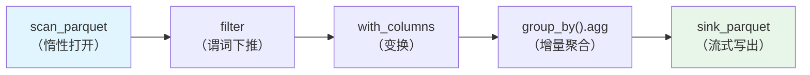
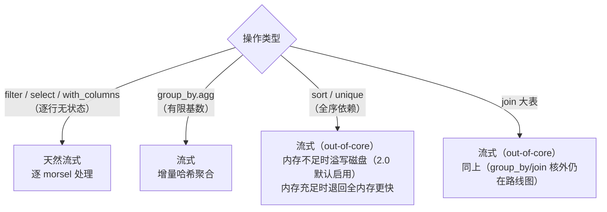

# 第 8 章 流式操作与流式执行引擎

> 本章要解决什么问题：掌握 scan → 惰性变换 → sink 的端到端流式管道，理解 new streaming engine 的 morsel 机制，知道哪些操作可流式、哪些会断流。这是全书流式主线的核心章。

## 8.1 端到端流式管道


```mermaid
flowchart LR
    A["scan_parquet<br/>（惰性打开）"] --> B["filter<br/>（谓词下推）"]
    B --> C["with_columns<br/>（变换）"]
    C --> D["group_by().agg<br/>（增量聚合）"]
    D --> E["sink_parquet<br/>（流式写出）"]
    style A fill:#e1f5fe
    style E fill:#e8f5e9
```

```python
(pl.scan_parquet("logs/*.parquet")
   .filter(pl.col("level") == "ERROR")
   .with_columns(hour=pl.col("ts").dt.truncate("1h"))
   .group_by("hour")
   .agg(pl.len().alias("n"))
   .sink_parquet("error_stats.parquet"))  # 全程内存受控
```

这条管道即使输入是 200GB，内存占用也只有：单个 morsel 的工作集 + 增量聚合的哈希表（小时数 × 列宽）。**内存复杂度 O(基数) 而非 O(数据量)**。

### collect vs sink 的内存对比

```python
import os
import polars as pl

# ❌ collect 路径：全量物化到内存再写盘
df = (pl.scan_parquet("logs/*.parquet")
        .group_by("endpoint").agg(pl.len()).collect())
df.write_parquet("out.parquet")

# ✅ sink 路径：不物化，逐 morsel 流过引擎
(pl.scan_parquet("logs/*.parquet")
   .group_by("endpoint").agg(pl.len())
   .sink_parquet("out.parquet"))
# 用 /usr/bin/time -l 或资源监视器对比两者峰值 RSS
```

## 8.2 new streaming engine

- 新流式引擎（1.41+ 进入 stable）取代了旧流式引擎：旧引擎只让部分节点流式、靠 `explain` 的 STREAMING 标记识别；新引擎整条管道默认以 morsel 为单元流式执行
- `collect()` 默认 `engine="auto"`——**2.0 起 auto 直接解析为流式引擎**（此前解析为 in-memory），`engine="streaming"` 的显式指定成为冗余但无害的习惯写法
- morsel 机制：分块读取 → 分块处理 → 分块写出
- 峰值内存控制原理

要点在"默认"二字：引擎不再逐节点挑选谁能流式，而是整条管道统一以 morsel 为单位推进——读一块、算一块、写一块，管道任何位置都不必见到全量数据。峰值内存因此可控，机制上可拆成三层：单个 morsel 的工作集上限固定，任一时刻驻留内存的只有当前这一块，与输入总量无关；算子之间以有界缓冲衔接，上游产一批、下游消一批，背压约束之下中间结果不会整层物化；聚合状态是唯一的例外，它随基数而非数据量增长。三层叠加，内存账单上与数据量相关的项全部清零、只剩基数一项——这正是 8.1 末尾"O(基数) 而非 O(数据量)"的机制来源。

默认切到流式的代价写在主版本号里：**join、group_by、unpivot 等操作不再默认保证输出行序**。旧行为只作为兜底保留：单次查询 `collect(engine="in-memory")` 或全局 `pl.Config.set_engine_affinity("in-memory")` 可回退；要行序但不想换引擎，用 `maintain_order=True`（如 `join(..., maintain_order="left")`，代价是放弃部分并行归并）。判断你的管道是否受影响只看一条：下游是否依赖"行序隐含信息"（如"第一行即最新"）——依赖就显式 sort 或加 maintain_order，不依赖（绝大多数聚合管道）就什么都不用改。

性能侧的官方账本：流式默认 + 引擎改进（join 重排序、公共子计划消除增强、动态谓词/布隆过滤器）让官方在 TPC-H/TPC-DS 衍生基准上于几乎所有查询领先同期的 DuckDB 与 DataFusion，官方称默认路径整体约 5 倍于旧默认。数字属于特定环境，照例以你自己的负载复测为准（第 12 章）；已知边界是核数很大时存在固定调度开销，小数据查询在 32 核限制下反而更有竞争力。

```python
# 流式 collect：结果仍是 DataFrame，但中间过程流式
result = (
    pl.scan_parquet("logs/*.parquet")
      .filter(pl.col("amount") > 0)
      .group_by("user_id")
      .agg(pl.col("amount").sum())
      .collect(engine="streaming")   # 显式指定流式引擎
)
# 适用：结果集小（聚合结果），但中间数据巨大
```

```python
# 异步 sink：sink 本身也可以不阻塞主线程
sink_lf = (
    pl.scan_parquet("logs/*.parquet")
      .group_by("endpoint").agg(pl.len())
      .sink_parquet("out.parquet", lazy=True)   # 只登记计划，不执行
)
# ...此处可继续登记其它 sink，统一调度...
sink_lf.collect()   # 此刻才真正执行；返回空 DataFrame，数据已在 out.parquet
```

## 8.3 哪些操作可流式


```mermaid
flowchart TD
    OP{"操作类型"} -->|"filter / select / with_columns<br/>（逐行无状态）"| YES["天然流式<br/>逐 morsel 处理"]
    OP -->|"group_by.agg<br/>（有限基数）"| YES2["流式<br/>增量哈希聚合"]
    OP -->|"sort / unique<br/>（全序依赖）"| OOC["流式（out-of-core）<br/>内存不足时溢写磁盘（2.0 默认启用）<br/>内存充足时退回全内存更快"]
    OP -->|"join 大表"| OOC2["流式（out-of-core）<br/>同上（group_by/join 核外仍在路线图）"]
```

新引擎下 sort 等全序算子支持 out-of-core：内存不足时把中间数据溢写磁盘、逐块归并，代价是 I/O；内存充足时仍走全内存路径，速度更快。2.0 起溢写**默认启用**：内存占用达到约 80% RAM 时开始溢写，默认磁盘预算 64GB——当前支持溢写的有 sort、窗口函数与多数表达式，join/group_by 的核外支持还在路线图上（所以 8.5 的基数纪律仍然必要）。仍有少数复杂算子可能退回全内存执行，以实测为准。

### 验证手段：实测峰值内存

旧验证方法 `explain(streaming=True)` 已于 1.25 弃用，且 1.41+ 新流式引擎的 `explain` 输出**不再包含 STREAMING 节点标记**——整条管道默认就在流式，计划文本看不出差别。可靠的验证手段是实测峰值 RSS：管道真的在流式，峰值内存就不随数据量线性增长。

```python
# 用子进程跑管道，resource 读取峰值 RSS（跨平台，无需外部工具）
import subprocess
import sys
import resource

CHILD = """
import polars as pl
(pl.scan_parquet("logs/*.parquet")
   .filter(pl.col("level") == "ERROR")
   .with_columns(hour=pl.col("ts").dt.truncate("1h"))
   .group_by("hour")
   .agg(pl.len().alias("n"))
   .sink_parquet("error_stats.parquet"))
"""

proc = subprocess.run([sys.executable, "-c", CHILD])
assert proc.returncode == 0
peak = resource.getrusage(resource.RUSAGE_CHILDREN).ru_maxrss
if sys.platform == "linux":       # macOS 返回字节，Linux 返回千字节
    peak *= 1024
print(f"峰值 RSS ≈ {peak / 1024 / 1024:.0f} MB")
```

```bash
# 命令行一行搞定
/usr/bin/time -l python pipeline.py   # macOS：看 "peak memory footprint"
/usr/bin/time -v python pipeline.py   # Linux：看 "Maximum resident set size"
```

把输入规模放大 5 倍再跑一次：峰值 RSS 几乎不变 → 内存复杂度 O(基数) 而非 O(数据量)，这就是流式执行的直接证据。

## 8.4 与 batch 处理结合

- 按 partition 列分批 scan
- 外层循环 + `pl.concat` 增量合并

这是流式失效时的降级路径：聚合基数失控、或某一步必须全量物化时，把大作业沿分区边界切成 N 个内存可控的小作业，各自 collect 出小结果。它可行是因为聚合可分解——sum、count 这类部分聚合值能跨批合并，所以代码里每批先聚合、`pl.concat` 之后再做一次 group_by 归并，归并对象是批级小表而非原始明细，代价只与基数相关。付出的是惰性优化的损失：每批独立成计划，跨批的公共变换与谓词不会被合并，循环的调度开销也随批数线性增长。

```python
# 流式不适用时的降级策略：按分区批处理
from datetime import date, timedelta

results = []
d = date(2026, 8, 1)
while d < date(2026, 8, 28):
    lf = (
        pl.scan_parquet(f"logs/date={d.isoformat()}/*.parquet")
          .group_by("endpoint").agg(pl.len())   # 单日基数小
    )
    results.append(lf.collect())
    d += timedelta(days=1)

# 二次归并：批结果再聚合
(pl.concat(results)
   .group_by("endpoint").agg(pl.col("len").sum())
   .sort("len", descending=True))
```

## 8.5 流式的边界：基数决定一切

流式管住的是扫描与算子缓冲的内存，管不住聚合状态：group_by 的哈希表给每个唯一键留一格，键数不随 morsel 的推进被合并或释放。因此同一张表换个分组键，命运截然不同——低基键的状态表停留在 MB 量级，高基键的哈希表足以击穿内存预算，扫描再流式也无济于事。评估流式聚合可行性的第一步永远是估基数；超限就按键哈希分片，把一次失控的聚合拆成多次基数受控的聚合。

```python
# group_by 可流式的前提：唯一键数量可控
# ✅ 基数 = 小时数 × 端点数 ≈ 720 × 200 = 14 万 → 哈希表 ~MB 级
lf.group_by(["hour", "endpoint"]).agg(pl.len())

# ❌ 基数 = user_id 数 = 2 亿 → 哈希表爆炸，"流式"名存实亡
lf.group_by("user_id").agg(pl.len())
# 对策：按 user_id 哈希分片，分多次流式处理
```

## 要点回顾

- scan → 变换 → sink 全程内存 O(分块) 而非 O(全量)
- 新流式引擎（1.41+）整条管道默认以 morsel 为单元流式执行，2.0 起成为 collect 的默认引擎（join/group_by/unpivot 不再保证行序）；验证靠实测峰值 RSS，而非旧的 STREAMING 标记
- 聚合基数是流式可行性的决定因素

## 性能检查清单

- [ ] 是否用 sink_* 替代了 collect 后再 to_parquet？
- [ ] group_by 的基数（unique key 数）是否可控？
- [ ] 是否实测过峰值 RSS，确认内存不随数据量线性增长？
- [ ] sort/join 大表是否留意过 out-of-core 路径的内存/速度取舍？
- [ ] 峰值内存是否实测过（time -l / subprocess + resource）？

## 练习

1. **规模不变性**：对同一条 sink 聚合管道，分别输入 1GB 与 5GB 数据（可循环 sink 生成），用 `subprocess` + `resource.getrusage` 记录两次峰值 RSS。若两者接近，就证明了内存复杂度 O(基数) 而非 O(数据量)——这是新流式引擎（1.41+）替代旧 STREAMING 标记的验证方法。
2. **内存实测**：生成 5GB 分区 Parquet（可用循环 sink），分别以 collect 和 sink 两种方式聚合，用 `/usr/bin/time -l`（macOS）或 `/usr/bin/time -v`（Linux）记录峰值 RSS 差异。
3. **基数实验**：对同一份大数据分别按低基列（如 weekday）与高基列（如 user_id）流式聚合，观察内存曲线差异，验证"基数决定一切"。
