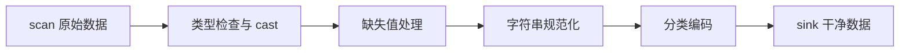

# 第 9 章 数据清洗与变换

> 本章要解决什么问题：掌握高频清洗操作的底层机制，全流程以链式调用实现（呼应第 5 章主线）。

## 9.1 清洗流程全景



## 9.2 缺失值：validity bitmap

- null（值缺失）vs NaN（浮点未定义）语义区分
- `fill_null` / `drop_nulls` / `forward_fill` 策略
- bitmap 操作的向量化成本

```python
import polars as pl

df = pl.DataFrame({
    "user": ["a", "b", "b", "c"],
    "ts": ["2026-08-01", None, "2026-08-03", "2026-08-04"],
    "amount": [100.0, None, 300.0, float("nan")],
})

print(df.select(
    pl.col("amount").is_null().sum().alias("nulls"),    # 1
    pl.col("amount").is_nan().sum().alias("nans"),      # 1
))

# 三种处理策略，语义完全不同
clean = (
    df.with_columns(
        # 策略 1：填充——组内前值填充（时序数据常用）
        amount_ffill=pl.col("amount").forward_fill().over("user"),
        # 策略 2：标记——保留缺失信息，交给下游决策
        amount_missing=pl.col("amount").is_null(),
        # 策略 3：替换——NaN 与 null 先统一再处理
        amount_clean=pl.col("amount").fill_nan(None).fill_null(0),
    )
)
```

```python
# drop 的粒度控制
df.drop_nulls()                        # 任一列为 null 即丢行
df.drop_nulls(subset=["amount"])       # 只看 amount 列
```

## 9.3 cast 规则

- 严格转换 vs `strict=False`
- 数值降宽（Int64 → Int32）的溢出风险
- `to_datetime` 的格式显式声明

```python
# strict（默认）：转换失败直接报错——生产管道推荐
pl.DataFrame({"x": ["1", "2", "abc"]}).select(
    pl.col("x").cast(pl.Int64)          # ❌ ComputeError
)

# strict=False：失败变 null，适合脏数据探查
pl.DataFrame({"x": ["1", "2", "abc"]}).select(
    pl.col("x").cast(pl.Int64, strict=False)   # [1, 2, null]
)
```

```python
# 降宽省内存，但要评估上界
df.with_columns(pl.col("id").cast(pl.Int32))    # 上限 21 亿
df.with_columns(pl.col("flag").cast(pl.Int8))   # 上限 127

# 字符串日期：显式格式比推断快且稳
(pl.scan_csv("events.csv")
   .with_columns(pl.col("ts").str.to_datetime("%Y-%m-%d %H:%M:%S")))
```

## 9.4 字符串处理

- `.str` 命名空间向量化处理
- 多编码：`len_bytes` vs `len_chars`
- 正则的预编译与回退成本

```python
df = pl.DataFrame({
    "email": ["  Alice@Corp.COM ", "bob@corp.com", None],
    "path": ["/a/b/c.txt", "/d/e.csv", "/f/g.parquet"],
})

df.with_columns(
    email=pl.col("email").str.strip_chars().str.to_lowercase(),
    is_corp=pl.col("email").str.ends_with("@corp.com"),
    ext=pl.col("path").str.split(".").list.last(),      # 切分后取列表元素
    depth=pl.col("path").str.count_matches("/"),
)
```

```python
# len_bytes vs len_chars：中文场景必须区分
s = pl.Series(["数据", "abc"])
print(s.str.len_chars())   # [2, 3]  用户视角的字符数
print(s.str.len_bytes())   # [6, 3]  UTF-8 存储字节数
```

## 9.5 Categorical 的字典编码

- `Categorical` vs `Enum` 选型
- 全局字符串缓存与 join 的配合
- 物理表示：u32 索引 + 字典

```python
# 低基数字符串列：内存与比较性能双赢
df = pl.DataFrame({"city": ["上海"] * 500_000 + ["北京"] * 500_000})
print(df.estimated_size("mb"))                            # String: ~7 MB
print(df.with_columns(pl.col("city").cast(pl.Categorical))
        .estimated_size("mb"))                            # ~4 MB

# Enum：类别固定且已知时更优（编译期检查 + 无重编码开销）
Weekday = pl.Enum(["Mon", "Tue", "Wed", "Thu", "Fri", "Sat", "Sun"])
df.with_columns(pl.col("dow").cast(Weekday))

# Categorical join：两侧需同源字典，否则报错或需对齐
# 全局缓存开关：pl.enable_string_cache()
```

## 9.6 全链式清洗示例

```python
(pl.scan_csv("raw.csv", schema_overrides={"amount": pl.Float64})
   .with_columns(
       pl.col("amount").cast(pl.Float64),
       pl.col("city").cast(pl.Categorical),
       pl.col("email").str.strip_chars().str.to_lowercase(),
   )
   .filter(pl.col("amount").is_not_null() & pl.col("amount").is_between(0, 1e6))
   .drop_nulls(subset=["email"])
   .with_columns(pl.col("amount").fill_nan(0))
   .sink_parquet("clean.parquet"))
```

## 要点回顾

- null 与 NaN 是两回事，处理方式不同
- Categorical 让低基数字符串列的内存和 join 性能大幅提升
- 清洗管道：scan 进、sink 出，中间零物化

## 性能检查清单

- [ ] 是否对低基数字符串用了 Categorical？
- [ ] 数值列是否用了最窄安全 dtype？
- [ ] 清洗管道是否 sink 直达，无中间物化？
- [ ] cast 是否显式 strict，避免静默吞错？
- [ ] 字符串长度语义（chars/bytes）是否正确？

## 练习

1. **cast 健壮性**：对 `["1", "2", "abc", None]` 分别执行 `cast(pl.Int64)` 与 `cast(pl.Int64, strict=False)`，预测并验证两种结果。
2. **清洗管道**：给定含脏数据的 CSV（空字符串、大小写混乱的 email、越界的 amount），写一条 scan 到 sink 的链式管道：规范化 email、剔除 amount 越界行、city 转 Categorical。
3. **内存对比**：对一列重复率 99% 的字符串（如 100 万行城市名），对比 String 与 Categorical 的 `estimated_size()`，再对比两者 `sort()` 的耗时。
