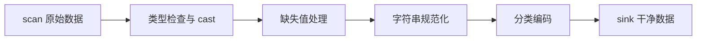

# 第 9 章 数据清洗与变换

> 本章要解决什么问题：掌握高频清洗操作的底层机制，全流程以链式调用实现（呼应第 5 章主线）。

## 9.1 清洗流程全景



## 9.2 缺失值：validity bitmap

- null（值缺失）vs NaN（浮点未定义）语义区分
- `fill_null` / `drop_nulls` / `forward_fill` 策略
- bitmap 操作的向量化成本

```python
import polars as pl

df = pl.DataFrame({
    "user": ["a", "b", "b", "c"],
    "ts": ["2026-08-01", None, "2026-08-03", "2026-08-04"],
    "amount": [100.0, None, 300.0, float("nan")],
})

print(df.select(
    pl.col("amount").is_null().sum().alias("nulls"),    # 1
    pl.col("amount").is_nan().sum().alias("nans"),      # 1
))

# 三种处理策略，语义完全不同
clean = (
    df.with_columns(
        # 策略 1：填充——组内前值填充（时序数据常用）
        amount_ffill=pl.col("amount").forward_fill().over("user"),
        # 策略 2：标记——保留缺失信息，交给下游决策
        amount_missing=pl.col("amount").is_null(),
        # 策略 3：替换——NaN 与 null 先统一再处理
        amount_clean=pl.col("amount").fill_nan(None).fill_null(0),
    )
)
```

```python
# drop 的粒度控制
df.drop_nulls()                        # 任一列为 null 即丢行
df.drop_nulls(subset=["amount"])       # 只看 amount 列
```

### bitmap 操作的向量化成本

null 标记不是一个存在每行里的值，而是与数据并行的 **validity bitmap**：位数组第 i 位为 0，第 i 行就是 null。判空因此是对位数组的向量化位运算——一条 CPU 指令处理 64 行——而不是逐行调用 `is None`。位扫描还有一个天然优势：bitmap 每行只占 1 bit，是主数据（如 Float64 每行 64 bit）的 1/64，扫完整个列的 null 标记所触碰的内存远小于扫数据本身。实测 500 万行 Float64（约 40 MB）、5% null：`is_null().sum()` 约 **0.07 ms**（只扫 625 KB 的 bitmap），无 null 列的 `sum()` 约 0.6 ms，含 null 列的 `sum()` 约 1.4 ms（数值路径再加 bitmap 检查）——判空比数值聚合还快一个量级。结论：**null 在列式存储里几乎免费**，不要为"省掉 null"引入 -1 或空字符串这类哨兵值——那会把 O(n/64) 的位判断退化成 O(n) 的值比较，还污染了取值域。

```python
import time

import numpy as np
import polars as pl

rng = np.random.default_rng(42)
vals = rng.random(5_000_000)
mask = rng.random(5_000_000) < 0.05
s = pl.Series("x", np.where(mask, np.nan, vals)).fill_nan(None)  # 5% null

for label, fn in [
    ("is_null().sum() ", lambda: s.is_null().sum()),
    ("sum()（5% null）", lambda: s.sum()),
]:
    fn()  # 预热
    times = []
    for _ in range(5):
        t0 = time.perf_counter()
        fn()
        times.append(time.perf_counter() - t0)
    print(label, "%.2f ms" % (min(times) * 1e3))
# 实测：is_null().sum() ≈ 0.07 ms；sum() ≈ 1.4 ms（无 null 同规模列 ≈ 0.6 ms）
# 判空扫描的 bitmap 只有 625 KB——主数据的 1/64（polars 1.44 / macOS arm64）
```

`fill_null` / `forward_fill` 的实现思路同样是单遍扫描：内核顺序走过数据与 bitmap，逐块决定每行的输出来源——常数填充只看当前位的取值；前向填充只需维护"最近一次见到的非 null 值"这一个状态，无需逐行回调，也无需回看。

## 9.3 cast 规则

- 严格转换 vs `strict=False`
- 数值降宽（Int64 → Int32）的溢出风险
- `to_datetime` 的格式显式声明

```python
# strict（默认）：转换失败直接报错——生产管道推荐
pl.DataFrame({"x": ["1", "2", "abc"]}).select(
    pl.col("x").cast(pl.Int64)          # ❌ ComputeError
)

# strict=False：失败变 null，适合脏数据探查
pl.DataFrame({"x": ["1", "2", "abc"]}).select(
    pl.col("x").cast(pl.Int64, strict=False)   # [1, 2, null]
)
```

```python
# 降宽省内存，但要评估上界
df.with_columns(pl.col("id").cast(pl.Int32))    # 上限 21 亿
df.with_columns(pl.col("flag").cast(pl.Int8))   # 上限 127

# 字符串日期：显式格式比推断快且稳
(pl.scan_csv("events.csv")
   .with_columns(pl.col("ts").str.to_datetime("%Y-%m-%d %H:%M:%S")))
```

## 9.4 字符串处理

- `.str` 命名空间向量化处理
- 多编码：`len_bytes` vs `len_chars`
- 正则的预编译与回退成本

```python
df = pl.DataFrame({
    "email": ["  Alice@Corp.COM ", "bob@corp.com", None],
    "path": ["/a/b/c.txt", "/d/e.csv", "/f/g.parquet"],
})

df.with_columns(
    email=pl.col("email").str.strip_chars().str.to_lowercase(),
    is_corp=pl.col("email").str.ends_with("@corp.com"),
    ext=pl.col("path").str.split(".").list.last(),      # 切分后取列表元素
    depth=pl.col("path").str.count_matches("/"),
)
```

```python
# len_bytes vs len_chars：中文场景必须区分
s = pl.Series(["数据", "abc"])
print(s.str.len_chars())   # [2, 3]  用户视角的字符数
print(s.str.len_bytes())   # [6, 3]  UTF-8 存储字节数
```

## 9.5 Categorical 的字典编码

- `Categorical` vs `Enum` 选型
- 跨字典 join 的自动 remap（1.x 行为）
- 物理表示：u32 索引 + 字典

```python
# 低基数字符串列：内存与比较性能双赢
df = pl.DataFrame({"city": ["上海"] * 500_000 + ["北京"] * 500_000})
print(df.estimated_size("mb"))                            # String: ~5.7 MB
print(df.with_columns(pl.col("city").cast(pl.Categorical))
        .estimated_size("mb"))                            # ~3.8 MB
# 实测值：100 万行、2 个类别，polars 1.44 / macOS arm64

# Enum：类别固定且已知时更优（编译期检查 + 无重编码开销）
Weekday = pl.Enum(["Mon", "Tue", "Wed", "Thu", "Fri", "Sat", "Sun"])
df.with_columns(pl.col("dow").cast(Weekday))
```

### 跨字典 join 的自动 remap（1.x 行为）

两个 Categorical 列即使字典各自独立——同一个字符串在左右两侧映射到不同的物理索引——join 也不会出错：引擎在比较前先把一侧的字典**重映射（remap）到另一侧的编码空间**，对齐物理索引后再做等值连接。0.x 时代这需要全局 `pl.enable_string_cache()`（让所有 Categorical 共享一张字典），1.x 已彻底移除该要求，跨字典 Categorical join 直接可用、无需任何全局开关。

要留意的坑只剩一个：**Categorical 与 Enum 混用**。两侧 join 键 dtype 不一致（`cat` 对 `enum`）时，引擎不会自动选边 cast，直接抛 `SchemaError`。需要显式统一，方向规则是：`Enum → Categorical` 总是可行；`Categorical → Enum` 要求列中每个取值都在 Enum 的类别声明里，多出一个就报 `InvalidOperationError`——这正是 Enum 的编译期校验在保护你。

```python
cat_side = pl.DataFrame({"d": ["Mon", "Tue"]}).with_columns(pl.col("d").cast(pl.Categorical))
enum_side = pl.DataFrame({"d": ["Mon", "Tue"], "x": [1, 2]}).with_columns(
    pl.col("d").cast(pl.Enum(["Mon", "Tue", "Wed"]))
)

# cat_side.join(enum_side, on="d")
# ❌ SchemaError: datatypes of join keys don't match - `d`: cat vs enum

enum_side.with_columns(pl.col("d").cast(pl.Categorical)).join(cat_side, on="d")
# ✅ 显式 cast 统一后正常 join
```

### Categorical 的 sort 顺序：physical vs lexical

字典编码列的排序有两种语义：**lexical**（按字符串本身的次序）与 **physical**（按字典索引，即类别首次出现的顺序）。1.32 起，用于切换的 `Categorical(ordering="physical"/"lexical")` 参数已废弃——Categorical 的 `sort()` 恒为 lexical；要按出现顺序排，就显式排物理索引列 `to_physical()`。`Enum` 则不同：排序恒按**类别声明的顺序**，语义在定义时就固定，这也是它"固定字典"红利的另一面。

```python
df = pl.DataFrame({"fruit": ["banana", "apple", "cherry", "apple"]})
df_cat = df.with_columns(pl.col("fruit").cast(pl.Categorical))

print(df_cat.sort("fruit").get_column("fruit").to_list())
# ['apple', 'apple', 'banana', 'cherry']——Categorical 恒为 lexical

print(df_cat.sort(pl.col("fruit").to_physical()).get_column("fruit").to_list())
# ['banana', 'apple', 'apple', 'cherry']——按物理索引（出现顺序）：banana(0) < apple(1) < cherry(2)

df_enum = pl.DataFrame({"dow": ["Wed", "Mon", "Tue", "Mon"]}).with_columns(
    pl.col("dow").cast(pl.Enum(["Mon", "Tue", "Wed"]))
)
print(df_enum.sort("dow").get_column("dow").to_list())
# ['Mon', 'Mon', 'Tue', 'Wed']——Enum 按类别声明顺序排
```

## 9.6 全链式清洗示例

这条管道浓缩了本章的全部决策，两个设计意图先说清楚：

**cast Categorical 放在 filter 之后**：过滤先把行集收敛到最终保留的数据，cast 时构建的字典就只编码存活行里出现过的城市；若先 cast 再 filter，被剔除的城市仍留在字典里（字典白白变大），cast 本身也要处理更多行。一般规则：**先收敛行集，再编码、再填充**。

**用 sink 而不是 collect**：`sink_parquet` 逐 morsel 流式落盘（第 8 章），管道的内存上界是单个 morsel 加中间状态，而不是整个结果集；`collect` 会把全量数据物化进内存——数据量一大就失去"清洗管道内存受控"的意义（第 3 章流式主线）。

```python
(pl.scan_csv("raw.csv", schema_overrides={"amount": pl.Float64})
   .with_columns(pl.col("email").str.strip_chars().str.to_lowercase())
   .filter(pl.col("amount").is_not_null() & pl.col("amount").is_between(0, 1e6))
   .drop_nulls(subset=["email"])
   .with_columns(
       pl.col("amount").fill_nan(0),
       pl.col("city").cast(pl.Categorical),
   )
   .sink_parquet("clean.parquet"))
```

逐行拆解每一步的清洗语义与顺序敏感点：

| 步骤 | 清洗语义 | 顺序敏感点 |
|---|---|---|
| `schema_overrides={"amount": pl.Float64}` | 读入即锁定数值类型 | 不锁定的话脏列会被推断成 String，后续数值操作全部失效 |
| email 规范化（`strip_chars` + `to_lowercase`） | 消除空白与大小写噪声 | 若过滤条件依赖规范化结果（如 `ends_with("@corp.com")`）必须在前；此处不依赖，但先规范化再过滤语义更清晰 |
| `filter(is_not_null() & is_between(0, 1e6))` | 剔除 amount 缺失与越界的行 | **必须发生在 `fill_nan` 之前**——见下方实测 |
| `drop_nulls(subset=["email"])` | email 缺失的行整行丢弃 | `strip_chars` 不改变 null（null 传播），先后无所谓，但"先规范化再丢弃"更可读 |
| `fill_nan(0)` | 把剩余 NaN 归零 | 在 filter 之后：NaN 行已被剔除，不会"变 0 混进来" |
| `cast(pl.Categorical)` | city 列字典编码 | 在行集收敛之后：字典不含被剔除行的幽灵类别 |
| `sink_parquet` | 流式落盘 | — |

顺序敏感点里最反直觉的是 `fill_nan` 与 `filter` 的先后。同一份数据上实测两种顺序：

```python
df = pl.DataFrame({"amount": [100.0, float("nan"), 500.0, float("nan")]})
cond = pl.col("amount").is_not_null() & pl.col("amount").is_between(0, 1e6)

# 先 filter 后 fill_nan（管道现顺序）：NaN 不满足 is_between → 行被剔除
print(df.filter(cond).with_columns(pl.col("amount").fill_nan(0))
        .get_column("amount").to_list())   # [100.0, 500.0]

# 先 fill_nan 后 filter（错误顺序）：NaN 变 0 → 通过过滤被保留
print(df.with_columns(pl.col("amount").fill_nan(0)).filter(cond)
        .get_column("amount").to_list())   # [100.0, 0.0, 500.0, 0.0]
```

一旦交换顺序，"剔除 NaN 行"就静默变成"把 NaN 填成 0 保留"——同样的输入，两份不同的下游统计。

## 要点回顾

- null 与 NaN 是两回事，处理方式不同
- Categorical 让低基数字符串列的内存和 join 性能大幅提升
- 清洗管道：scan 进、sink 出，中间零物化

## 性能检查清单

- [ ] 是否对低基数字符串用了 Categorical？
- [ ] 数值列是否用了最窄安全 dtype？
- [ ] 清洗管道是否 sink 直达，无中间物化？
- [ ] cast 是否显式 strict，避免静默吞错？
- [ ] 字符串长度语义（chars/bytes）是否正确？

## 练习

1. **cast 健壮性**：对 `["1", "2", "abc", None]` 分别执行 `cast(pl.Int64)` 与 `cast(pl.Int64, strict=False)`，预测并验证两种结果。
2. **清洗管道**：给定含脏数据的 CSV（空字符串、大小写混乱的 email、越界的 amount），写一条 scan 到 sink 的链式管道：规范化 email、剔除 amount 越界行、city 转 Categorical。
3. **内存对比**：对一列重复率 99% 的字符串（如 100 万行城市名），对比 String 与 Categorical 的 `estimated_size()`，再对比两者 `sort()` 的耗时。
