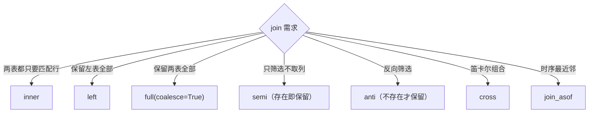

# 第 10 章 分组聚合与连接

> 本章要解决什么问题：掌握基础聚合全家桶、分位数、join 全家桶的语义与代价，以及超大数据集的流式聚合/join 策略。

## 10.1 基础聚合全家桶

| 聚合 | 表达式 | 备注 |
|---|---|---|
| 求和 | `pl.col("x").sum()` | 向量化 + 多线程分区求和 |
| 均值 | `pl.col("x").mean()` | sum / count 组合 |
| 计数 | `pl.len()` / `.count()` | len 计行，count 计非 null |
| 标准差/方差 | `.std()` / `.var()` | ddof 默认 1 |
| 唯一计数 | `.n_unique()` | |

```python
import polars as pl

df = pl.DataFrame({
    "dept": ["a", "a", "b", "b", "b"],
    "salary": [100, 200, 300, None, 500],
})

# len vs count：null 语义差异是常见坑
print(df.group_by("dept").agg(
    pl.len().alias("n_rows"),               # a:2, b:3 —— 物理行数
    pl.col("salary").count().alias("n_valid"),  # a:2, b:2 —— 跳过 null
    pl.col("salary").sum().alias("total"),      # b: 300+500（null 被跳过）
    pl.col("salary").mean().alias("avg"),
    pl.col("salary").std().alias("std"),
))
```

- 命名聚合：`group_by().agg(total=pl.col("x").sum())` 形式
- 聚合结果展开：`explode` / `flatten`

命名聚合不只是语法糖：kwargs 形式让输出列名与聚合语义在同一处声明，重构时不必在 `agg` 与 `alias` 两点之间来回对照。聚合出列表再展开则是"先收拢、再摊平"的两段式模式：先在组内把成员收集成 List（一次聚合），再按需 `explode` 成多行（一次整形）——比在聚合里硬拼展开更可控，也让 TopN（组内排序后 `head(N)`）这类"每组取前 k"的需求有了统一写法。

### 高效统计三件套（探索阶段省时利器）

```python
# 1. approx_n_unique：基数近似（HyperLogLog 思路，远快于精确 n_unique）
df.select(pl.col("user_id").approx_n_unique())

# 2. hist：直方图分箱——一行看分布（Series 方法，返回带分箱边界的表）
df.get_column("salary").hist(bin_count=4)
# ┌────────────┬────────────────┬───────┐
# │ breakpoint ┆ category       ┆ count │
# │ ---        ┆ ---            ┆ ---   │
# │ f64        ┆ cat            ┆ u32   │
# ╞════════════╪════════════════╪═══════╡
# │ 200.0      ┆ [100.0, 200.0] ┆ 2     │
# │ 300.0      ┆ (200.0, 300.0] ┆ 1     │
# │ 400.0      ┆ (300.0, 400.0] ┆ 0     │
# │ 500.0      ┆ (400.0, 500.0] ┆ 1     │
# └────────────┴────────────────┴───────┘

# 3. rle_id：游程编码分组——把"连续相同段"编为一个 id
# 典型用途：识别连续的会话/状态段（比窗口函数快得多）
(pl.DataFrame({"event": ["A", "A", "B", "B", "B", "A"]})
   .with_columns(session=pl.col("event").rle_id()))
# event A A B B B A → session 0 0 1 1 1 2
```

```python
# 聚合出列表，再按需展开
df.group_by("dept").agg(pl.col("salary"))            # salary → List[i64]
df.group_by("dept").agg(pl.col("salary").implode())   # 显式列表聚合

# TopN 模式：每个分组取前 N
df.group_by("dept").agg(
    pl.col("salary").sort(descending=True).head(2).alias("top2")
)
```

## 10.2 百分位与分位数

```python
df.select(
    pl.col("salary").quantile(0.25, interpolation="linear").alias("q1"),
    pl.col("salary").median().alias("median"),   # = quantile(0.5)
    pl.col("salary").quantile(0.75, interpolation="linear").alias("q3"),
)
```

- 插值方法差异：`linear` / `nearest` / `midpoint` / `lower` / `higher`
- IQR 异常检测模板
- 多级分组聚合与 `over` 窗口聚合的区别

插值方法决定分位点落在两个观测之间时取什么值。对 [1, 2, 3, 4] 取 0.25 分位（polars 1.44.1 实测）：`linear` 得 1.75——虚拟位置 0.75 落在 1 与 2 之间，线性内插；`nearest` 得 2.0——取最近的观测；`lower` 得 1.0——取下侧相邻观测（对称地 `higher` 得 2.0，`midpoint` 取两侧平均 1.5）。注意 **polars 的默认插值是 `nearest`**，与 numpy/pandas 的默认（linear）不同——跨库对齐时务必显式写 `interpolation="linear"`，否则同一段数据两套库的分位数会悄悄错位；要求结果必须是真实观测值（门槛值、分层切点）时选 nearest 或 lower。IQR 模板必须运行在 `over` 窗口而非 `group_by().agg` 之上，这是本节的语义分水岭：agg 把每组收敛成一行、明细丢失，over 把组统计量广播回每行、行数不变——而异常检测的语义恰恰是"每行对照自己组的四分位"，行数一变就无从判定。

```python
# IQR 异常检测：分组内标准化
# 注意 quantile 未传 interpolation 时走默认 nearest；跨库对齐请显式 linear
(df.with_columns(
    q1=pl.col("salary").quantile(0.25, interpolation="linear").over("dept"),
    q3=pl.col("salary").quantile(0.75, interpolation="linear").over("dept"),
 )
 .with_columns(
     iqr=pl.col("q3") - pl.col("q1"),
 )
 .filter(pl.col("salary").is_between(
     pl.col("q1") - 1.5 * pl.col("iqr"),
     pl.col("q3") + 1.5 * pl.col("iqr"),
 )))
```

```python
# group_by.agg（行数改变）vs over（行数不变）——语义分水岭
df.group_by("dept").agg(pl.col("salary").mean())   # 每组一行
df.with_columns(pl.col("salary").mean().over("dept"))  # 广播回每行
```

## 10.3 join 全家桶



| 类型 | 语义 | 实现与代价 |
|---|---|---|
| `inner` | 两侧匹配 | 哈希 join，右表建哈希 |
| `left` / `right` | 保留一侧 | 哈希 + null 填充 |
| `full(coalesce)` | 全保留（1.0 起 `outer` 改名 `full`） | 哈希 + 双侧补齐，键可选合并 |
| `cross` | 笛卡尔积 | O(n·m)，慎用 |
| `semi` | 只保留左表中存在于右表的行 | 不膨胀 |
| `anti` | 只保留左表中不存在于右表的行 | 不膨胀 |
| `join_asof` | 按时序最近邻匹配 | 要求数据按 on 键有序（`set_sorted` 可跳过检查） |

```python
orders = pl.DataFrame({
    "user_id": [1, 2, 3, 4],
    "amount": [100, 200, 300, 400],
})
users = pl.DataFrame({
    "user_id": [1, 2, 5],
    "name": ["a", "b", "e"],
})

# inner：只保留双方都有的
orders.join(users, on="user_id", how="inner")
# ┌ user_id ┬ amount ┬ name ┐   （2 行：1、2）

# left：保留左表全部
orders.join(users, on="user_id", how="left")
# user_id 3、4 的 name 为 null

# semi：筛选器视角——不需要右表任何列
orders.join(users.select("user_id"), on="user_id", how="semi")
# ┌ user_id ┬ amount ┐  （2 行）—— 不引入 name 列、不膨胀

# anti：反向筛选
orders.join(users.select("user_id"), on="user_id", how="anti")
# 3、4 两行——典型用途：增量数据中排除已处理过的主键
```

```python
# join_asof：时序最近邻
trades = pl.DataFrame({
    "ts": [1, 5, 9], "price": [10.0, 11.0, 12.0],
}).sort("ts").set_sorted("ts")

quotes = pl.DataFrame({
    "ts": [2, 6, 10], "bid": [9.5, 10.5, 11.5],
}).sort("ts").set_sorted("ts")

# 每笔成交对齐到它之前最近的报价
trades.join_asof(quotes, on="ts", strategy="backward")
```

- 多键 join：`on=["k1", "k2"]`

**join 顺序：谁为小表建哈希**

哈希 join 必须先把一侧物化成哈希表（内表），另一侧流式探测。上面速查表把 inner 简记为"右表建哈希"，但 1.x 引擎实际会估算两侧规模、自动选较小的一侧做内表——不必为性能刻意调整 join 方向。实测（polars 1.44.1，Apple M 系列，1000 万行大表 × 1 万行小表，int64 键随机打乱，3 次取最优）：大表在左 9.2 ms，小表在左 8.7 ms——两侧差异在噪声级，1.44 引擎两侧自适应。两个注脚：① 把小表显式放在 `join()` 右侧（作为参数传入的一方）仍是稳妥习惯——"右表是查找表"的语义清晰，也不依赖当前引擎的内表选择策略；② 基准 join 前先打乱键——同数据两侧键有序时虽略有提速（实测约 7.6 ms），但会掩盖哈希 join 本身的行为，测不出引擎的典型性能。

**join_where：非等值条件连接**

适用场景是区间匹配、门槛筛选这类写不出等值键的连接——`on=` 只接受等值键，任意 (in)相等条件只能进 `join_where` 的谓词（多个谓词 AND，`how` 支持 inner/left/right）：

```python
# 非等值连接：给每笔订单找出所有门槛低于其金额的优惠券
orders = pl.DataFrame({
    "user_id": [1, 2, 3, 4],
    "amount": [100, 200, 300, 400],
})
coupons = pl.DataFrame({
    "coupon_id": ["c1", "c2"],
    "threshold": [150, 350],
})

orders.join_where(coupons, pl.col("amount") > pl.col("threshold"))
# ┌ user_id ┬ amount ┬ coupon_id ┬ threshold ┐   （4 行，行序不保证）
# │ 4       ┆ 400    ┆ c2        ┆ 350       │
# │ 4       ┆ 400    ┆ c1        ┆ 150       │
# │ 3       ┆ 300    ┆ c1        ┆ 150       │
# │ 2       ┆ 200    ┆ c1        ┆ 150       │
# └─────────┴────────┴───────────┴───────────┘
```

代价提醒：没有等值键就没有可复用的哈希表，引擎对不等式谓词虽有基于排序的优化（IEJoin 一类），但最坏复杂度仍是 O(n·m)；更日常的风险是**输出行数爆炸**——区间匹配类谓词下，两表各上万行输出就可能上亿行（它是性能清单里"误用 cross join"一条的近亲）。谓词中的列名默认解析到左表；两表重名时右表列带 `_right` 后缀。该 API 目前标记为实验性，输出行序不保证。

## 10.4 group_by 的多线程分区策略

- 分区 → 局部聚合 → 归并
- `maintain_order` 的代价

执行时每个 Rayon 线程领到一段 morsel，先在本地做**局部哈希聚合**——各自维护一张"组键 → 部分聚合值"的小表，morsel 扫完就把局部结果并入全局（归并）。局部表的规模只取决于该线程见到的**基数**而非总行数，而 sum/mean/min/max 这类部分聚合值可以按任意批次切分、边扫边并——这正是第 8 章"聚合是流式友好操作"的根源。归并阶段各线程的局部表相互独立，谁先算完谁先并，天然可并行。

`maintain_order=True` 的代价也正出在这里：它要求输出按组键全局有序，归并就不能"各自独立拼接"，而要按组键有序地全局合并——并行归并退化为有序合并，多出来的正是这部分全局排序协调成本。

```python
# maintain_order=True 保证输出按组键有序
# 代价：禁用部分并行归并——仅在下游依赖顺序时开启
df.group_by("dept", maintain_order=True).agg(pl.col("salary").sum())

# 生产管道推荐：不保序 + 显式 sort（sort 本身高度并行）
df.group_by("dept").agg(pl.col("salary").sum()).sort("dept")
```

## 10.5 窗口函数 over

```python
# 组内归一化、组内排名——一次扫描完成
(df.with_columns(
    share=(pl.col("salary") / pl.col("salary").sum().over("dept")).alias("share"),
    rank=pl.col("salary").rank(descending=True).over("dept"),
))
```

- `over` 的分组窗口计算
- 与 `group_by().agg` 的语义差异

over 的执行机制是"分组计算、按原行序回贴"：引擎按分区键把列切给各线程并行计算，算完把每组结果贴回原行位置——输出与输入等长等序，窗口结果因此能与原列直接做逐行运算（上面用组内总和除出份额就是一例）。与 `group_by().agg` 的取舍只看明细是否还要用：要组级汇总表用 agg；要在每行上引用组统计量（归一化、组内排名、组内过滤）用 over。代价是 over 比 agg 多一步回贴，且分区数逼近行数时（如 per-user 窗口）分组开销会吞掉并行收益——性能清单"分区数远小于行数"一条盯的就是它。

## 10.6 超大数据集的流式 join/聚合策略

```python
# 超大事实表 join 小维表：流式友好（维表可整表广播/哈希）
(pl.scan_parquet("facts/*.parquet")        # 100 GB
   .join(pl.scan_parquet("dim_user.parquet").collect(),  # 小表物化
         on="user_id", how="inner")
   .group_by("city")
   .agg(pl.col("amount").sum())
   .sink_parquet("city_stats.parquet"))
```

### 大表 join 大表：按 join 键预分片

两侧都大到放不进内存建哈希时，把问题拆成 N 个"小 join"：写侧单次扫描，按 join 键的 `hash()` 取模分片落盘——同一键必然落入同一片（hash 在同一 polars 版本内确定，左右表哪怕分两次进程写也一致），两表用同一分片函数与片数，等值匹配就不会跨片；读侧逐片 load 做哈希 join + 局部聚合，内存上限从"整表"降到"单片"，结果逐片 sink 到独立文件。

```python
import os
from glob import glob

N = 16

# 写侧：一次扫描，hash 取模分片落盘（PartitionBy 在 1.44 标记为 unstable）
def shard_to(src: str, dst: str) -> None:
    (pl.scan_parquet(src)
       .with_columns(shard=pl.col("key").hash() % N)
       .sink_parquet(pl.PartitionBy(dst, key="shard")))

shard_to("big_left.parquet", "shards/left")
shard_to("big_right.parquet", "shards/right")

# 读侧：逐片哈希 join + 局部聚合，每片独立落盘
for left_dir in sorted(glob("shards/left/shard=*")):
    right_dir = left_dir.replace("/left/", "/right/")
    if not os.path.isdir(right_dir):     # 空片不落盘：右表缺片 = 该片无匹配
        continue
    (pl.scan_parquet(f"{left_dir}/*.parquet")
       .join(pl.scan_parquet(f"{right_dir}/*.parquet"), on="key", how="inner")
       .group_by("dim")
       .agg(pl.col("amount").sum())
       .sink_parquet(f"out/{os.path.basename(left_dir)}.parquet"))
```

实测（polars 1.44.1）：`pl.col("key").hash()` 返回 UInt64（如 13223116160119632573），`% 16` 得片号，同键必同片；`PartitionBy` 落盘为 `shard=N/00000000.parquet` 的目录布局，空片不写文件——所以读侧按实际存在的片目录配对，而不是 `for i in range(N)`。若不想用 unstable 的 `PartitionBy`，写侧可退化为逐片 `filter(pl.col("key").hash() % N == i)`，代价是 N 次全表扫描。

**别忘了二次归并**：分片键是 `key`、聚合键是 `dim`——除非 `dim` 完全由 `key` 决定（同一 `dim` 必同片），否则各片 sink 出来的都是**部分聚合值**，同一个 `dim` 会散落在多个 `out/shard=*.parquet` 里。收尾必须再归并一次：

```python
# 二次归并：把各片的部分聚合值合并成最终结果
(pl.scan_parquet("out/*.parquet")
   .group_by("dim")
   .agg(pl.col("amount").sum())
   .sink_parquet("city_stats_final.parquet"))
```

若聚合键与分片键恰好对齐（如按 `key` 本身分组），此步可省——但"可省"必须是论证出来的，不是默认的。

### 聚合基数决定流式可行性

流式引擎解决的是"扫描不驻留内存"，不是"状态无限"：group_by 在流式下仍要维护一张"组键 → 聚合状态"的表，内存随基数增长（呼应性能清单第 3 条）。基数百万级、聚合状态是标量时通常无虞；若每组还要 `implode` 收集列表、或聚合状态本身很大，状态表同样会撑爆内存——先用 `approx_n_unique` 估基数，再决定流式还是预聚合落盘。

### 小表广播还是分片哈希

选择标准就一条：小表能否整表进内存建一次哈希。用 `df.estimated_size()` 估规模——约百 MB 量级以内直接整表物化/广播（本节开头 dim 表的 `.collect()` 即此），不必分片；到了 GB 级、或两侧同量级，才走分片路线。

## 要点回顾

- `len` 计行、`count` 计非 null——聚合前想清楚 null 语义
- semi/anti 用于筛选不膨胀，优于 join 后 drop
- `join_asof` 前务必 `set_sorted`
- group_by 保序有代价，能用 sort 就别 maintain_order

## 性能检查清单

- [ ] join 键是否已去重（1:N 膨胀）？——`group_by("k").len()` 预检右表
- [ ] 大表 join 是否能下推过滤先减小右表？
- [ ] 聚合基数是否可控以支持流式？
- [ ] 是否误用了 cross join（本可用 join_where 或展开条件）？
- [ ] `over` 的分区数是否远小于行数？

## 练习

1. **join 语义**：构造左表 4 行、右表 3 行（有部分键重叠），分别执行七种 join（inner/left/right/full/cross/semi/anti），写下每个输出的行数与列，自制一张速查表。
2. **IQR 实战**：生成含 1% 极端值的 100 万行数据，用 10.2 节的 IQR 模板剔除异常值，再对比剔除前后的 mean 与 median 的变化。
3. **环比聚合**：给定带 null 的分组数据，同时输出每组的 `pl.len()` 与 `count()`，解释两者何时相等、何时不等。
4. **膨胀检测**：对一个 1:N 的 join 写出"预检右表键是否重复"的表达式，并在 join 前先收窄右表。
