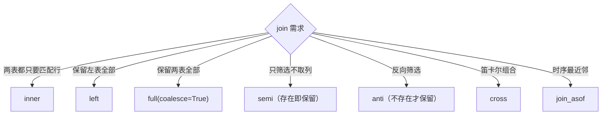

# 第 10 章 分组聚合与连接

> 本章要解决什么问题：掌握基础聚合全家桶、分位数、join 全家桶的语义与代价，以及超大数据集的流式聚合/join 策略。

## 10.1 基础聚合全家桶

| 聚合 | 表达式 | 备注 |
|---|---|---|
| 求和 | `pl.col("x").sum()` | 向量化 + 多线程分区求和 |
| 均值 | `pl.col("x").mean()` | sum / count 组合 |
| 计数 | `pl.len()` / `.count()` | len 计行，count 计非 null |
| 标准差/方差 | `.std()` / `.var()` | ddof 默认 1 |
| 唯一计数 | `.n_unique()` | |

```python
import polars as pl

df = pl.DataFrame({
    "dept": ["a", "a", "b", "b", "b"],
    "salary": [100, 200, 300, None, 500],
})

# len vs count：null 语义差异是常见坑
print(df.group_by("dept").agg(
    pl.len().alias("n_rows"),               # a:2, b:3 —— 物理行数
    pl.col("salary").count().alias("n_valid"),  # a:2, b:2 —— 跳过 null
    pl.col("salary").sum().alias("total"),      # b: 300+500（null 被跳过）
    pl.col("salary").mean().alias("avg"),
    pl.col("salary").std().alias("std"),
))
```

- 命名聚合：`group_by().agg(total=pl.col("x").sum())` 形式
- 聚合结果展开：`explode` / `flatten`

### 高效统计三件套（探索阶段省时利器）

```python
# 1. approx_n_unique：基数近似（HyperLogLog 思路，远快于精确 n_unique）
df.select(pl.col("user_id").approx_n_unique())

# 2. hist：直方图分箱——一行看分布（Series 方法，返回带分箱边界的表）
df.get_column("amount").hist(bin_count=4)
# 返回 breakpoint | category | count 三列，直接画分布

# 3. rle_id：游程编码分组——把"连续相同段"编为一个 id
# 典型用途：识别连续的会话/状态段（比窗口函数快得多）
(pl.DataFrame({"event": ["A", "A", "B", "B", "B", "A"]})
   .with_columns(session=pl.col("event").rle_id()))
# event A A B B B A → session 0 0 1 1 1 2
```

```python
# 聚合出列表，再按需展开
df.group_by("dept").agg(pl.col("salary"))            # salary → List[i64]
df.group_by("dept").agg(pl.col("salary").implode())   # 显式列表聚合

# TopN 模式：每个分组取前 N
df.group_by("dept").agg(
    pl.col("salary").sort(descending=True).head(2).alias("top2")
)
```

## 10.2 百分位与分位数

```python
df.select(
    pl.col("salary").quantile(0.25, interpolation="linear").alias("q1"),
    pl.col("salary").median().alias("median"),   # = quantile(0.5)
    pl.col("salary").quantile(0.75, interpolation="linear").alias("q3"),
)
```

- 插值方法差异：`linear` / `nearest` / `midpoint` / `lower` / `higher`
- IQR 异常检测模板
- 多级分组聚合与 `over` 窗口聚合的区别

```python
# IQR 异常检测：分组内标准化
(df.with_columns(
    q1=pl.col("salary").quantile(0.25).over("dept"),
    q3=pl.col("salary").quantile(0.75).over("dept"),
 )
 .with_columns(
     iqr=pl.col("q3") - pl.col("q1"),
 )
 .filter(pl.col("salary").is_between(
     pl.col("q1") - 1.5 * pl.col("iqr"),
     pl.col("q3") + 1.5 * pl.col("iqr"),
 )))
```

```python
# group_by.agg（行数改变）vs over（行数不变）——语义分水岭
df.group_by("dept").agg(pl.col("salary").mean())   # 每组一行
df.with_columns(pl.col("salary").mean().over("dept"))  # 广播回每行
```

## 10.3 join 全家桶



| 类型 | 语义 | 实现与代价 |
|---|---|---|
| `inner` | 两侧匹配 | 哈希 join，右表建哈希 |
| `left` / `right` | 保留一侧 | 哈希 + null 填充 |
| `full(coalesce)` | 全保留（1.0 起 `outer` 改名 `full`） | 哈希 + 双侧补齐，键可选合并 |
| `cross` | 笛卡尔积 | O(n·m)，慎用 |
| `semi` | 只保留左表中存在于右表的行 | 不膨胀 |
| `anti` | 只保留左表中不存在于右表的行 | 不膨胀 |
| `join_asof` | 按时序最近邻匹配 | 要求数据按 on 键有序（`set_sorted` 可跳过检查） |

```python
orders = pl.DataFrame({
    "user_id": [1, 2, 3, 4],
    "amount": [100, 200, 300, 400],
})
users = pl.DataFrame({
    "user_id": [1, 2, 5],
    "name": ["a", "b", "e"],
})

# inner：只保留双方都有的
orders.join(users, on="user_id", how="inner")
# ┌ user_id ┬ amount ┬ name ┐   （2 行：1、2）

# left：保留左表全部
orders.join(users, on="user_id", how="left")
# user_id 3、4 的 name 为 null

# semi：筛选器视角——不需要右表任何列
orders.join(users.select("user_id"), on="user_id", how="semi")
# ┌ user_id ┬ amount ┐  （2 行）—— 不引入 name 列、不膨胀

# anti：反向筛选
orders.join(users.select("user_id"), on="user_id", how="anti")
# 3、4 两行——典型用途：增量数据中排除已处理过的主键
```

```python
# join_asof：时序最近邻
trades = pl.DataFrame({
    "ts": [1, 5, 9], "price": [10.0, 11.0, 12.0],
}).sort("ts").set_sorted("ts")

quotes = pl.DataFrame({
    "ts": [2, 6, 10], "bid": [9.5, 10.5, 11.5],
}).sort("ts").set_sorted("ts")

# 每笔成交对齐到它之前最近的报价
trades.join_asof(quotes, on="ts", strategy="backward")
```

- 多键 join：`on=["k1", "k2"]`
- join 顺序对小表构建哈希的影响
- `join_where`（条件连接）

## 10.4 group_by 的多线程分区策略

- 分区 → 局部聚合 → 归并
- `maintain_order` 的代价

```python
# maintain_order=True 保证输出按组键有序
# 代价：禁用部分并行归并——仅在下游依赖顺序时开启
df.group_by("dept", maintain_order=True).agg(pl.col("salary").sum())

# 生产管道推荐：不保序 + 显式 sort（sort 本身高度并行）
df.group_by("dept").agg(pl.col("salary").sum()).sort("dept")
```

## 10.5 窗口函数 over

```python
# 组内归一化、组内排名——一次扫描完成
(df.with_columns(
    share=(pl.col("salary") / pl.col("salary").sum().over("dept")).alias("share"),
    rank=pl.col("salary").rank(descending=True).over("dept"),
))
```

- `over` 的分组窗口计算
- 与 `group_by().agg` 的语义差异

## 10.6 超大数据集的流式 join/聚合策略

```python
# 超大事实表 join 小维表：流式友好（维表可整表广播/哈希）
(pl.scan_parquet("facts/*.parquet")        # 100 GB
   .join(pl.scan_parquet("dim_user.parquet").collect(),  # 小表物化
         on="user_id", how="inner")
   .group_by("city")
   .agg(pl.col("amount").sum())
   .sink_parquet("city_stats.parquet"))

# 大表 join 大表：考虑按 join 键预分片，分批进行
```

## 要点回顾

- `len` 计行、`count` 计非 null——聚合前想清楚 null 语义
- semi/anti 用于筛选不膨胀，优于 join 后 drop
- `join_asof` 前务必 `set_sorted`
- group_by 保序有代价，能用 sort 就别 maintain_order

## 性能检查清单

- [ ] join 键是否已去重（1:N 膨胀）？——`group_by("k").len()` 预检右表
- [ ] 大表 join 是否能下推过滤先减小右表？
- [ ] 聚合基数是否可控以支持流式？
- [ ] 是否误用了 cross join（本可用 join_where 或展开条件）？
- [ ] `over` 的分区数是否远小于行数？

## 练习

1. **join 语义**：构造左表 4 行、右表 3 行（有部分键重叠），分别执行七种 join（inner/left/right/full/cross/semi/anti），写下每个输出的行数与列，自制一张速查表。
2. **IQR 实战**：生成含 1% 极端值的 100 万行数据，用 10.2 节的 IQR 模板剔除异常值，再对比剔除前后的 mean 与 median 的变化。
3. **环比聚合**：给定带 null 的分组数据，同时输出每组的 `pl.len()` 与 `count()`，解释两者何时相等、何时不等。
4. **膨胀检测**：对一个 1:N 的 join 写出"预检右表键是否重复"的表达式，并在 join 前先收窄右表。
