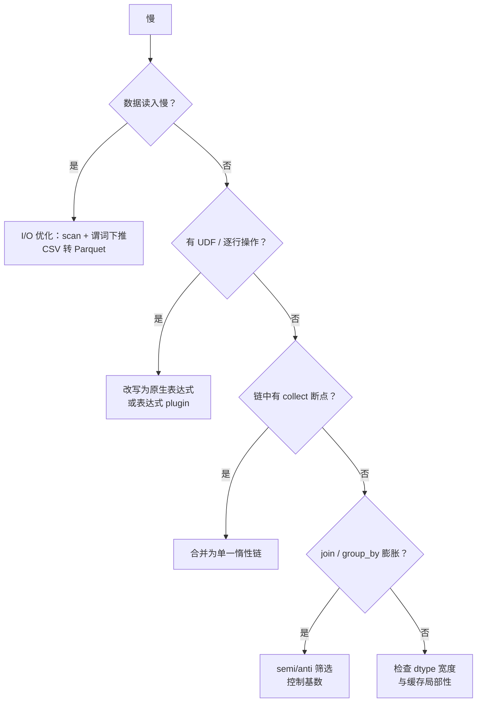

# 第 12 章 性能调优方法论

> 本章要解决什么问题：建立系统化的调优方法——profile 定位、反模式排查、避免基准测试陷阱。

## 12.1 profile 定位热点

```python
import polars as pl

lf = (
    pl.scan_parquet("events.parquet")
      .filter(pl.col("amount") > 100)
      .with_columns(taxed=pl.col("amount") * 1.13)
      .group_by("user_id")
      .agg(pl.col("taxed").sum())
)

# 每个节点的耗时与行数——瓶颈在哪一目了然
df, stats = lf.profile()
print(stats)
# 输出列：node（操作名）、start、end（微秒）
# end - start 最大的就是热点
```

```python
# 单表达式级别的耗时：df.select(...).pipe 计时即可，
# 更细粒度的火焰图可用 py-spy 对进程采样
# pip install py-spy && py-spy record -o profile.svg -- python script.py

import polars as pl

big = pl.DataFrame({"x": pl.int_range(0, 10_000_000)})
big.select(pl.col("x").rolling_mean(100).sum())
```

## 12.2 调优决策树



## 12.3 性能反模式

- 逐行操作（`map_elements` / `iter_rows`）
- 不必要的 collect：中间物化丢失优化机会
- 打断链式优化：链中夹带 collect/UDF
- 高基数 group_by（超出缓存）

```python
# 反模式 1：逐行迭代
for row in df.iter_rows():        # ❌ 每行构造一个 Python 元组
    total += row["amount"]

df.select(pl.col("amount").sum())  # ✅

# 反模式 2：在 Python 里做 Polars 能做的事
df.with_columns(pl.col("path").map_elements(lambda p: p.split(".")[-1]))  # ❌
df.with_columns(pl.col("path").str.split(".").list.last())                  # ✅

# 反模式 3：高基数 group_by + 低选择性过滤
# 先过滤掉不需要的组，能把哈希表缩小几个数量级
(pl.scan_parquet("big.parquet")
   .filter(pl.col("status") == "ACTIVE")     # ✅ 先收窄
   .group_by("user_id").agg(pl.len()))
```

## 12.4 基准测试陷阱

- 测量方法本身的开销（`time.perf_counter` 精度足够；更深的分析用 py-spy 采样火焰图）
- 缓存预热效应
- 数据规模外推的误导

```python
# ❌ 陷阱 1：单次计时——首次运行包含编译、页缓存未热
t0 = time.perf_counter(); run(); print(time.perf_counter() - t0)

# ✅ 多次运行取中位数
import statistics, time
times = []
for _ in range(5):
    t0 = time.perf_counter()
    run()
    times.append(time.perf_counter() - t0)
print(statistics.median(times))

# ❌ 陷阱 2：用包含 collect 的墙钟时间对比 Eager
# collect 包含了优化与读取，而 Eager 版本的数据早已在内存

# ❌ 陷阱 3：小数据基准外推
# 100MB 上快 3 倍 ≠ 100GB 上快 3 倍——缓存与 I/O 行为完全不同
```

## 12.5 一个完整的调优案例

```python
# 起点：一段"莫名慢"的管道
def slow_pipeline():
    df = pl.read_csv("events.csv")                       # ① read 而非 scan
    df = df.filter(df["status"] == "OK")                 # ② 该写法能运行，但每次比较
    #                                                       都会物化布尔 Series，无法下推优化
    df = df.with_columns(
        bonus=df["amount"].map_elements(lambda x: x * 0.1)  # ③ UDF
    )
    return df.group_by("region").agg(pl.col("bonus").sum().alias("total"))

# 调优后：scan + 表达式 + 一次执行
def fast_pipeline():
    return (
        pl.scan_csv("events.csv")
          .filter(pl.col("status") == "OK")
          .with_columns(bonus=pl.col("amount") * 0.1)    # ③ → 原生表达式
          .group_by("region")
          .agg(pl.col("bonus").sum().alias("total"))
          .collect()
    )
# 典型结果：3~10 倍提速（取决于数据规模），且内存峰值更低
```

## 要点回顾

- 先 profile 再动手，不猜
- 反模式大多归结为"掉出 Rust 内核"或"丢失全局优化"
- 基准必须预热、多次、取中位数

## 性能检查清单

- [ ] 已用 profile 而非直觉定位瓶颈？
- [ ] 无逐行操作、无中间 collect？
- [ ] 基准测试是否预热且多次取中位？
- [ ] 过滤是否尽量前置（收窄 group_by/join 的输入）？
- [ ] 基准环境（硬件/版本/数据规模）是否记录？

## 练习

1. **热点定位**：构造一个"I/O 慢 + 计算快"的管道（如大量小文件 scan），用 `profile()` 找出热点节点，再通过合并文件优化它，前后各跑一次 profile 对比。
2. **调优实战**：把 12.5 节的 slow_pipeline 原样录入运行，逐步应用三处修复，记录每步的提速幅度。
3. **基准方法论**：为你自己的一个真实查询写基准脚本——预热一次、正式测 5 次取中位数，并输出环境信息（CPU 型号、Polars 版本、数据规模）。
