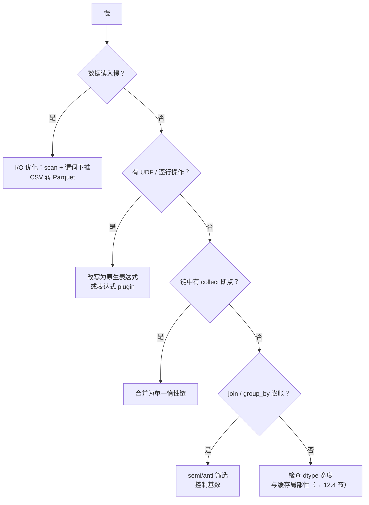

# 第 12 章 性能调优方法论

> 本章要解决什么问题：建立系统化的调优方法——profile 定位、反模式排查、避免基准测试陷阱。

## 12.1 profile 定位热点

```python
import polars as pl

lf = (
    pl.scan_parquet("events.parquet")
      .filter(pl.col("amount") > 100)
      .with_columns(taxed=pl.col("amount") * 1.13)
      .group_by("user_id")
      .agg(pl.col("taxed").sum())
)

# 每个节点的耗时与行数——瓶颈在哪一目了然
df, stats = lf.profile()
print(stats)
# 输出列：node（操作名）、start、end（微秒）
# end - start 最大的就是热点
```

**注意：`LazyFrame.profile()` 自 1.43 起弃用**。实测 1.44.1 仍可调用（返回值照旧），但会触发 `DeprecationWarning`：它是为旧 in-memory 引擎设计的——旧引擎逐节点串行执行，start/end 时间戳才有意义；新流式引擎（第 8 章）并发执行整条管道，逐节点计时既不完整也不可靠。实测也印证了这一点：上面的 stats 往往只列出个别节点（filter 已被下推进 scan、扫描与聚合不再单独出现），拿这些数字对号入座很容易误判瓶颈。新引擎下定位热点，按粒度从粗到细有三件工具：

**① `lf.explain()` 看计划结构**——不计时，但能确认优化是否真的发生：

```python
print(lf.explain())
# 输出（节选，polars 1.44.1 实测）：
# AGGREGATE [col("taxed").sum()] BY [col("user_id")]
#   Parquet SCAN [events.parquet]
#     PROJECT 2/3 COLUMNS
#     SELECTION: col("amount") > 100     ← 谓词已下推进扫描
# 计划本身就能暴露问题：SELECTION 缺失（谓词没下推）、PROJECT 全列
# （投影没裁剪）——这些是不用计时就能发现的"热点"
```

**② `perf_counter` 分段计时**——把管道从中间劈开，两半各自计时（实测：2000 万行 parquet）：

```python
import time
import polars as pl

# 预热（首次 collect 含一次性成本，见 12.5 陷阱 1）
pl.scan_parquet("events.parquet").filter(pl.col("status") == "OK").collect()

t0 = time.perf_counter()
scanned = (
    pl.scan_parquet("events.parquet")
      .filter(pl.col("status") == "OK")
      .collect()
)
t1 = time.perf_counter()
print(f"① scan+filter+collect: {(t1 - t0) * 1000:6.1f} ms  （{scanned.height:,} 行）")
# 实测：① scan+filter+collect:   40.3 ms  （6,666,667 行）

result = (scanned.with_columns(taxed=pl.col("amount") * 1.13)
                 .group_by("user_id")
                 .agg(pl.col("taxed").sum().alias("total")))
t2 = time.perf_counter()
print(f"② with_columns+group_by: {(t2 - t1) * 1000:6.1f} ms  （{result.height:,} 组）")
# 实测：② with_columns+group_by: 40.9 ms  （50,000 组）
# 两半同一量级、① 略高——瓶颈不在某一侧，继续劈细或转 ③
```

分段计时有一句诚实的注脚：拆开的代价是多物化一次中间结果（667 万行落进内存），两段之和（~81 ms）会比整链单次 collect（预热后实测 ~74 ms）略长。分段用于定位瓶颈在哪一侧，别把分段耗时当作整链的精确分解。

**③ py-spy 采样火焰图**——不改代码，看引擎内部时间去哪了：

```python
# 单表达式级别的耗时：df.select(...).pipe 计时即可，
# 更细粒度的火焰图可用 py-spy 对进程采样
# pip install py-spy && py-spy record -o profile.svg -- python script.py

import polars as pl

big = pl.DataFrame({"x": pl.int_range(0, 10_000_000)})
big.select(pl.col("x").rolling_mean(100).sum())
```

## 12.2 调优决策树



## 12.3 性能反模式

- 逐行操作（`map_elements` / `iter_rows`）
- 不必要的 collect：中间物化丢失优化机会
- 打断链式优化：链中夹带 collect/UDF
- 高基数 group_by（超出缓存）

这四条反模式指向同一个失血点：只要数据离开 Rust 内核一次——掉进 Python 解释器、被中间物化、或让优化器看不到全链——向量化、多线程与下推优化就同时失效。逐行操作的代价按行数线性放大：每行一次解释器往返，百万行就是百万次；中间 collect 与链中断点的危害则在优化层——管道被切成数段后，谓词下推与投影裁剪都止步于断点，上游重复扫描、中间结果重复物化。高基数 group_by 则是内存层的问题：哈希表随基数增长，涨到缓存装不下时，每次键探测都变成一次内存往返，吞吐从缓存速度跌到内存带宽速度。

```python
# 反模式 1：逐行迭代
for row in df.iter_rows():        # ❌ 每行构造一个 Python 元组
    total += row["amount"]

df.select(pl.col("amount").sum())  # ✅

# 反模式 2：在 Python 里做 Polars 能做的事
df.with_columns(pl.col("path").map_elements(lambda p: p.split(".")[-1]))  # ❌
df.with_columns(pl.col("path").str.split(".").list.last())                  # ✅

# 反模式 3：高基数 group_by + 低选择性过滤
# 先过滤掉不需要的组，能把哈希表缩小几个数量级
(pl.scan_parquet("big.parquet")
   .filter(pl.col("status") == "ACTIVE")     # ✅ 先收窄
   .group_by("user_id").agg(pl.len()))
```

## 12.4 dtype 宽度与缓存局部性

CPU 从内存取数据的最小单位是 64 字节的**缓存行**。`Int64` 一列每行占 8 字节，一条缓存行只装得下 8 个值；收窄成 `Int32`（4 字节）后，同一条缓存行能装 16 个——扫描同样的行数，内存流量直接减半。聚合与过滤恰恰是**纯顺序扫描**：内核逐缓存行线性推进，没有随机跳转，缓存命中率（以及数据超出缓存后的内存带宽）直接决定吞吐。当数据远大于 L3 缓存（消费级 CPU 一般几十 MB）时，瓶颈就从"算得快不快"变成"喂得快不快"，dtype 宽度成了吞吐上限的一部分。

实测：1 亿行 `Int64` 收窄为 `Int32`（polars 1.44.1，Apple M 系列，7 次取中位数）：

```python
import time
import statistics
import polars as pl

N = 100_000_000
big64 = pl.DataFrame({"v": pl.int_range(0, N, eager=True, dtype=pl.Int64) * 3})
big32 = big64.with_columns(pl.col("v").cast(pl.Int32))

big64.estimated_size() / 1024**2   # 762.9 MB
big32.estimated_size() / 1024**2   # 381.5 MB——恰好减半

def bench(df, expr):
    times = []
    for _ in range(7):
        t0 = time.perf_counter()
        df.select(expr)
        times.append(time.perf_counter() - t0)
    return statistics.median(times)

bench(big64, pl.col("v").sum())    # 9.4 ms
bench(big32, pl.col("v").sum())    # 4.9 ms  → 1.9×

bench(big64, pl.col("v").filter(pl.col("v") > 50_000_000).sum())    # 22.8 ms
bench(big32, pl.col("v").filter(pl.col("v") > 50_000_000).sum())    # 12.1 ms → 1.9×
```

字节减半、耗时几乎精确减半（两个操作都 ~1.9×）——这是内存带宽受限的直接证据：800 MB 用 9.4 ms 扫完 ≈ 85 GB/s，消费级内存的带宽已经被吃满，CPU 再快也只能等数据。收窄 dtype 因此成为少数"改一个 cast 就换近一倍吞吐"的手段，但有两个必须防的坑：

```python
# 坑 1：溢出是静默的——Int32 列的 sum 结果仍是 Int32，不会自动升宽
s = pl.Series("v", [2_000_000_000, 2_000_000_000, 2_000_000_000], dtype=pl.Int32)
s.sum()                 # 1705032704 ——回绕了！正确值是 6_000_000_000
s.cast(pl.Int64).sum()  # 6000000000 ——求和前先升到 Int64 累加

# 坑 2：算术运算保持窄类型，中间结果先溢出
s2 = pl.Series("v", [46341], dtype=pl.Int32)   # 46341² > 2³¹ - 1
(s2 * s2).item()        # -2147479015 ——回绕成负数

# 落点：收窄放在 scan 之后立即做，让后续所有算子都吃窄列；
# 若能控制落盘格式，parquet 里直接存 Int32，连 I/O 都省一半
(pl.scan_parquet("events.parquet")
   .with_columns(pl.col("amount").cast(pl.Int32))    # 紧跟 scan
   .filter(pl.col("amount") > 100))
```

## 12.5 基准测试陷阱

- 测量方法本身的开销（`time.perf_counter` 精度足够；更深的分析用 py-spy 采样火焰图）
- 缓存预热效应
- 数据规模外推的误导

这三条陷阱的共性在于：代码不报错、数字照常输出，错的只是结论——首次运行的一次性成本（页缓存未热、计划首次构建）被单次计时当成稳态吞吐，小数据上成立的结论被外推到成本结构完全不同的大数据上。两条纠偏原则贯穿本节：数字要取稳态（预热后多次测量），量级要贴近生产（或明确标注外推风险）。下面三个反例先看错误做法长什么样：

```python
# ❌ 陷阱 1：单次计时——首次运行包含编译、页缓存未热
t0 = time.perf_counter(); run(); print(time.perf_counter() - t0)

# ✅ 多次运行取中位数
import statistics, time
times = []
for _ in range(5):
    t0 = time.perf_counter()
    run()
    times.append(time.perf_counter() - t0)
print(statistics.median(times))

# ❌ 陷阱 2：用包含 collect 的墙钟时间对比 Eager
# collect 包含了优化与读取，而 Eager 版本的数据早已在内存

# ❌ 陷阱 3：小数据基准外推
# 100MB 上快 3 倍 ≠ 100GB 上快 3 倍——缓存与 I/O 行为完全不同
```

**陷阱 1 展开**：首次运行是"一次性成本"的大杂烩——parquet 页缓存未热、惰性计划首次构建、CPU 分支预测与缓存尚在冷态。单次计时把这些一次性成本当成稳态成本，结论天然偏高。多跑几次取**中位数**（而非均值——中位数对偶发的系统抖动免疫），测到的才是稳态吞吐。

**陷阱 2 展开**——对照实测（2000 万行 parquet，同一查询 filter + group_by + sum，5 次取中位数）：

```python
import time
import statistics
import polars as pl

LF = (
    pl.scan_parquet("events.parquet")
      .filter(pl.col("status") == "OK")
      .group_by("user_id")
      .agg(pl.col("amount").sum().alias("total"))
)

def timed(fn):
    times = []
    for _ in range(5):
        t0 = time.perf_counter()
        fn()
        times.append(time.perf_counter() - t0)
    return statistics.median(times)

# 冷 collect：从文件开始，含 parquet 读取 + 解码
t_cold = timed(lambda: LF.collect())                 # 实测：78.0 ms

# 已物化的 DataFrame 上执行同一查询：数据早已在内存
mat = pl.read_parquet("events.parquet")
t_warm = timed(lambda: mat.filter(pl.col("status") == "OK")
                        .group_by("user_id")
                        .agg(pl.col("amount").sum().alias("total")))
# 实测：54.9 ms
```

同一个查询，冷 collect 比物化后执行慢 42%（78.0 vs 54.9 ms）——但多出的 ~23 ms 全是 parquet 读取与解码，与计算快慢无关。拿这对数字去比"引擎谁快"，测的其实是 I/O。有意思的是这次 lazy 反而"输"了：它老老实实付了读取的钱，而 eager 版本的数据是别人提前搬进内存的。公平的对比要么双方都从文件读起，要么双方都在内存数据上执行——差一个读取，结论就能反转。

**陷阱 3 展开**：100 MB 的数据可能整个躺在 L2/L3 缓存里，内存带宽、磁盘 I/O、out-of-core 交换统统没参与；100 GB 时这些全是主导成本。小数据基准里"快 3 倍"的方案到了大数据上优势可能归零甚至反转——例如 12.4 节的 dtype 收窄，在整列都装进缓存的小数据上收益会远小于实测的 1.9×。要么在与生产同量级的数据上做基准，要么明确标注量级、声明外推风险。

## 12.6 一个完整的调优案例

```python
# 起点：一段"莫名慢"的管道
def slow_pipeline():
    df = pl.read_csv("events.csv")                       # ① read 而非 scan
    df = df.filter(df["status"] == "OK")                 # ② 该写法能运行，但每次比较
    #                                                       都会物化布尔 Series，无法下推优化
    df = df.with_columns(
        bonus=df["amount"].map_elements(lambda x: x * 0.1)  # ③ UDF
    )
    return df.group_by("region").agg(pl.col("bonus").sum().alias("total"))

# 调优后：scan + 表达式 + 一次执行
def fast_pipeline():
    return (
        pl.scan_csv("events.csv")
          .filter(pl.col("status") == "OK")
          .with_columns(bonus=pl.col("amount") * 0.1)    # ③ → 原生表达式
          .group_by("region")
          .agg(pl.col("bonus").sum().alias("total"))
          .collect()
    )
# 典型结果：3~10 倍提速（取决于数据规模），且内存峰值更低
```

## 要点回顾

- 先 profile 再动手，不猜
- 反模式大多归结为"掉出 Rust 内核"或"丢失全局优化"
- 基准必须预热、多次、取中位数

## 性能检查清单

- [ ] 已用 profile 而非直觉定位瓶颈？
- [ ] 无逐行操作、无中间 collect？
- [ ] 基准测试是否预热且多次取中位？
- [ ] 过滤是否尽量前置（收窄 group_by/join 的输入）？
- [ ] 基准环境（硬件/版本/数据规模）是否记录？

## 练习

1. **热点定位**：构造一个"I/O 慢 + 计算快"的管道（如大量小文件 scan），用 `profile()` 找出热点节点，再通过合并文件优化它，前后各跑一次 profile 对比。
2. **调优实战**：把 12.6 节的 slow_pipeline 原样录入运行，逐步应用三处修复，记录每步的提速幅度。
3. **基准方法论**：为你自己的一个真实查询写基准脚本——预热一次、正式测 5 次取中位数，并输出环境信息（CPU 型号、Polars 版本、数据规模）。
