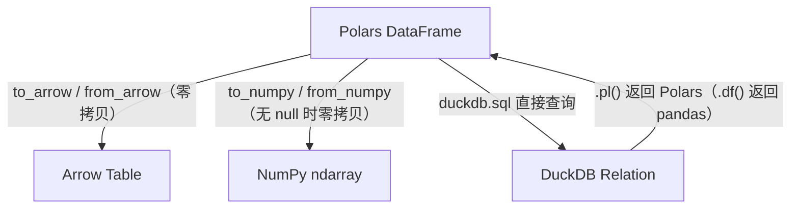

# 第 13 章 UDF 边界与生态互通

> 本章要解决什么问题：知道 Python 边界在哪、如何突破（表达式 plugin），以及与 NumPy/Arrow/DuckDB 的零拷贝互通。

## 13.1 map_elements 的性能悬崖

- 每次 Python↔Rust 往返的序列化成本
- 适用场景：确实无原生表达式的低频操作

```python
import polars as pl
import time

big = pl.select(x=pl.int_range(0, 1_000_000, dtype=pl.Int64).cast(pl.Float64))

# 原生表达式：Rust 内核，向量化
t0 = time.perf_counter()
big.select(pl.col("x") * 2)
t_native = time.perf_counter() - t0            # ~1 ms

# map_elements：100 万次 Python 函数调用 + 装箱拆箱
t0 = time.perf_counter()
big.select(pl.col("x").map_elements(lambda v: v * 2))
t_udf = time.perf_counter() - t0               # ~300 ms
print(f"差距：{t_udf / t_native:.0f} 倍")
```

```python
# UDF 的三个层级——能上则上
# 层级 1：原生表达式（永远首选）
pl.col("x").str.to_uppercase()

# 层级 2：表达式组合——多个原生子表达式拼出复杂逻辑
pl.when(pl.col("x") > 0).then(pl.col("x").log()).otherwise(None)

# 层级 3：map_elements（最后手段）
pl.col("x").map_elements(my_complex_fn)   # 自定义加密、调用外部库等
```

## 13.2 表达式 plugin

- 用 Rust 编译表达式函数进引擎
- `polars_plugin` 机制：注册自定义命名空间函数
- 开发流程：cargo 工程结构 → 编译 → Python 侧 `register_plugin_function`

完整工程只需要两个文件，可以照着搭：

```text
polars_udt/
├── Cargo.toml
└── src/lib.rs
```

```toml
# Cargo.toml —— 表达式 plugin 工程骨架
[package]
name = "polars_udt"
version = "0.1.0"

[lib]
name = "polars_udt"
crate-type = ["cdylib"]

[dependencies]
# 版本以 polars crate 与 pyo3 当时的稳定版为准，二者需与 Python 侧 polars 版本匹配
polars = { version = "*" }
pyo3 = { version = "*", features = ["extension-module"] }
```

```rust
// src/lib.rs —— 一个表达式 plugin 的最小实现
use polars::prelude::*;

#[polars_expr(output_type=Int64)]
fn my_gcd(inputs: &[Series]) -> PolarsResult<Series> {
    let a = inputs[0].i64()?;
    let b = inputs[1].i64()?;
    // 逐元素调用 Rust 实现的 gcd——编译进引擎，无 Python 往返
    let out: Int64Chunked = a.into_iter().zip(b).map(|(a, b)| {
        match (a, b) { (Some(a), Some(b)) => Some(gcd(a, b)), _ => None }
    }).collect();
    Ok(out.into_series())
}
```

构建与注册三步：

1. `cargo build --release` 编译出动态库，产物在 `target/release/` 下——macOS 为 `libpolars_udt.dylib`，Linux 为 `libpolars_udt.so`（Windows 为 `polars_udt.dll`）；
2. Python 侧把动态库路径传给 `register_plugin_function`（也接受动态库所在目录）；
3. 注册得到的是普通 `Expr`——可与原生表达式混用、进惰性管道，像内置函数一样参与优化。

`register_plugin_function` 在 polars 1.44.1 的真实签名（`inspect.signature` 实测抄录，注释按官方文档字符串整理）：

```python
register_plugin_function(
    *,
    plugin_path,                      # 动态库路径：文件或其所在目录
    function_name,                    # Rust 侧 #[polars_expr] 标注的函数名
    args,                             # 传给 Rust 侧 inputs 的表达式参数
    kwargs=None,                      # 非表达式参数，必须 JSON 可序列化
    is_elementwise=False,             # 逐元素语义：可触发向量化/流式快速路径
    changes_length=False,             # 输出长度会变（unique / slice 类）
    returns_scalar=False,             # 聚合语义：作为最终聚合时自动展开单位长度
    cast_to_supertype=False,          # 多输入先统一转换到公共超类型
    input_wildcard_expansion=False,   # 执行前先展开通配符表达式
    pass_name_to_apply=False,         # group_by 传入的 Series 附带列名（每组一次堆分配）
    use_abs_path=False,               # 把路径解析为绝对路径
)  # 返回 Expr
```

这些参数不是"配置项"，而是**你向引擎作出的承诺**——标错了不会报错，只会静默得到错误结果：比如把聚合函数标成 `is_elementwise=True`，流式与分组路径都会算错。

```python
# Python 侧注册并使用——像原生表达式一样参与优化
from polars.plugins import register_plugin_function

df.with_columns(
    register_plugin_function(
        # Linux 为 .so；macOS 为 .dylib、Windows 为 .dll
        plugin_path="target/release/libpolars_udt.so",
        function_name="my_gcd",
        args=[pl.col("a"), pl.col("b")],
    ).alias("gcd")
)
```

**何时值得写 plugin**，三条判断：

- **调用频次**：逻辑要对千万行逐行执行——13.1 实测 `map_elements` 比原生慢约 300 倍，这个倍数把 Python 写得再好也消不掉，只能换执行层；
- **是否需要进优化器**：plugin 表达式与原生表达式一样参与谓词下推、并行分片与流式执行；`map_elements` 只能等收集完成后逐值调用，进不了任何优化；
- **团队维护成本**：Rust 工具链、版本锁定、CI 冒烟测试都是持续成本——一次性脚本不值得，多人共用的核心库才值得。

> **ABI 版本警示**：plugin 动态库与运行时 polars 直接共享内存布局，二者 ABI 必须严格匹配——Cargo 里 `polars` crate 的版本要与 Python 侧 `polars` 版本一致（性能清单最后一条正为此而设）。不匹配时通常不是抛 Python 异常，而是加载即 panic、甚至 undefined behavior（静默的内存错误），极难排查。对策：锁定版本并同步升级，CI 里加一个冒烟测试——加载 plugin、跑一个最小表达式、断言输出。

## 13.3 零拷贝生态互通



**与 NumPy**：数值列无 null 时 `to_numpy()` 直接返回底层缓冲区的零拷贝视图（实测两次调用共享内存；视图只读，要可写就传 `writable=True`，代价是一次拷贝）。含 null 的列没有连续的物理表示，必须先物化——Float64 列的 null 会被转成 NaN 的普通数组，这次拷贝无法避免。

**与 Arrow**：`to_arrow` / `from_arrow` 走标准 Arrow 数据接口，两侧缓冲区满足对齐、连续等布局要求时零拷贝共享；不满足时（如偏移数组不对齐、需要重排缓冲区）退化为一次整块 memcpy——仍是低成本拷贝，不是逐值转换。

**与 DuckDB**：`duckdb.sql` 能直接查询 Polars 的 DataFrame 与 LazyFrame（替换扫描经 Arrow 接入，不必先落盘），查询结果用 `rel.pl()` 以 Polars DataFrame 返回、`.df()` 以 pandas 返回。实测（polars 1.44.1 + duckdb 1.5.5）：对 `pl.scan_parquet` 得到的 LazyFrame 直接 `SELECT region, AVG(amount) ... GROUP BY region` 正常执行。

```python
# NumPy 互通：把成熟的科学计算库接到管道里
import numpy as np

df = pl.DataFrame({"x": [1.0, 2.0, 3.0]})

# 零拷贝视图 → NumPy 函数 → 零拷贝回 Polars
result = df.with_columns(
    sigmoid=pl.Series(
        1 / (1 + np.exp(-df.get_column("x").to_numpy()))
    )
)
```

```python
# DuckDB 互通：Polars 管道 + SQL ad-hoc 查询
import duckdb

lf = pl.scan_parquet("events.parquet")

# DuckDB 直接查询 Polars 的 LazyFrame（1.x 支持）
rel = duckdb.sql("SELECT region, AVG(amount) FROM lf GROUP BY region")
stats = rel.pl()               # .pl() 返回 Polars DataFrame（.df() 返回 pandas）
# 或 pl.from_arrow(rel.arrow()) 零拷贝转回

# 分工模式：Polars 做重变换（清洗/聚合），DuckDB 做探索式 SQL
```

## 13.4 与 pandas 的边界互操作

- `from_pandas` 的成本：只有必要时用
- 渐进式迁移策略

```python
# from_pandas：Arrow 化需要一次完整转换
import pandas as pd

pdf = pd.DataFrame({"a": [1, 2, 3]})
df = pl.from_pandas(pdf)

# 渐进式迁移三步法：
# 1. 入口/出口保持 pandas（兼容上下游），中间用 Polars
df = pl.from_pandas(pdf).select(...).to_pandas()
# 2. 瓶颈段逐个替换为 Polars 管道
# 3. 最终把 pandas 依赖压缩到系统边界
```

**from_pandas 的成本**：数值列经 Arrow 缓冲区对接多为零拷贝——实测 100 万行 int64 列快到测不出来（转换后与 pandas 侧共享内存）；object 列没有列式表示，只能逐值装箱转换——实测 100 万行 object 字符串列约 28 ms，随行数线性增长。先在 pandas 侧把 object 列转成原生 dtype 再过边界，成本能低一个量级。

**渐进式迁移三步法**（上面代码块注释里的三步展开）：

**第 1 步 · 出入口保持 pandas，中间换 Polars**：上下游接口、同事的函数、报表工具都不动，只把计算内核替换成 `from_pandas(pdf).select(...).to_pandas()`。这一步改动最小、随时可回滚，先用它验证内核收益是否真实。

**第 2 步 · 瓶颈段逐个替换**：用第 12 章的 profile 定位最慢的一段，改成 Polars 惰性管道（scan → 变换 → sink），其余照旧；每替换一段做一次回归对比，确认数值一致、耗时下降。

**第 3 步 · 把 pandas 压到系统边界**：最终链路内部全程 Arrow 布局，只剩入口读与出口写两个转换点，边界转换近乎零成本。

**边界策略**：一句话——"入口出口 pandas、内核 Polars"。pandas 留在系统边缘做兼容层（对接旧接口与外部工具），Polars 承担全部重计算；反过来（内核 pandas、边界 Polars）两头付转换税，零拷贝红利一点吃不到。

## 要点回顾

- UDF 是最后手段，plugin 是正确突破方式
- 生态互通建立在 Arrow 之上，零拷贝是常态
- 与 DuckDB 是协作关系而非竞争——管道与查询各司其职

## 性能检查清单

- [ ] UDF 调用频率是否足够低以摊薄开销？（或改为 plugin）
- [ ] 是否避免了不必要的 pandas 往返？
- [ ] NumPy 互操作是否利用了零拷贝（无 null 列）？
- [ ] plugin 的 ABI 版本是否与运行时 polars 匹配？

## 练习

1. **UDF 分层改写**：找出你代码中三个 `map_elements` 调用，判断哪些能降级为层级 1（原生表达式）或层级 2（表达式组合），改写并对比耗时。
2. **零拷贝管道**：构造含 null 与不含 null 的两个 Float64 列，分别 `to_numpy()` 后修改一个元素，检查原 Series 是否被影响，验证零拷贝的边界条件。
3. **DuckDB 协作**：把一份 Parquet 的聚合查询分别用 Polars 表达式与 DuckDB SQL 各写一遍，对比代码量与耗时，体会两种范式的适用场景。
