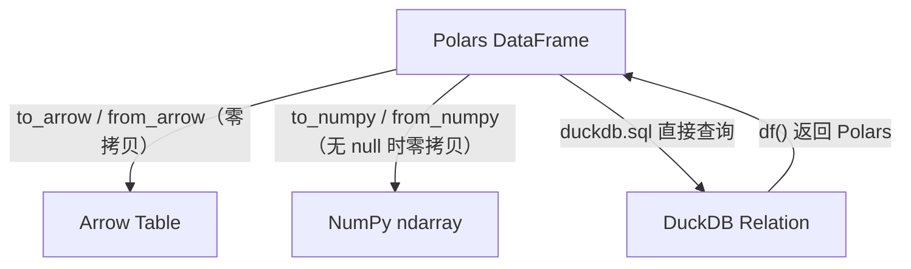

# 第 13 章 UDF 边界与生态互通

> 本章要解决什么问题：知道 Python 边界在哪、如何突破（表达式 plugin），以及与 NumPy/Arrow/DuckDB 的零拷贝互通。

## 13.1 map_elements 的性能悬崖

- 每次 Python↔Rust 往返的序列化成本
- 适用场景：确实无原生表达式的低频操作

```python
import polars as pl
import time

big = pl.DataFrame({"x": pl.int_range(0, 1_000_000, dtype=pl.Float64)})

# 原生表达式：Rust 内核，向量化
t0 = time.perf_counter()
big.select(pl.col("x") * 2)
t_native = time.perf_counter() - t0            # ~1 ms

# map_elements：100 万次 Python 函数调用 + 装箱拆箱
t0 = time.perf_counter()
big.select(pl.col("x").map_elements(lambda v: v * 2))
t_udf = time.perf_counter() - t0               # ~300 ms
print(f"差距：{t_udf / t_native:.0f} 倍")
```

```python
# UDF 的三个层级——能上则上
# 层级 1：原生表达式（永远首选）
pl.col("x").str.to_uppercase()

# 层级 2：表达式组合——多个原生子表达式拼出复杂逻辑
pl.when(pl.col("x") > 0).then(pl.col("x").log()).otherwise(None)

# 层级 3：map_elements（最后手段）
pl.col("x").map_elements(my_complex_fn)   # 自定义加密、调用外部库等
```

## 13.2 表达式 plugin

- 用 Rust 编译表达式函数进引擎
- `polars_plugin` 机制：注册自定义命名空间函数
- 开发流程：cargo 工程结构 → 编译 → Python 侧 `register_plugin_function`

```toml
# Cargo.toml —— 表达式 plugin 工程骨架
[package]
name = "polars_udt"
version = "0.1.0"

[lib]
name = "polars_udt"
crate-type = ["cdylib"]

[dependencies]
polars = { version = "0.4x" }
pyo3 = { version = "0.2x", features = ["extension-module"] }
```

```rust
// src/lib.rs —— 一个/plugin 的最小实现
use polars::prelude::*;

#[polars_expr(output_type=Int64)]
fn my_gcd(inputs: &[Series]) -> PolarsResult<Series> {
    let a = inputs[0].i64()?;
    let b = inputs[1].i64()?;
    // 逐元素调用 Rust 实现的 gcd——编译进引擎，无 Python 往返
    let out: Int64Chunked = a.into_iter().zip(b).map(|(a, b)| {
        match (a, b) { (Some(a), Some(b)) => Some(gcd(a, b)), _ => None }
    }).collect();
    Ok(out.into_series())
}
```

```python
# Python 侧注册并使用——像原生表达式一样参与优化
from polars import register_plugin_function

df.with_columns(
    register_plugin_function(
        plugin_path="target/release/libpolars_udt.so",
        function_name="my_gcd",
        args=[pl.col("a"), pl.col("b")],
    ).alias("gcd")
)
```

## 13.3 零拷贝生态互通



- 与 NumPy：无 null 列零拷贝
- 与 Arrow：`to_arrow` / `from_arrow`
- 与 DuckDB：SQL 查询 Polars DataFrame，结果直接返回 Polars

```python
# NumPy 互通：把成熟的科学计算库接到管道里
import numpy as np

df = pl.DataFrame({"x": [1.0, 2.0, 3.0]})

# 零拷贝视图 → NumPy 函数 → 零拷贝回 Polars
result = df.with_columns(
    sigmoid=pl.Series(
        1 / (1 + np.exp(-df.get_column("x").to_numpy()))
    )
)
```

```python
# DuckDB 互通：Polars 管道 + SQL ad-hoc 查询
import duckdb

lf = pl.scan_parquet("events.parquet")

# DuckDB 直接查询 Polars 的 LazyFrame（1.x 支持）
rel = duckdb.sql("SELECT region, AVG(amount) FROM lf GROUP BY region")
stats = rel.df()               # 返回物化结果
# 或 pl.from_arrow(rel.arrow()) 零拷贝转回

# 分工模式：Polars 做重变换（清洗/聚合），DuckDB 做探索式 SQL
```

## 13.4 与 pandas 的边界互操作

- `from_pandas` 的成本：只有必要时用
- 渐进式迁移策略

```python
# from_pandas：Arrow 化需要一次完整转换
pdf = pd.DataFrame({"a": [1, 2, 3]})
df = pl.from_pandas(pdf)

# 渐进式迁移三步法：
# 1. 入口/出口保持 pandas（兼容上下游），中间用 Polars
df = pl.from_pandas(pdf).select(...).to_pandas()
# 2. 瓶颈段逐个替换为 Polars 管道
# 3. 最终把 pandas 依赖压缩到系统边界
```

## 要点回顾

- UDF 是最后手段，plugin 是正确突破方式
- 生态互通建立在 Arrow 之上，零拷贝是常态
- 与 DuckDB 是协作关系而非竞争——管道与查询各司其职

## 性能检查清单

- [ ] UDF 调用频率是否足够低以摊薄开销？（或改为 plugin）
- [ ] 是否避免了不必要的 pandas 往返？
- [ ] NumPy 互操作是否利用了零拷贝（无 null 列）？
- [ ] plugin 的 ABI 版本是否与运行时 polars 匹配？

## 练习

1. **UDF 分层改写**：找出你代码中三个 `map_elements` 调用，判断哪些能降级为层级 1（原生表达式）或层级 2（表达式组合），改写并对比耗时。
2. **零拷贝管道**：构造含 null 与不含 null 的两个 Float64 列，分别 `to_numpy()` 后修改一个元素，检查原 Series 是否被影响，验证零拷贝的边界条件。
3. **DuckDB 协作**：把一份 Parquet 的聚合查询分别用 Polars 表达式与 DuckDB SQL 各写一遍，对比代码量与耗时，体会两种范式的适用场景。
