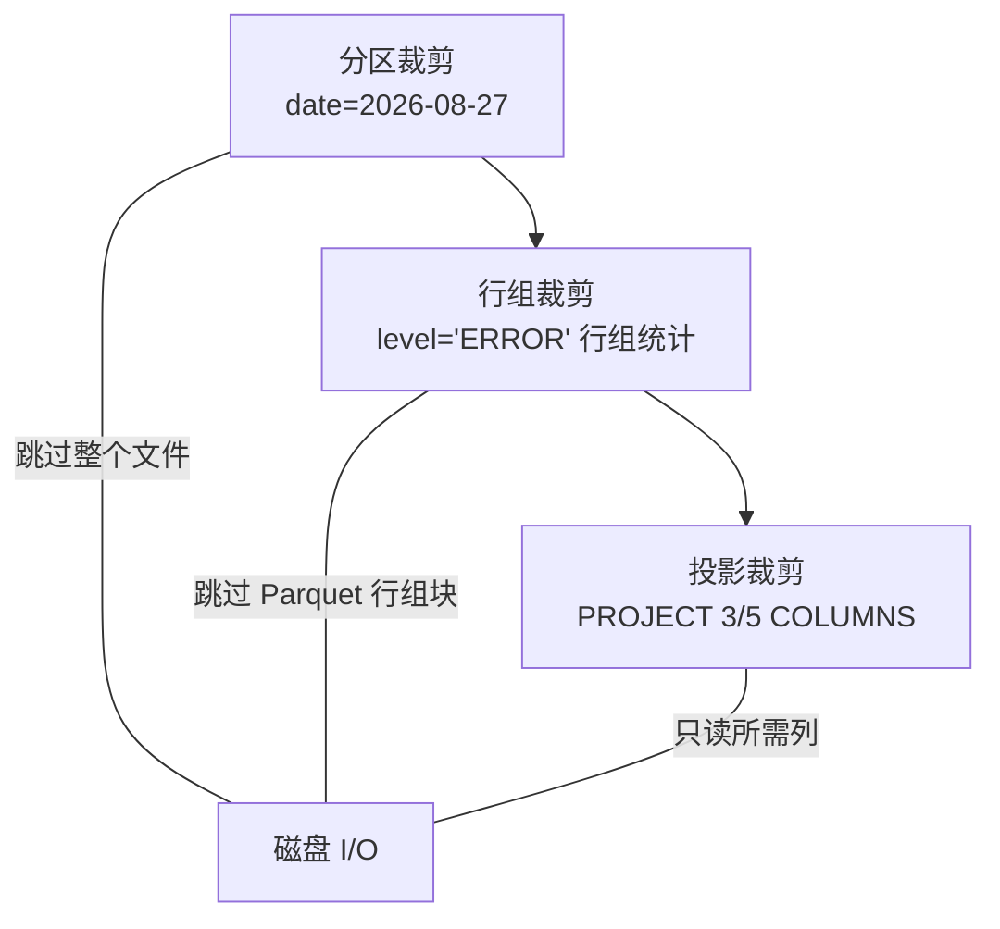

# 第 14 章 实战：亿级日志分析管道

> 本章要解决什么问题：综合流式主线（scan → 变换 → sink）处理亿级行日志，全程内存受控。

## 14.1 场景与数据

- 输入：多日期分区的 Parquet 日志（如 200GB、10 亿行）
- 输出：小时级错误统计 + 慢端点 TopN

输入输出的形态对比决定了整章的技术选型：进的是 200GB 原始日志，出的只是两张小统计表——聚合基数（小时 × 端点）比输入行数低约四个数量级，这种"大进小出"的漏斗正是流式管道的理想负载，内存只需覆盖单个 morsel 加聚合基数，而非全量数据。输入按日期分区，则让增量运行成为可能：每次只扫新增分区，历史数据完全不碰。数据形态如下：

```python
# 数据形态示例
# logs/date=2026-08-27/part-000.parquet
# logs/date=2026-08-28/part-000.parquet
# 列：ts (Datetime), level (String), endpoint (String),
#     latency_ms (Int64), user_id (Int64)
```

先运行一次数据生成（2 个日期分区 × 2000 行日志），本章代码即可顺序执行：

```python
import polars as pl
from datetime import date, datetime, timedelta
from pathlib import Path
import numpy as np

rng = np.random.default_rng(11)
for day in [date(2026, 8, 27), date(2026, 8, 28)]:
    part = Path(f"logs/date={day.isoformat()}")
    part.mkdir(parents=True, exist_ok=True)
    n = 2000
    pl.DataFrame({
        "ts": [datetime(2026, 8, day.day) + timedelta(minutes=int(i))
               for i in rng.integers(0, 1440, n)],
        "level": rng.choice(["INFO"] * 6 + ["WARN"] * 2 + ["ERROR"] * 2, n),
        "endpoint": rng.choice(["/api/a", "/api/b", "/api/c", "/api/d"], n),
        "latency_ms": rng.integers(5, 2000, n),
        "user_id": rng.integers(1, 100, n),
    }).sort("ts").write_parquet(part / "part-000.parquet")
```

## 14.2 端到端流式管道

```python
import polars as pl

(pl.scan_parquet("logs/date=2026-08-*/*.parquet")
   .filter(pl.col("level") == "ERROR")                     # 谓词下推
   .with_columns(hour=pl.col("ts").dt.truncate("1h"))     # 时间粒度
   .group_by(["hour", "endpoint"])
   .agg(
       pl.len().alias("n"),
       pl.col("latency_ms").mean().alias("avg_latency"),
       pl.col("latency_ms").quantile(0.99).alias("p99_latency"),  # 百分位监控
   )
   .sink_parquet("error_stats.parquet"))                    # 流式写出
```

内存分析：管道的可变工作集 = 单个 morsel（几十万行）+ 增量哈希表（720 小时 × ~200 端点 ≈ 14 万键）。**输入 200GB，内存占用稳定在几十 MB**。

## 14.3 三层裁剪：分区、行组、投影

亿级数据的第一性能来源不是"算得快"，而是**根本不读**。按粒度从粗到细，裁剪分三层：



### 分区裁剪：filter 分区列，跳过整个文件

分区列（`date=`）不在文件内部，而在目录名里。开启 `hive_partitioning` 后，对分区列的 filter 会让扫描层**直接不打开无关文件**：

```python
# hive_partitioning=True：把目录结构识别为分区列
one_day = (
    pl.scan_parquet("logs/**/*.parquet", hive_partitioning=True)
      .filter(pl.col("date") == date(2026, 8, 27))   # 只扫 08-27 分区
)
print(one_day.explain())
# Parquet SCAN [logs/date=2026-08-27/part-000.parquet]  ← 文件列表已裁剪！
# PROJECT */6 COLUMNS
# SELECTION: col("date") == 2026-08-27

print(one_day.collect().height)   # 2000（只有 27 日的行）
```

两个易踩的坑：

1. **分区列被推断为 `Date` 类型**——比较必须用 `date(...)` 对象，写字符串会报类型错误
2. 不开启 `hive_partitioning` 时分区列不可用，只能用 glob（`date=2026-08-2*`）粗筛——glob 能缩小范围，但无法做值比较

### 行组裁剪：谓词下推 + Parquet 统计

```python
# 验证：计划中的 SELECTION 确实下推到扫描层
lf = (pl.scan_parquet("logs/date=2026-08-*/*.parquet")
        .filter(pl.col("level") == "ERROR"))
print(lf.explain())
# Parquet SCAN 中出现 SELECTION —— 存储层直接跳过 level 列
# 不含 ERROR 的行组（统计信息可证明）整块跳过，读取量骤减
```

Parquet 每个行组记录 min/max 统计。`level` 是低基数字符串，某行组的 min/max 都是 `"INFO"` 时整块跳过——对 20% 错误率的日志，实际读取量远小于全量。

### 投影裁剪

管道只用了 5 列中的 4 列（`user_id` 未用），explain 的 `PROJECT 4/5 COLUMNS` 即体现。列式存储下这是免费的 I/O 节省。

## 14.4 TopN 的两阶段：先聚合再排序

```python
# ❌ 错误直觉：对原始数据 sort 再取头（10 亿行全量排序，示意勿运行）
# big.sort("latency_ms", descending=True).head(100)

# ✅ 正确策略：先聚合（收窄到端点粒度），再排序
(pl.scan_parquet("logs/date=2026-08-*/*.parquet")
   .group_by("endpoint")
   .agg(pl.col("latency_ms").mean().alias("avg_latency"))
   .collect()
   .sort("avg_latency", descending=True)
   .head(20))
# 聚合后只有 ~200 行，sort 成本可忽略
```

## 14.5 增量运行与监控

### 增量运行：只处理新增分区

```python
# anti join 去重：排除已入库的小时（幂等保证）
already = pl.scan_parquet("error_stats.parquet").select("hour", "endpoint")

(pl.scan_parquet("logs/date=2026-08-2*/*.parquet")         # glob 收窄到新增分区
   .filter(pl.col("level") == "ERROR")
   .with_columns(hour=pl.col("ts").dt.truncate("1h"))
   .group_by(["hour", "endpoint"]).agg(pl.len().alias("n"))
   .join(already, on=["hour", "endpoint"], how="anti")     # 增量去重
   .sink_parquet("error_stats_increment.parquet"))
```

### 与 DuckDB 协作做 ad-hoc SQL

```python
import duckdb

# 管道产出的 Parquet 直接用 SQL 探索——无需再次加载
duckdb.sql("""
    SELECT endpoint, p99_latency
    FROM 'error_stats.parquet'
    WHERE p99_latency > 1000
    ORDER BY p99_latency DESC
""").show()
```

### 峰值内存实测走查

流式管道的"内存受控"不能靠声称，要靠实测（模板见第 8 章）。把 14.2 的管道写进独立脚本后：

```python
# measure_peak.py —— 单独文件，用子进程隔离测量
import resource
import subprocess
import sys

proc = subprocess.run([sys.executable, "pipeline.py"], check=True)
peak = resource.getrusage(resource.RUSAGE_CHILDREN).ru_maxrss
# macOS 返回字节，Linux 返回千字节
print(f"峰值 RSS: {peak / 1e6:.0f} MB")
```

验证方法——**规模不变性**：把输入放大 5 倍（分区数 × 5），若峰值 RSS 基本不变（仅哈希表随基数线性增长），说明管道确实在流式执行；若 RSS 随输入等比增长，说明某处悄悄物化了全量数据。

```bash
# 也可以直接用系统工具
/usr/bin/time -l python pipeline.py   # macOS（-v 为 Linux 版）
```

## 14.6 环比监控（呼应第 11 章）

```python
(pl.scan_parquet("error_stats.parquet")
   .sort("hour")
   .with_columns(
       mom=pl.col("n").pct_change(24).over("endpoint"),  # 与 24 小时前比较
   )
   .filter(pl.col("mom") > 0.5)   # 错误量环比暴涨 50% 的端点
   .collect())
```

告警阈值不只是拍脑袋的 50%：`pct_change` 对小基数极度敏感（n 从 1 涨到 2 就是 +100%）。更稳健的做法是给环比加最小样本门槛：

```python
(pl.scan_parquet("error_stats.parquet")
   .sort("hour")
   .with_columns(
       mom=pl.col("n").pct_change(24).over("endpoint"),
   )
   .filter((pl.col("mom") > 0.5) & (pl.col("n") >= 50))  # 小样本不告警
   .collect())
```

## 14.7 规模分析：从 4000 行到 10 亿行，什么变了？

本章示例只有 4000 行，但管道结构在 10 亿行下**不需要改动**。真正需要随规模重新审视的是三个量：

| 量 | 示例规模 | 亿级规模 | 影响 |
|---|---|---|---|
| 聚合基数（hour × endpoint） | 48 键 | ~14 万键 | 增量哈希表是唯一随数据增长的内存项，需预估上限 |
| 分区数 | 2 | 数千 | glob 匹配与计划构建本身有开销；分区过碎时用 `hive_partitioning` + 日期 filter 优于宽 glob |
| morsel 大小 | 不变 | 不变 | 引擎固定（约 10 万行级），单块处理时间稳定，是内存上界的锚点 |

以及一个质变：10 亿行的 `sort` 会超出内存——但新流式引擎（1.42+）的 out-of-core 排序会溢写磁盘，管道仍能跑完，只是变慢。这也是 14.4 强调"先聚合再排序"的深层原因：**聚合把 10 亿行收敛到几百行后再排序，从一开始就不进入溢写路径**。

## 要点回顾

- 流式管道的内存上界 = morsel + 哈希表（基数决定）
- 三层裁剪（分区/行组/投影）是亿级数据的第一性能来源
- TopN 永远先聚合再排序，避开全量排序与溢写路径
- anti join 是幂等增量处理的利器
- 内存受控要靠"规模不变性"实测验证，而非声称

## 性能检查清单

- [ ] 峰值内存是否稳定在预期上界？（用 `/usr/bin/time -l` 实测）
- [ ] 输入放大 5 倍后峰值 RSS 是否基本不变（规模不变性）？
- [ ] 聚合基数（小时 × 端点）是否预估过？
- [ ] 分区裁剪是否生效（explain 的文件列表已收窄）？
- [ ] 增量运行是否幂等（anti join 保障）？
- [ ] 告警类环比是否加了最小样本门槛？

## 练习

1. **模拟数据**：用 `pl.datetime_range` + 随机数生成分区日志（3 天 × 4 端点 × 10 万行/天），写入 `logs/date=*/part-0.parquet`，运行 14.2 节管道并验证输出行数 = 3 天 × 4 端点。
2. **分区裁剪验证**：开启 `hive_partitioning=True` 后 filter 单个日期，用 explain 确认扫描文件列表从 3 个缩到 1 个；再用 glob 方式实现同样效果，对比两种方式的适用场景（值比较 vs 模式匹配）。
3. **p99 对比**：把聚合中的 `quantile(0.99)` 分别换成 `max` 与 `mean`，三种口径下找出"最慢端点"是否一致？讨论监控该用哪个。
4. **幂等验证**：连续运行两次 14.5 节的增量管道（anti join 版本），验证第二次输出的增量为 0 行。
