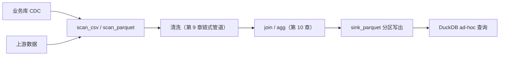

# 第 16 章 实战：数据工程管道

> 本章要解决什么问题：构建 Parquet 数据湖上的增量 ETL，与 DuckDB 协作（两条主线的综合检验）。

## 16.1 场景与架构

- 输入：业务数据库 CDC 导出、上游 CSV
- 输出：分区 Parquet 数据湖 + 派生表



## 16.2 增量 ETL

```python
from datetime import date, datetime
import polars as pl

# CDC 导出：每批次一个 CSV，含操作类型
# cdc/orders_2026-08-27.csv
# 列：op (I/U/D), order_id, user_id, amount, ts

def ingest_day(day: date) -> None:
    """单日增量：清洗 → 去重 → 分区写出（幂等）"""
    partition = f"lake/orders/date={day.isoformat()}"

    (pl.scan_csv(f"cdc/orders_{day.isoformat()}.csv",
                 schema_overrides={"order_id": pl.Int64, "amount": pl.Float64})
       # 清洗（第 9 章）
       .with_columns(
           pl.col("amount").cast(pl.Float64),
           pl.col("user_id").cast(pl.Int64, strict=False),
       )
       .filter(pl.col("amount") > 0)
       # 同一 order_id 保留最新一条（CDC 的多次更新）
       .sort("ts")
       .unique(subset=["order_id"], keep="last")
       # 增量去重：排除湖中已存在的 order_id（幂等保证）
       .join(
           pl.scan_parquet("lake/orders/**/*.parquet").select("order_id"),
           on="order_id", how="anti",
       )
       .sink_parquet(f"{partition}/part-0.parquet"))
```

### 水位线（watermark）管理

```python
# 简单可靠：用分区目录本身记录进度
from pathlib import Path

def get_watermark(lake_root: str) -> date:
    parts = sorted(Path(lake_root, "orders").glob("date=*"))
    if not parts:
        return date(2026, 8, 1)   # 初始起点
    return date.fromisoformat(parts[-1].name.split("=")[1])

def pending_days(lake_root: str, today: date) -> list[date]:
    wm = get_watermark(lake_root)
    return [wm + timedelta(days=i + 1) for i in range((today - wm).days)]
```

## 16.3 与 DuckDB 协作

```python
import duckdb

# Polars 负责变换管道，DuckDB 负责 ad-hoc SQL
# 数据湖对两边都是零拷贝可读的（Parquet + Arrow）

# 探索：每日订单量与客单价
duckdb.sql("""
    SELECT date, COUNT(*) AS n, AVG(amount) AS aov
    FROM 'lake/orders/**/*.parquet'
    GROUP BY date ORDER BY date
""").show()

# 复杂分析交给 DuckDB 的 SQL，结果零拷贝回 Polars 继续加工
result = duckdb.sql("""
    WITH daily AS (
        SELECT date, SUM(amount) AS total
        FROM 'lake/orders/**/*.parquet' GROUP BY date
    )
    SELECT * FROM daily WHERE total > 1000000
""").arrow()
pl.from_arrow(result).with_columns(
    mom=pl.col("total").pct_change(1)   # 回到 Polars 算环比
)
```

## 16.4 派生表：用户画像

```python
# 从订单湖派生用户画像——全链式 + 流式（两条主线的综合检验）
(pl.scan_parquet("lake/orders/**/*.parquet")
   .group_by("user_id")
   .agg(
       pl.len().alias("n_orders"),
       pl.col("amount").sum().alias("total_amount"),
       pl.col("amount").mean().alias("avg_amount"),
       pl.col("amount").quantile(0.95).alias("p95_amount"),
       pl.col("ts").max().alias("last_order_at"),
   )
   .with_columns(
       # RFM 分层：表达式组合（第 5 章）
       rfm=(
           pl.when(pl.col("total_amount") > 10000).then(pl.lit("high"))
            .when(pl.col("total_amount") > 1000).then(pl.lit("mid"))
            .otherwise(pl.lit("low"))
       ),
   )
   .sink_parquet("lake/user_profile.parquet"))
```

## 16.5 剖析

### 分区裁剪

```python
# 分区目录的价值：谓词下推到路径层面
pl.scan_parquet("lake/orders/date=2026-08-2*/*.parquet")
# 文件系统 glob 只命中 8 月下旬的分区——扫描范围从全湖缩到几天

# anti join 的成本控制：排除列 + 只读 order_id
pl.scan_parquet("lake/orders/**/*.parquet").select("order_id")
# explain() 会显示 PROJECT 1/N COLUMNS
```

### 小文件问题与合并策略

```python
# 每日一个分区、每天一个小文件 → 一年后 365 个小文件
# 读取时元数据解析开销累积 → 定期合并（compaction）

from datetime import date, timedelta

def compact_month(lake_root: str, month_start: date) -> None:
    month_end = month_start + timedelta(days=30)
    parts = sorted(Path(lake_root, "orders").glob("date=*"))
    month_parts = [p for p in parts
                   if month_start <= date.fromisoformat(p.name.split("=")[1]) < month_end]
    if len(month_parts) <= 1:
        return
    (pl.scan_parquet([f"{p}/*.parquet" for p in month_parts])
       .sink_parquet(f"lake/_compact/orders_{month_start.isoformat()}.parquet"))
    # 原子替换：mv 旧目录 → tmp，写入新分区，成功后删除 tmp
```

## 要点回顾

- 分区 + anti join = 幂等增量 ETL
- Polars（管道）与 DuckDB（查询）分工协作，数据湖共享
- 小文件需要定期 compaction，否则元数据开销累积

## 性能检查清单

- [ ] 增量运行是否只读新增分区（glob 收窄）？
- [ ] 派生表是否支持下游谓词下推（列裁剪 + 行组统计）？
- [ ] anti join 是否只投影了去重键？
- [ ] 小文件是否按月/季合并？
- [ ] 全链路是否零物化（scan 进 sink 出）？

## 练习

1. **幂等 ingest**：实现 16.2 节的 `ingest_day`，对同一天连续调用两次，用 `anti join` 保证第二次写入 0 行（提示：第二次运行时湖中已含当天的 order_id）。
2. **分区裁剪验证**：生成 7 天分区后，用 glob 只扫描最后两天，对比全湖扫描与裁剪扫描的 `explain()` 中扫描文件数与实际耗时。
3. **画像迭代**：16.4 节的用户画像 sink 之后，新到一批订单——重算画像时如何增量更新而不是全量重算？（提示：读旧画像 + 增量聚合 + `group_by` 归并）
